# GridGuard — Arkitektur och Systemdesign

GridGuard är ett systemprogrammeringsprojekt i C och C++ som implementerar en watchdog-övervakad multi-processpipeline för realtidsoptimering av energiförbrukning baserat på nordiska spotpriser och solcellsdata.

GridGuard hämtar spotpriser och väderdata i realtid, beräknar förväntad solcellsproduktion och genererar en löpande 48-timmars energiplan — köp billigt, sälj överskott, undvik toppar.

---

## 1. Process-hierarki

```
bin/GridGuard             (launcher — execv:ar watchdog direkt)
└── bin/GridGuard-watchdog (supervisor — äger alla processer)
    ├── bin/GridGuard-fetcher  (hämtar väder + spotprisdata)
    ├── bin/GridGuard-parser   (validerar och strukturerar rådata)
    └── bin/GridGuard-server   (HTTP API + energiberäkningar)
                └── [thread] ComputeWorker
```

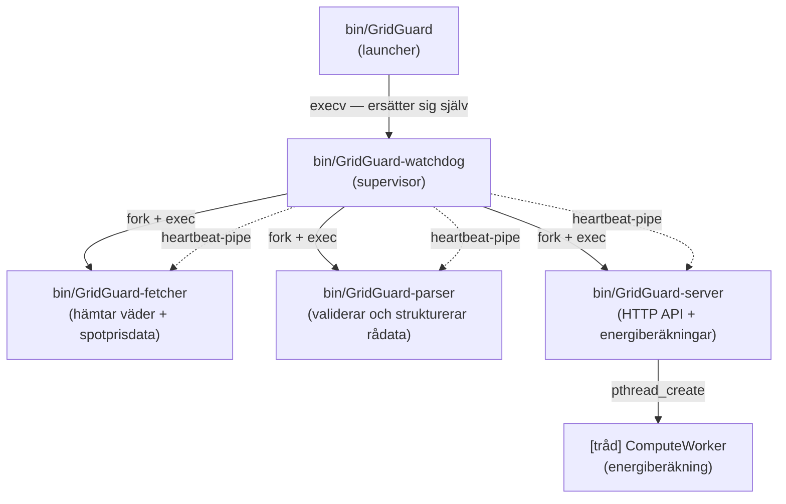

**Launcher** (`src/main.c`) är en tunn wrapper som gör `execv` direkt på watchdog — den ersätter sig själv utan att lämna en extra process i trädet.

**Watchdog** är systemets rotprocess. Den:
- Skapar alla IPC-resurser (FIFOs, socket) innan processerna startas
- Forkar och exec:ar de tre child-processerna i rätt ordning
- Övervakar varje process via heartbeat-pipes
- Startar om hela gruppen vid krasch (med exponentiell backoff)
- Skriver processtatistik till POSIX shared memory (`/gridguard_watchdog_metrics`)
- Skriver PID-fil (`/var/run/gridguard.pid`)

**Server** äger inte längre sina child-processer — det gör Watchdog. Server initialiserar bara sin interna ComputeWorker-tråd och öppnar de IPC-resurser som Watchdog redan skapat.

---

## 2. Startsekvens

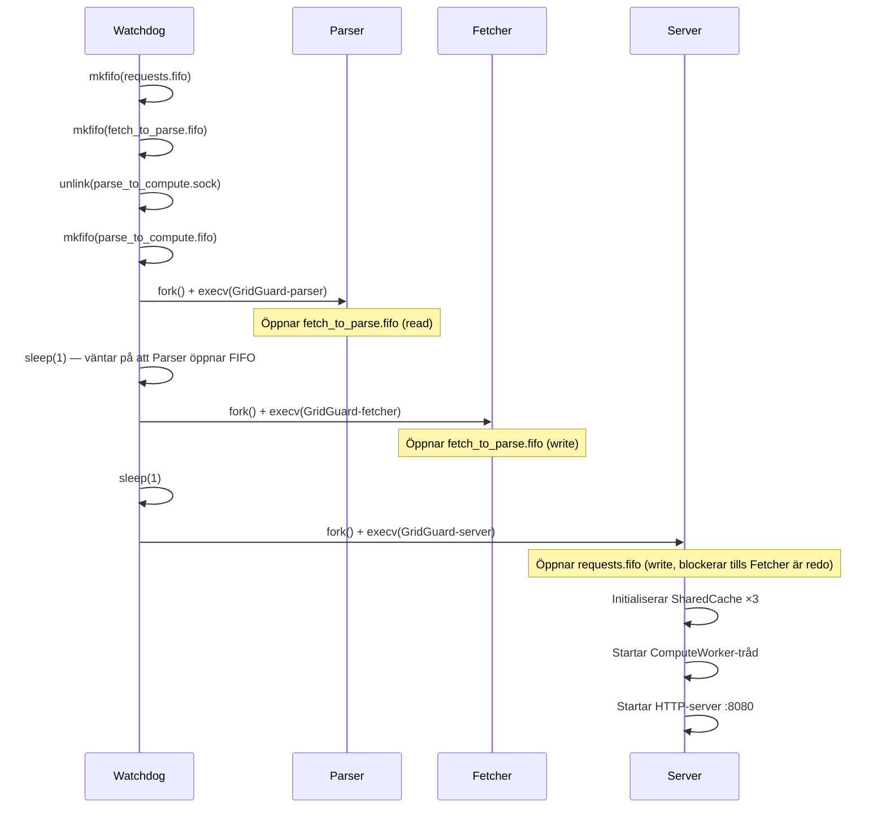

```
1. Watchdog startar
   ├── Laddar RuntimeConfig från config/gridguard.conf (optional, fallback till defaults)
   └── Skapar IPC-resurser:
       ├── mkfifo /tmp/gridguard_requests.fifo        (Server → Fetcher)
       ├── mkfifo /tmp/gridguard_fetch_to_parse.fifo  (Fetcher → Parser)
       ├── unlink /tmp/gridguard_parse_to_compute.sock
       └── mkfifo /tmp/gridguard_parse_to_compute.fifo (Parser → Server notify)

2. Parser startas (öppnar FIFO read-end innan Fetcher försöker öppna write-end)
   └── sleep(1)

3. Fetcher startas
   └── sleep(1)

4. Server startas
   ├── Öppnar /tmp/gridguard_requests.fifo (O_WRONLY — blockerar tills Fetcher är redo)
   ├── Initialiserar SharedCache ×3 (weather, price, forecast) med konfigurerbara TTL-värden
   ├── Startar ComputeWorker-tråd (Unix socket-klient mot Parser)
   └── Startar HTTP-server på konfigurerbar port (default: 8080)
```

---

## 2.1. Daemon-skapande (POSIX Double-Fork)

Server-processen transformeras till en bakgrundsdaemon enligt Unix best practices. När processen körs under Watchdog (detekteras via `GRIDGUARD_HEARTBEAT_FD` miljövariabel) skippas double-fork steget eftersom Watchdog redan ansvarar för processövervakning via `waitpid()`.

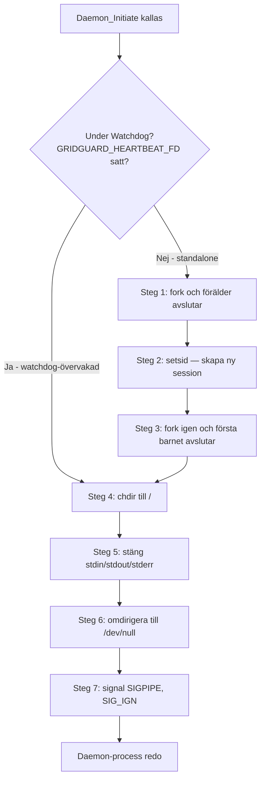

**Steg-för-steg:**

1. **Fork #1**: Förälder avslutar → barnet blir inte längre processgrupps-ledare
2. **setsid()**: Skapar ny session → lossnar från kontrollerande terminal
3. **Fork #2**: Första barnet avslutar → säkerställer att processen aldrig kan återfå en terminal (bara session leader kan öppna terminal)
4. **chdir("/")**: Byter till root-katalog → undviker att låsa någon mountpoint
5. **close(0, 1, 2)**: Stänger stdin, stdout, stderr
6. **dup2(/dev/null)**: Omdirigerar 0, 1, 2 till /dev/null → undviker krascher när kod skriver till stdout/stderr
7. **signal(SIGPIPE, SIG_IGN)**: Ignorerar SIGPIPE → klientdisconnects dödar inte daemon

**Watchdog-specialfall:**

När `GRIDGUARD_HEARTBEAT_FD` är satt (Watchdog körning):
- Steg 1–3 skippas (fork och setsid)
- Watchdog äger redan processträdet via `fork()` + `waitpid()`
- Om Server double-fork:ar skulle Watchdog förlora spårning av rätt PID
- Heartbeat-tråden skriver till `fd` som Watchdog läser för att detektera att processen lever

**Implementation:** `src/sys/Daemon.c:52-133`

---

## 3. IPC-kanaler

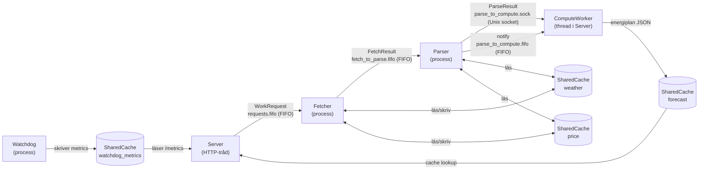

```
Server ──[FIFO: gridguard_requests.fifo]──► Fetcher
                   WorkRequest (struct, binär)

Fetcher ──[FIFO: gridguard_fetch_to_parse.fifo]──► Parser
                   FetchResult (struct, binär)

Parser ──[Unix socket: gridguard_parse_to_compute.sock]──► ComputeWorker
                   ParseResult (struct, binär)

Parser ──[FIFO: gridguard_parse_to_compute.fifo]──► ComputeWorker
                   Notify-signal (trigger för socket-läsning)

Watchdog ──[POSIX shm: /gridguard_watchdog_metrics]──► Server (/metrics endpoint)
                   WatchdogMetrics (struct, read-only från server)

Server ──[POSIX shm: /gridguard_weather]──► Fetcher/Parser (SharedCache)
Server ──[POSIX shm: /gridguard_price]───► Fetcher/Parser (SharedCache)
Server ──[POSIX shm: /gridguard_forecast]─► (forecast-cache, intern)
```

**Varför FIFO och inte anonym pipe?**
Watchdog startar processerna som oberoende exec:ade binärer. Anonyma pipes ärvs bara vid fork+exec i samma process — Watchdog måste använda namngivna FIFOs för att processerna ska kunna hitta varandra utan att dela file descriptors via arv.

---

## 4. Heartbeat-mekanism

Varje child-process får en anonym pipe vid fork:en via miljövariabeln `GRIDGUARD_HEARTBEAT_FD`. Processen skriver periodiskt till denna pipe för att signalera att den lever.

```
Watchdog                          Child-process
   |                                   |
   |── pipe() ──────────────────────── |
   |   read_fd (watchdog behåller)     |
   |   write_fd (ärvsett av child) ────► setenv("GRIDGUARD_HEARTBEAT_FD", fd)
   |                                   |
   |── poll(read_fd, 2s) ◄──────────── write(write_fd, "hb", 2)
   |   timeout = ingen heartbeat       |
```

**Timeout-hantering:** Om en process inte skickat heartbeat på `HEARTBEAT_TIMEOUT` sekunder klassar Watchdog den som fryst (`FROZEN`) och dödar hela processgruppen innan omstart.

**Varför anonym pipe och inte FIFO?**
Heartbeat-pipen ska vara exklusiv mellan Watchdog och varje enskild child-process — ingen annan process ska kunna skriva till den. Anonym pipe skapad vid `fork()` ger exakt denna isolation. FIFOs är namngivna och tillgängliga för alla processer med rätt filsökvägsbehörighet.

---

## 5. Restart Policy

| Parameter | Värde |
|---|---|
| Max omstarter | 5 |
| Tidsfönster | 300 sekunder |
| Backoff-strategi | Exponentiell: 2s → 4s → 8s → 16s → 32s (max) |

Vid krasch dödar Watchdog **alla** processer (inte bara den kraschade) och startar om hela gruppen. Anledning: processerna är sammankopplade via FIFOs — om Fetcher kraschar har Parser ingen write-end att läsa ifrån, vilket leder till ett hängt tillstånd ändå.

**Resetlogik:** Om inga krascher sker på 300 sekunder nollställs räknaren. En stabil körning kan alltså hålla 5 omstarter per 5-minutersfönster utan att systemet ger upp.

```c
// Exponentiell backoff (RestartPolicy.c)
int delay = rp->baseBackoffSec;      // 2
for (int i = 0; i < count - 1; i++) // Dubblar för varje restart
    delay *= 2;                      // cap vid 32s
```


---

## 6. Signalhantering

### Watchdog

| Signal | Effekt |
|---|---|
| `SIGTERM` / `SIGINT` | Graceful shutdown: vidarebefordrar SIGTERM till alla child-processer, väntar 3s, sedan SIGKILL |
| `SIGHUP` | Vidarebefordrar SIGHUP till alla child-processer (reload-signal) |
| `SIGUSR1` | Loggar processtatusrapport (PIDs, heartbeat-ålder, restart-räknare) |
| `SIGUSR2` | Manuell omstart av alla processer (triggar samma flöde som krasch-omstart) |

### Server

| Signal | Effekt |
|---|---|
| `SIGHUP` | Hot-reload av config från `config/gridguard.conf` (via `RuntimeConfig_Reload()`) |
| `SIGTERM` / `SIGINT` | Graceful shutdown via `SignalHandler` |
| `SIGPIPE` | Ignoreras (för att undvika crash vid client disconnect) |

```bash
kill -USR1 $(cat /var/run/gridguard.pid)   # Statusrapport i watchdog.log
kill -USR2 $(cat /var/run/gridguard.pid)   # Manuell omstart
kill -HUP $(cat /var/run/gridguard.pid)    # Reload config (alla processer)
```

---

## 7. Shared Memory — Cacher

Tre SharedCache-instanser används för att dela data mellan processer utan att gå via nätverk eller disk:

| Namn (shm) | Innehåll | Producent | Konsument | TTL (default) |
|---|---|---|---|---|
| `/gridguard_weather` | Väderdata (JSON, TTL-baserad) | Fetcher | Parser | 900s (15 min, konfigurerbar) |
| `/gridguard_price` | Spotprisdata (JSON, TTL-baserad) | Fetcher | Parser | 43200s (12 h, konfigurerbar) |
| `/gridguard_forecast` | Beräknad energiprognos (JSON) | ComputeWorker | Server (HTTP-svar) | 1800s (30 min, konfigurerbar) |
| `/gridguard_watchdog_metrics` | Processtatistik | Watchdog | Server (`/metrics`) | N/A |

**Synkronisering:** SharedCache använder `pthread_rwlock` lagrad i shared memory — flera readers kan läsa parallellt, writers får exklusivt lås. Watchdog metrics är read-only från serverns sida (inga lås krävs vid läsning av atomära värden).

**TTL:** Vädercachen och priscachen har en Time-To-Live som kan konfigureras via `config/gridguard.conf` (se sektion 20). Vid cache miss kör servern hela pipeline (Fetch → Parse → Compute) synkront och lagrar resultatet.

### Process-Shared RWLock

SharedCache-implementeringen använder `pthread_rwlock_t` med `PTHREAD_PROCESS_SHARED`-attribut för att möjliggöra synkronisering mellan processer:

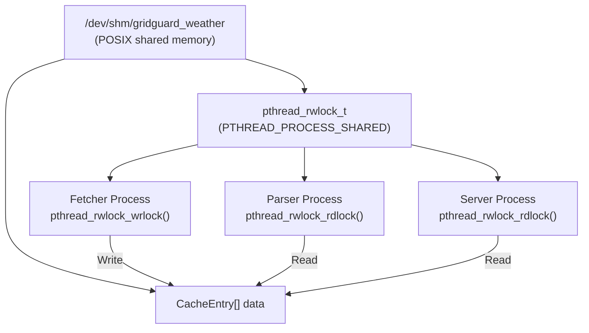

**Viktiga egenskaper:**
- Låset lagras **inuti** shared memory-segmentet (ej i varje process)
- `PTHREAD_PROCESS_SHARED` gör låset synligt för alla processer med mmap:ad access
- Flera readers kan läsa parallellt, writer får exklusivt lås
- Kernel-baserad synkronisering via futex (snabbt)

**Layout i minnet:**
```
shm-segment (/dev/shm/gridguard_weather):
┌─────────────────────────────────────┐
│  pthread_rwlock_t  lock             │  (process-shared)
│  int               count            │
│  time_t            ttl              │
│  CacheEntry[16]    entries[]        │
│    char  key[64]                    │
│    char  data[32768]                │
│    time_t created_at                │
└─────────────────────────────────────┘
```

Implementering: `src/cache/SharedCache.c` (rad 45–60 för rwlock init)

### Cache HIT/MISS-flöde

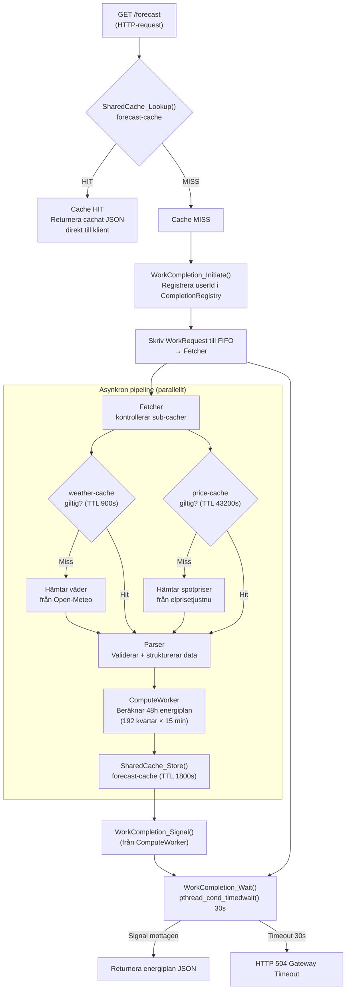

### Event-driven cache-invalidering

Systemet är designat för att en inloggad användare **alltid** ska få en prognos baserad på senaste data — utan att behöva veta om ny data har kommit in.

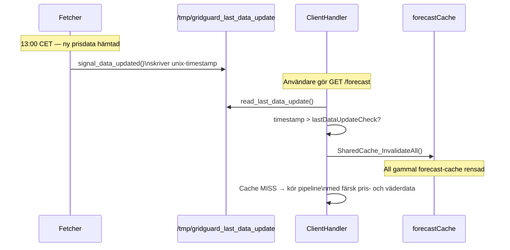

Fetcher skriver en timestamp-fil (`/tmp/gridguard_last_data_update`) varje gång ny pris- eller väderdata hämtas. ClientHandler läser filen vid varje `/forecast`-request och jämför mot sin `lastDataUpdateCheck`. Om ny data har anlänt sedan sist invalideras **hela** forecast-cachen — alla användares gamla prognoser — och nästa request kör en färsk pipeline.

### Prisdata och imorgondagens priser

Elprisetjustnu publicerar imorgondagens priser kring **13:00–14:00 CET**. Fetcher hanterar detta med en `tomorrowPricesFetched`-flagga:

```
Om klockan >= 13:00 CET och tomorrowPricesFetched == false:
    Försök hämta imorgondagens priser (SE1–SE4)
    Vid framgång: tomorrowPricesFetched = true
    Vid misslyckande: försök igen om 5 minuter
Om klockan < 13:00 CET:
    tomorrowPricesFetched = false (nollställs vid midnatt)
```

Priscachen har en TTL på **43200s (12 h)** — tillräckligt lång för att täcka ett helt dygns priser utan onödiga API-anrop, men kortare än 24 h för att undvika att gammal prisdata används vid midnattsövergång.

---

## 8. Auth-arkitektur — Simulerad plattforms-DB och tokenflöde

GridGuard simulerar ett verkligt produktionsscenario där en molnplattform och en lokal enhet delar en hemlig nyckel men aldrig kommunicerar direkt med varandra.

### Systemets tre aktörer

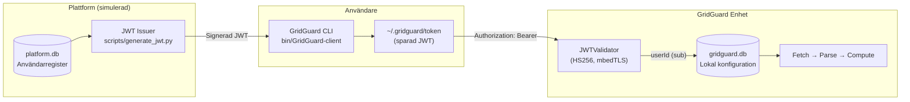

**Plattformen och enheten kommunicerar aldrig direkt.** Det enda de delar är `GRIDGUARD_JWT_SECRET` — den hemliga nyckeln som används för att signera och verifiera JWT:ar.

### Hur en användare får sin token

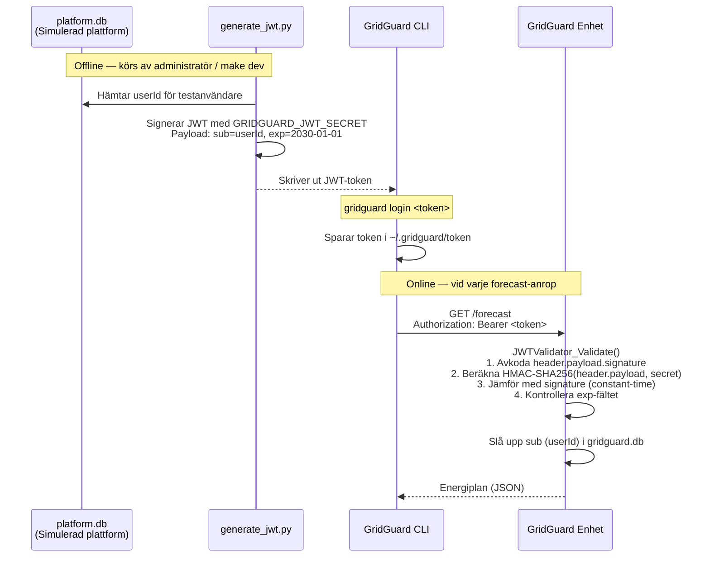

### Simulerad plattforms-DB (`platform.db`)

I ett riktigt system skulle plattformen vara en molntjänst. Här simuleras den med en lokal SQLite-databas:

```
make dev
  └── scripts/seed_platform.py   → Skapar platform.db med testanvändare
  └── scripts/generate_jwt.py    → Frågar platform.db, utfärdar signerad JWT
  └── bin/GridGuard-client login  → Sparar JWT till ~/.gridguard/token
```

`platform.db` innehåller bara `userId` (och eventuell kontaktinfo). Den vet ingenting om solpaneler, GPS-koordinater eller energiförbrukning — det lagras uteslutande på enheten.

**Implementation:** `src/auth/JWTValidator.c`, `src/auth/JWTIssuer.c`, `src/auth/PlatformDB.c`

---

## 9. Dataintegritet — Användardata lämnar aldrig enheten

GridGuard är designat enligt **privacy-by-architecture**: känslig information om var användaren bor och hur de konsumerar energi lagras aldrig på en central server.

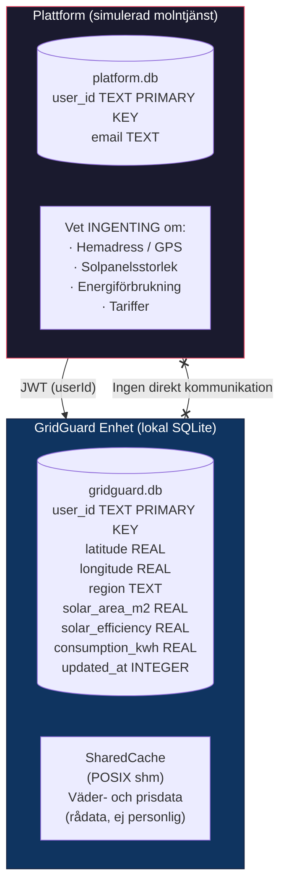

**Vad lagras var:**

| Data | Plattform | Enhet |
|---|---|---|
| `userId` (JWT `sub`) | Ja | Ja (primärnyckel) |
| E-post / kontaktinfo | Ja | Nej |
| GPS-koordinater | Nej | Ja (`gridguard.db`) |
| Solpanelsstorlek | Nej | Ja (`gridguard.db`) |
| Elregion / tariffer | Nej | Ja (`gridguard.db`) |
| Väderdata | Nej | Temporärt (SharedCache, TTL 15 min) |
| Spotpriser | Nej | Temporärt (SharedCache, TTL 12 h) |
| Energiplaner / BUY/SELL | Nej | Temporärt (SharedCache, TTL 30 min) |

**Konsekvens:** Även om plattformen komprometteras exponeras inga GPS-koordinater, inga förbrukningsprofiler och inga energimönster. En angripare med tillgång till `platform.db` får bara en lista med user-ID:n.

**Konfiguration via HTTP (PUT /user/config):** Användaren sätter sin konfiguration direkt mot enheten via JWT-autentiserad HTTP. Plattformen är aldrig inblandad i det steget.

---

## 10. Server-intern pipeline (per HTTP-request)

```
HTTP-request (/forecast)
    │
    ▼
ClientHandler::HandleForecast()
    │
    ├── SharedCache_Lookup() ──► HIT: returnera cachat JSON direkt
    │
    └── MISS:
        ├── WorkCompletion_Initiate()     (skapar condition variable)
        ├── RegisterCompletion(userId)    (registrerar i CompletionRegistry)
        ├── write(requestFifo, WorkRequest)  ──► Fetcher
        │
        │   [asynkron pipeline: Fetcher → Parser → ComputeWorker]
        │
        └── WorkCompletion_Wait()         (blockerar HTTP-tråden, timeout 30s)
            │
            ▼
        SharedCache_Store() + HTTP-svar
```

**Trådmodell:** Servern hanterar varje HTTP-klient i en separat tråd (ThreadPool). ComputeWorker är en dedikerad bakgrundstråd som lyssnar på Parser-notifieringar. `CompletionRegistry` är en mutex-skyddad map `userId → WorkCompletion*` som kopplar ihop HTTP-tråden med ComputeWorker-tråden.

### End-to-end dataflöde med transformationer

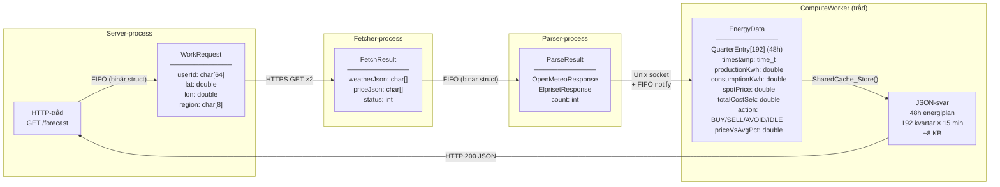

---

## 11. ThreadPool-arkitektur

Servern använder en thread pool med N worker threads (default: 20) som hanterar inkommande HTTP-requests via ett producer-consumer-mönster.

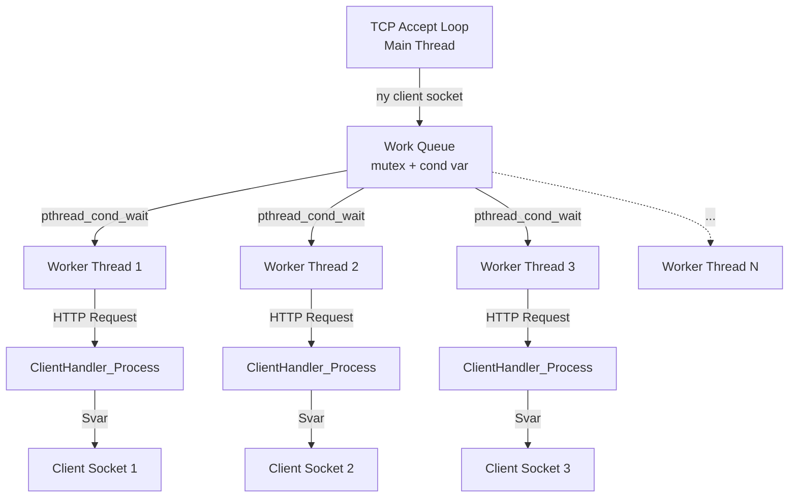

**Synkronisering:**
- Main thread: `pthread_cond_signal()` när ny klient läggs till i kön
- Worker threads: `pthread_cond_wait()` blockerar tills arbete finns
- Queue skyddas av `pthread_mutex_t`

**Fördelar:**
- Begränsat antal trådar (undviker thread exhaustion)
- Automatisk load balancing mellan workers
- Låg latency för nya requests (trådar redan skapade)

Implementering: `src/sys/ThreadPool.c`, `src/sys/Queue.c`, `src/server/ClientHandler.c`

---

## 12. WorkCompletion — HTTP-tråd ↔ ComputeWorker synkronisering

När en HTTP-request kräver fresh data (cache miss) blockeras HTTP-tråden tills ComputeWorker färdigställt beräkningen. Detta löses med condition variables:

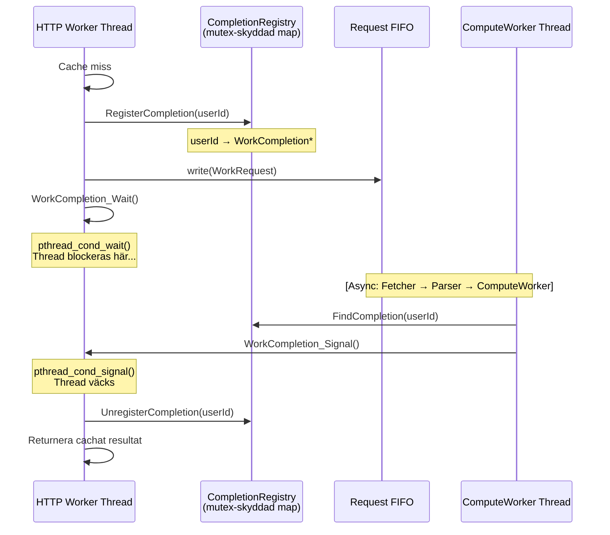

**Timeout-säkerhet:**
- `WorkCompletion_Wait()` använder `pthread_cond_timedwait()` med 30s timeout
- `CLOCK_MONOTONIC` används (säkert mot systemtidsändringar)
- Om timeout inträffar returneras HTTP 504 Gateway Timeout

**Minnessäkerhet:**
- `CompletionRegistry` är en global array med 1024 slots
- Mutex skyddar både registrering och signalering
- WorkCompletion allokeras på stacken i HTTP-tråden (ej heap)

Implementering: `src/sys/WorkCompletion.c`, `src/sys/CompletionRegistry.c`

---

## 13. Från Scheduler till WorkCompletion — Designevolution

### Ursprunglig design (februari 2026): tråd-baserad pipeline med Scheduler

Systemet började som en **single-process, tråd-baserad pipeline**. Varje steg körde i en dedikerad tråd och kommunicerade via mutex-skyddade köer:

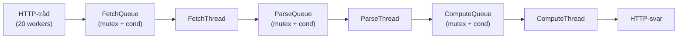

I planeringsstadiets changelog (2026-02-12) identifierades **en Scheduler-abstraktion** som önskvärd — en centraliserad komponent för task distribution, work stealing och lastbalansering mellan workers.

### Varför Scheduler aldrig implementerades

Arkitekturen migrerades i mars 2026 till **separata processer** (fork + exec), vilket krävdes för att täcka kursmålen om IPC (FIFO, Unix sockets, shared memory). I en multi-process-design med FIFOs och Unix sockets som transportlager finns det inget gemensamt adressrymd att schedulera arbete i — varje process äger sin egen exekvering.

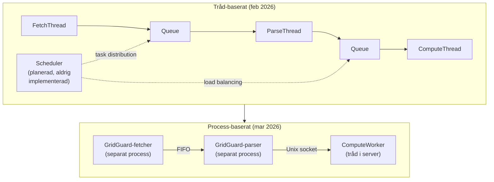

### Vad WorkCompletion löser istället

Scheduler-problemet (hur dispatch:ar vi arbete till rätt worker?) ersattes av ett **annat och svårare problem**: hur vet en HTTP-tråd när *just dess* request är klar, när beräkningen sker asynkront i en separat process?

`WorkCompletion` + `CompletionRegistry` löser exakt det:

| Komponent | Ansvar |
|---|---|
| `WorkCompletion` | Linux completion-mönster: HTTP-tråden väntar via `pthread_cond_timedwait()` |
| `CompletionRegistry` | Mutex-skyddad array: `userId → WorkCompletion*` — kopplar ihop HTTP-tråd med ComputeWorker |

**Scheduler dispatchar arbete *framåt* i pipelinen. WorkCompletion kopplar ihop resultatet *bakåt* till ursprungsbegäran.** De löser komplementära problem, och den multi-process-arkitektur som gjorde Scheduler onödig skapade exakt det synkroniseringsproblem som WorkCompletion behövdes för.

---

## 14. Beslutlogik — BUY / SELL / AVOID / IDLE

För varje 15-minuterskvart i den 48-timmarslånga prognosen (192 kvartar) klassificerar ComputeWorker situationen i ett av fyra tillstånd. Beslutet baseras på **totalkostnad** (spotpris + nättariff + energiskatt + moms) relativt percentilgränser, samt aktuell solcellsproduktion.

### Kvalitetsgränser (percentiler över 48h)

```
p33 = 33:e percentilen av alla kvartskostnader → billigaste tredjedelens gräns
p70 = 70:e percentilen av alla kvartskostnader → dyraste tredjelens gräns

Kvalitetsfilter: BUY kräver ≥ 8% rabatt mot median
                 AVOID kräver ≥ 8% premie mot median
```

### Beslutflöde (prioritetsordning)

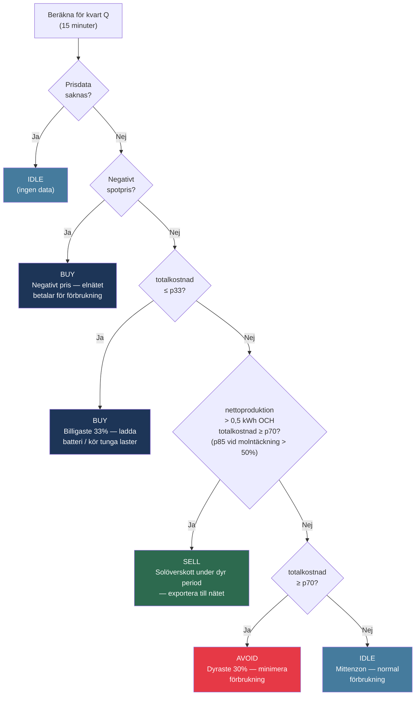

### Tillståndssammanfattning

| Prioritet | Tillstånd | Villkor | Rekommendation |
|---|---|---|---|
| 1 | **IDLE** | Prisdata saknas | Ingen åtgärd möjlig |
| 2 | **BUY** | Negativt spotpris | Maximera förbrukning — elnätet betalar |
| 3 | **BUY** | `totalkostnad ≤ p33` (billigaste 33%) | Ladda batteri, kör tvättmaskin/diskmaskin |
| 4 | **SELL** | `netto > 0,5 kWh` **OCH** `totalkostnad ≥ p70` (eller ≥ p85 vid molntäckning > 50%) | Exportera solöverskott — sälj enbart under dyra perioder. Hög molntäckning höjer prisgränsen för att undvika export när produktionen är osäker. |
| 5 | **AVOID** | `totalkostnad ≥ p70` (dyraste 30%) | Minimera förbrukning, skjut upp laster |
| 6 | **IDLE** | Annars (mittenzon) | Normal förbrukning |

**Viktigt:** SELL triggas **inte** enbart för att det finns solöverskott — det krävs även att priset är högt (≥ p70). Under billiga perioder med solöverskott väljs BUY (ladda batteri) framför SELL.

**Prognososäkerhet:** Vid molntäckning > 50% höjs SELL-tröskeln till ~p85 (`expensiveThreshold × 1.15`). Hög molntäckning innebär osäker solproduktion — systemet kräver ett starkare prissignal innan det rekommenderar export för att undvika att sälja under perioder där produktionen oväntat sjunker.

### Bästa laddningsfönster (bestBuyWindow)

Utöver per-kvart-signaler beräknar ComputeWorker det **praktiskt bästa sammanhängande BUY-blocket** för flexibla laster (tvättmaskin, diskmaskin, elbilsladdning). Algoritmen väger besparingar mot tid på dygnet:

```
Kvällar 17–22: faktor 1,5× (bäst — hemma och vaken)
Nätter 22–07:  faktor 1,0× (acceptabelt — tidsinställning)
Dagtid 07–17:  faktor 0,5× (sämst — ofta borta)
```

**Implementering:** `src/compute/Compute.c` — `Compute_GenerateEnergyPlan()`

### Smart signal-filtrering — från 192 kvartar till actionabla fönster

ComputeWorker transformerar de 192 råkvartsarna till ett kompakt JSON-format för dashboarden. IDLE-signaler filtreras bort helt — de är brus, inte information.

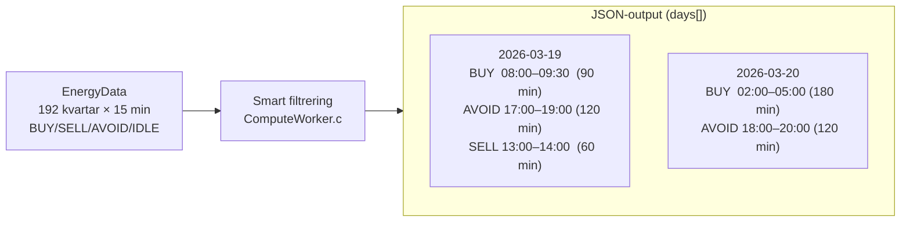

**Algoritmen:**
1. Iterera över alla kvartar och detektera *signalövergångar* (t.ex. IDLE→BUY, BUY→AVOID)
2. Varje sammanhängande block av samma signal (exkl. IDLE) grupperas till ett *fönster*
3. Fönstret emitteras med `start`, `end`, `duration_minutes`, pris, sol- och förbrukningsdata
4. IDLE-kvartar hoppar över — de genererar inget fönster

**Resultat:** 192 råentries komprimeras till typiskt **50–100 actionabla fönster**, grupperade per dag.

**Implementering:** `src/compute/ComputeWorker.c:102–180`

### Solcellsmodell — Temperaturkorrigering (IEC 61724 / IEC 61215)

Solcellsproduktionen per 15-minuterskvart beräknas i tre steg: paneltemperatur, temperaturderating, och slutlig energiproduktion.

#### Steg 1 — Paneltemperatur (NOCT-modell, IEC 61215)

Paneler i direkt solsken blir varmare än lufttemperaturen. NOCT (*Nominal Operating Cell Temperature*) är standardiserat till 45 °C vid 800 W/m² och 20 °C lufttemperatur. Vind kyler panelen via konvektiv kylning.

```
panelTemp = airTemp + (tempRise × irradiance) / (1 + WIND_COOLING_FACTOR × windSpeed)

där:
  tempRise          = (45 - 20) / 800 = 0.03125 °C per W/m²   (NOCT-kalibrerat)
  WIND_COOLING_FACTOR = 0.04                                    (konvektiv kylkoefficient)
```

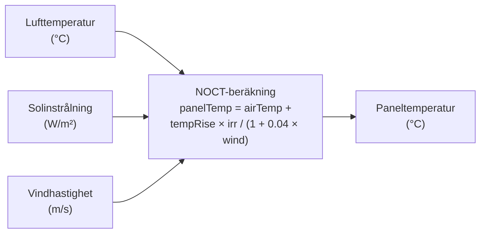

#### Steg 2 — Temperaturderating

Kiselbaserade solceller tappar effekt med ökad temperatur. Kristallint kisel (c-Si) har en typisk temperaturkoefficient på -0,45 % per °C (IEC 61724).

```
tempEfficiency = 1.0 + PANEL_TEMP_COEFFICIENT × (panelTemp - STC_TEMP)

där:
  PANEL_TEMP_COEFFICIENT   = -0.0045   (-0,45 % / °C, IEC 61724 c-Si standard)
  STC_TEMP                 = 25.0 °C   (Standard Test Conditions referenstemperatur)

Klämd till intervallet [0.70, 1.10]
```

**Exempel:** En panel vid 60 °C (varmt sommardag) ger:
`tempEfficiency = 1.0 + (-0.0045) × (60 - 25) = 1.0 - 0.1575 = 0.84` → 16 % effektivitetsförlust

#### Steg 3 — Energiproduktion per kvart (kWh)

```
quarterProduction = (irradiance / 1000) × solarAreaM2 × solarEfficiency
                    × SOLAR_REAL_WORLD_EFFICIENCY × tempEfficiency × 0.25

där:
  irradiance / 1000           = normalisering mot STC (1 000 W/m² referens)
  solarAreaM2                 = panelyta från användarkonfiguration (m²)
  solarEfficiency             = verkningsgrad från användarkonfiguration (typisk: 0.18–0.22)
  SOLAR_REAL_WORLD_EFFICIENCY = 0.75   (kabel-, växelriktare- och smuts-förluster)
  tempEfficiency              = beräknad i steg 2
  0.25                        = 15 min / 60 min (konverterar kW → kWh per kvart)
```

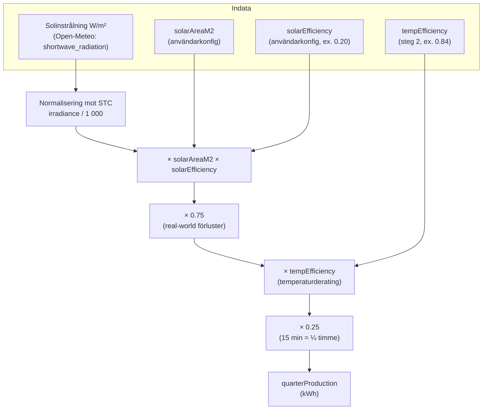

#### Konstantsammanfattning

| Konstant | Värde | Standard / Källa |
|---|---|---|
| `SOLAR_REAL_WORLD_EFFICIENCY` | 0.75 | Branschstandard (kabel + växelriktare + smuts) |
| `PANEL_TEMP_COEFFICIENT` | −0.0045 / °C | IEC 61724, kristallint kisel |
| `PANEL_TEMP_AT_STANDARD_TEST` | 25 °C | STC (Standard Test Conditions) |
| `WIND_COOLING_FACTOR` | 0.04 | NOCT-kalibrerat konvektiv kylkoefficient |
| NOCT-referens | 45 °C vid 800 W/m², 20 °C luft | IEC 61215 |
| `tempEfficiency` klämning | [0.70, 1.10] | Undviker modellextrapolering |

**Implementering:** `src/compute/Compute.c` — `CalculatePanelTemperature()` (rad 47–54) och `Compute_GenerateEnergyPlan()` (rad 252–262)

---

## 15. C++ Client — RAII, STL och C/C++-gränssnittet

### Varför C++ för klienten men C för servern?

GridGuard är ett hybridprojekt med ett tydligt arkitekturellt gränssnitt:

| Komponent | Språk | Motivering |
|---|---|---|
| Watchdog, Server, Fetcher, Parser | C | Maximal kontroll över processhantering, IPC, minnesmodell; zero overhead; POSIX-APIs är C-nativa |
| GridGuard-client (`bin/GridGuard-client`) | C++ | Demonstrerar RAII, STL och undantagssäkerhet för resurshanterings-primitiver; klienten har inte serverns hårda latens-/minneskrav |

**Gränssnittet** (`UserConfigWrapper`) hanterar konvertering mellan C++-objekt och C-structs, vilket visar hur de två språken kan samexistera i ett projekt utan att blanda paradigm i samma fil.

### Klassdiagram

```mermaid
classDiagram
    class SocketGuard {
        -int fd
        +SocketGuard(int socket)
        +~SocketGuard()
        +get() int
        +release() int
        +SocketGuard(const SocketGuard&) = delete
        +operator=(const SocketGuard&) = delete
    }

    class HttpClient {
        -std::unique_ptr~char[]~ buffer
        -std::vector~std::string~ headers
        +HttpClient(host, port)
        +get(path) std::string
        +post(path, body) std::string
        -parseResponse() void
    }

    class GridGuardClient {
        -HttpClient client
        -std::string token
        +GridGuardClient(host, port, token)
        +getForecast() json
        +getUserConfig() json
        +setUserConfig(config) void
    }

    class UserConfigWrapper {
        +toC() UserConfig*
        +fromC(UserConfig*) void
    }

    SocketGuard --o HttpClient : används av
    HttpClient --o GridGuardClient : ägs av
    UserConfigWrapper ..> GridGuardClient : används av
```

### RAII — SocketGuard (Rule of Five)

```cpp
class SocketGuard {
    int fd;
public:
    explicit SocketGuard(int socket) : fd(socket) {}
    ~SocketGuard() { if (fd >= 0) close(fd); }  // Automatisk cleanup

    // Rule of Five: kopiera/flytta förbjudet — socket-ägandeskap är unikt
    SocketGuard(const SocketGuard&)            = delete;
    SocketGuard& operator=(const SocketGuard&) = delete;
    SocketGuard(SocketGuard&&)                 = delete;
    SocketGuard& operator=(SocketGuard&&)      = delete;

    int get()     const { return fd; }
    int release()       { int tmp = fd; fd = -1; return tmp; }
};
```

`SocketGuard` garanterar att socket-deskriptorn stängs vid scope exit — även om ett undantag kastas. `release()` möjliggör ägandeöverlåtelse när det behövs.

### STL-användning

| Container / Smart pointer | Användning | Vecka |
|---|---|---|
| `std::unique_ptr<char[]>` | Nätverksbuffert — automatisk frigöring | 9 |
| `std::vector<std::string>` | Dynamisk lista med HTTP-headers | 9 |
| `std::map<std::string, std::string>` | JSON-parsing av nyckel-värde-par | 9 |
| `std::string` | All stränghantering — inga manuella `strlen`/`strcpy` | 9 |
| Range-based for | Iteration över headers och JSON-fält | 9 |
| `std::move` | Effektiv resursöverföring av buffertar | 9 |

### Undantagssäkerhet

- `HttpClient` kastar `std::runtime_error` vid nätverksfel
- RAII garanterar att sockets stängs även om undantag kastas
- *Strong exception guarantee*: en operation lyckas helt eller inte alls — aldrig halvt

Implementering: `src/client/HttpClient.cpp`, `src/client/GridGuardClient.cpp`, `src/client/SocketGuard.hpp`

---

## 16. Prestanda och Optimering

Profileringsarbetet genomfördes i vecka 10 med `gprof`, `clock_gettime(CLOCK_MONOTONIC)` och Valgrind. Resultaten dokumenterades i `docs/profiling/PROFILING_REPORT.md` och styrde de optimeringar som implementerades i vecka 11.

### Identifierade flaskhalsar (PROFILING_REPORT sektion 7)

| Prioritet | Komponent | Flaskhals | Åtgärd |
|---|---|---|---|
| **1** | Forecast pipeline | Ingen cache — varje request körde full API-fetch (1–2 s) | Cache short-circuit implementerad |
| **2** | Compute | Kompilatoroptimeringar inte aktiverade (`-O0` i debug) | Aktiverade `-O2` i produktionsbygget |
| 3 | Queue | Mutex-contention vid 4p/1c (302k ops/sek) | Acceptabelt — pipeline kör 1p/1c |
| 4 | Cache | Linear scan O(N) vid lookup | Acceptabelt vid N=16 |

### Optimering 1 — Cache Short-Circuit

**Problem (identifierat via profilering):** Varje `/forecast`-request körde en komplett API-fetch-pipeline: HTTPS mot Open-Meteo + HTTPS mot elprisetjustnu + JSON-parsning + beräkning. Total latens: **1–2 sekunder per request**.

**Åtgärd:** SharedCache med TTL-baserad ogiltigförklaring. Vid cache-träff returneras forecast-JSON direkt utan att röra pipeline.

| Mätpunkt | Före | Efter | Förbättring |
|---|---|---|---|
| Latens vid cache-träff | 1 000–2 000 ms | ~2 ms | **400–1000×** |
| Latens vid cache-miss | 1 000–2 000 ms | 1 000–2 000 ms | — (oförändrat) |
| Andel cache-träffar (normal drift) | 0% | ~95% | — |

*Källa: `docs/Changelog/CHANGELOG_2026-03-09.md`*

### Optimering 2 — Kompilatoroptimering (-O0 → -O2)

**Problem (identifierat via gprof):** `Compute_GenerateEnergyPlan` stod för 100% av CPU-tid i compute-modulen. Benchmarks med `-O0` visade hög p99-latens (29.51 µs) med stora spikar.

**Åtgärd:** Aktiverade `-O2 -DNDEBUG` i produktionsbygget (`make release`). Effekter: function inlining, loop unrolling, dead code elimination.

#### Scenario 1 — Realistisk prognos (sinusformad sol + prisökning)

| Mätning | `-O0` (ingen opt.) | `-O2` (produktion) | Förbättring |
|---|---|---|---|
| avg | 3.22 µs | 2.10 µs | **1.53×** |
| p50 | 2.32 µs | 1.60 µs | 1.45× |
| p99 | 29.51 µs | 8.38 µs | **3.52×** |
| Genomströmning | 310 439 plan/sek | 476 792 plan/sek | **+54%** |

#### Scenario 2 — Worst-case (alternerande priser, fullt array)

| Mätning | `-O0` | `-O2` | Förbättring |
|---|---|---|---|
| avg | 2.27 µs | 1.56 µs | 1.45× |
| p99 | 23.87 µs | 3.89 µs | **6.14×** |
| Genomströmning | 440 368 plan/sek | 640 325 plan/sek | **+45%** |

*Källa: `docs/profiling/PROFILING_REPORT.md` sektion 8*

### Systemets totala prestanda (efter optimeringar)

| Komponent | Genomströmning | Latens (avg) | Marginal mot krav |
|---|---|---|---|
| Compute (realistisk) | 476 792 plan/sek | 2.10 µs | **7 000 000×** (ny plan behövs var 15 min) |
| Queue (1p/1c pipeline) | 625 133 ops/sek | 1.60 µs | Mer än tillräckligt |
| SharedCache (concurrent) | 2 457 106 lookups/sek | 1.29 µs | Mer än tillräckligt |

**Valgrind-resultat:** 0 heap-läckor, 0 use-after-free, 0 invalid reads/writes i produktionskod.

---

## 17. Testtäckning

GridGuard har ett fullständigt testsvit byggt med Google Test (CMake + FetchContent). Testerna körs automatiskt med AddressSanitizer (ASAN) och UndefinedBehaviorSanitizer (UBSAN) i debug-builds.

### Testöversikt

```
Total: 163 tester
├── Unit (15 sviter):
│   ├── Logger:              7 tester   — grundläggande infrastruktur
│   ├── HTTPRequest:         8 tester   — HTTP/1.1-parsning
│   ├── HTTPResponse:       13 tester   — HTTP-svar med Content-Length
│   ├── ConfigParser:        5 tester   — INI-filparsning
│   ├── RestartPolicy:      11 tester   — exponentiell backoff och rate limiting
│   ├── LoadScheduler:      14 tester   — energioptimering, EV-laddning, spotpriser
│   ├── Queue:              16 tester   — concurrent stress (multi-producer/consumer)
│   ├── JWT:                11 tester   — tokenutfärdande och signaturvalidering
│   ├── RuntimeConfig:       9 tester   — config-fil → env-var → default fallback
│   ├── APIEndpoints:       15 tester   — URL-konstruktion, DST-gränser, datumformat
│   ├── Compute:             9 tester   — BUY/SELL/AVOID/IDLE-signallogik
│   ├── WorkCompletion:      5 tester   — signal/wait-primitiv
│   ├── Heartbeat:           8 tester   — pipe-baserad healthcheck
│   ├── ScheduleDB:          8 tester   — SQLite CRUD (in-memory)
│   └── UserConfigDB:        7 tester   — SQLite upsert/retrieve (in-memory)
│
└── Integration (2 sviter):
    ├── ProcessPipeline:     8 tester   — fork()/exec() gräns, heartbeat IPC
    └── ChaosWatchdog:       9 tester   — SIGKILL chaos engineering
```

### Integrationstester — ProcessPipeline

Testar det faktiska `fork()`/`exec()`-gränssnittet som gör GridGuard till ett multi-processsystem — inte mocked IPC utan riktiga child-processer:

- Child skickar heartbeat-beat → `Heartbeat_Check` returnerar 1
- Död process (stängd pipe) detekteras via EOF
- Fryst process (pipe öppen, inga beats) detekteras via timeout
- Spawn och `waitpid` på tre simultana processer (server/fetcher/parser-analogi)
- Kill → restart-cykel med `RestartPolicy`-spårning
- Watchdog övervakar tre processer via oberoende heartbeat-pipes

### Chaos Engineering — ChaosWatchdog

Simulerar worst-case scenarios som kerneln kan orsaka (OOM-killer, operatör kill -9):

- SIGKILL kan inte ignoreras (till skillnad från SIGTERM)
- SIGKILL stänger automatiskt heartbeat-pipe (kernel-guaranteed)
- Fem SIGKILL-krascher i följd triggar rate limit
- Exponentiell backoff valideras efter varje krasch (2→4→8→16→32 s)
- Simultan kill av alla tre processer korrupterar inte watchdog-state
- Komplett crash → heartbeat → SIGKILL → restart-cykel

**Implementationsdetalj:** `spawnSleeper()` använder en ready-pipe för synkronisering — föräldern väntar tills barnet installerat `SIG_IGN` innan SIGTERM skickas. Eliminerar race condition som orsakade flaky tests.

### Sanitizers och verktyg

| Verktyg | Kommando | Resultat |
|---|---|---|
| ASAN + UBSAN | `make test-gtest` | 163/163 — inga minnesproblem |
| ThreadSanitizer | `make test-tsan` | 163/163 — **0 race conditions** |
| Helgrind | `make test-valgrind` (+ helgrind) | **0 errors** |
| Valgrind memcheck | `make test-valgrind` | **0 leaks** |

```bash
make test-gtest    # Alla 163 Google Tests med ASAN/UBSAN
make test-tsan     # Alla tester med ThreadSanitizer
make test-valgrind # Unit-tester under Valgrind memcheck
make clean-gtest   # Rensa CMake build-katalog
make clean-tsan    # Rensa TSan build-katalog
```

**CMake-konfiguration:** Tester byggs med `cmake -S . -B build -DCMAKE_BUILD_TYPE=Debug`. Google Test hämtas automatiskt via `FetchContent` (v1.14.0).

Fullständig dokumentation: `tests/README.md`

---

## 18. CI/CD — Automatisk Validering

GridGuard använder GitHub Actions för kontinuerlig integration. Varje push till `development` eller `master` — och varje pull request mot dessa grenar — triggar automatiskt en pipeline som bygger alla binärer och kör hela testsviten.

[](https://github.com/allejako/GridGuard/actions/workflows/ci.yml)

### Pipeline-steg

```mermaid
flowchart LR
    PUSH["Push / Pull Request\n(development eller master)"]
    RUNNER["Ubuntu-runner\n(GitHub Actions)"]
    DEPS["Installera beroenden\nlibmbedtls-dev, libsqlite3-dev\ncmake, libgtest-dev"]
    BUILD["make all\nBygger alla 6 binärer"]
    CMAKE["cmake -S . -B build\n-DCMAKE_BUILD_TYPE=Debug"]
    TEST["ctest -V\n163 tester med ASAN + UBSAN"]
    PASS["Grön bock\nCommit validerad"]
    FAIL["Rött kryss\nExakt vilket test som bröts"]

    PUSH --> RUNNER --> DEPS --> BUILD --> CMAKE --> TEST
    TEST -->|Alla godkänns| PASS
    TEST -->|Något misslyckas| FAIL

    style PASS fill:#2d6a4f,color:#fff
    style FAIL fill:#e63946,color:#fff
```

### Vad som körs

| Steg | Kommando | Syfte |
|---|---|---|
| Build | `make all` | Kompilerar alla 6 binärer |
| CMake-konfiguration | `cmake -S . -B build -DCMAKE_BUILD_TYPE=Debug` | Sätter upp Google Test med ASAN/UBSAN |
| Testkörning | `cd build && ctest -V` | Kör alla 163 tester med sanitizers aktiverade |

### Pull Request-skydd

Om en PR mot `master` eller `development` skapas körs CI-pipelinen **automatiskt innan merge är möjlig**. Ett misslyckat test → röd bock på GitHub, exakt vilket test som bröts visas i loggen.

### Varför ASAN + UBSAN i CI?

| Sanitizer | Detekterar |
|---|---|
| **AddressSanitizer (ASAN)** | Heap overflow, use-after-free, stack overflow — minnesbuggar som inte syns i normal körning |
| **UndefinedBehaviorSanitizer (UBSAN)** | Signed integer overflow, null pointer dereference, misaligned access |

Dessa körs på **varje commit** — buggar som är svåra att reproducera lokalt fångas direkt i CI.

Körningshistorik och badge: `github.com/allejako/GridGuard/actions`

---

## 19. Loggning

Varje process loggar till sin egen fil:

| Process | Loggfil |
|---|---|
| Watchdog | `logs/watchdog.log` |
| Server | `logs/server.log` |
| Fetcher | `logs/fetcher.log` |
| Parser | `logs/parser.log` |

Loggnivåer: `DEBUG`, `INFO`, `WARNING`, `ERROR`, `FATAL`. Nivå sätts vid `Logger_Initiate()` per process.

---

## 20. Konfigurationssystem

GridGuard använder ett runtime konfigurationssystem med tre nivåer (fallback chain):

```
1. Runtime config file (config/gridguard.conf) — INI-format, valfri
2. Environment variables (t.ex. GRIDGUARD_DB_PATH) — överskrider config-fil
3. Compile-time defaults (src/domain/Config.h) — fallback om inget annat anges
```

### Startup & Reload

**Startup:**
```bash
bin/GridGuard-watchdog --config /path/to/custom.conf
```

Watchdog laddar config före fork/exec av child-processer och skriver sökvägen till `GRIDGUARD_CONFIG_PATH`. Varje barnprocess (Fetcher, Parser, Server) ärver miljövariabeln via `fork()` och anropar `RuntimeConfig_Load` direkt vid uppstart.

**Hot-reload (SIGHUP):**
```bash
kill -SIGHUP $(cat /tmp/gridguard.pid)
```

Server upptäcker SIGHUP i sin main loop och kallar `RuntimeConfig_Reload()`. Nya värden används för nästa operation (cache TTL, HTTP timeout, etc.). Ingen omstart krävs.

### Konfigurerbara värden

**[server]**
- `port` — TCP-lyssningsport (default: 8080)

**[database]**
- `db_path` — Sökväg till gridguard.db (default: auto-upplöst, env: `GRIDGUARD_DB_PATH`)

**[network]**
- `timeout` — HTTP-timeout i sekunder (default: 30)
- `max_retries` — Återförsök vid HTTP-fel (default: 3)

**[cache]**
- `weather_ttl` — Väder-cache TTL (default: 900s)
- `price_ttl` — Priscache TTL (default: 43200s)
- `forecast_ttl` — Prognos-cache TTL (default: 1800s)

JWT-hemligheten hanteras **enbart via miljövariabel** — lagras aldrig i config-filen:
```bash
export GRIDGUARD_JWT_SECRET="din-hemlighet"
```

### Thread Safety

Config-access är thread-safe via `pthread_rwlock`:
- Flera readers kan läsa config simultant
- Reload-operationer tar write-lås (blockerar tills alla readers är klara)
- Noll prestanda-overhead under normal drift

Se `docs/CONFIG_DESIGN.md` för fullständig designdokumentation.

---

## 21. Designbeslut och avvägningar

### Varför separata processer istället för trådar för Fetcher/Parser?

- **Isolation:** En krasch i Fetcher (t.ex. vid nätverksfel eller mallformad JSON) påverkar inte Server-processen
- **Oberoende körbara:** Fetcher och Parser kan kompileras, testas och deployas separat
- **IPC som kontrakt:** FIFOs och sockets tvingar fram explicita dataformat (WorkRequest, FetchResult, ParseResult) — inga oavsiktliga delade states

**Nackdel:** Kommunikation via FIFOs/sockets är dyrare än inter-thread communication. För GridGuard med typisk last (<10 req/min) är detta försumbart.

### Varför FIFO (named pipe) och inte Unix socket för Fetcher → Parser?

Named pipe passar bättre för enkel, enkelriktad dataström av fixa structs. Unix socket valdes för Parser → ComputeWorker eftersom ComputeWorker behöver kunna skilja på separata meddelanden (datagram-semantik).

### Varför dödar Watchdog alla processer vid en enskild krasch?

FIFOs är enkelriktade och blockerar. Om Fetcher dör har Parser ingen writer — `read()` returnerar EOF och Parser hänger eller avslutar sig ändå. En atomär omstart av hela gruppen är enklare och mer förutsägbar än att hantera partiella tillstånd.

### Minnesmodell för SharedCache

Cachen allokeras i POSIX shared memory (`shm_open` + `mmap`). Mutex/rwlock lagras *inuti* det delade minnessegmentet med `PTHREAD_PROCESS_SHARED`-attribut, så att alla processer kan använda samma lock utan att gå via kernel-calls som semaforer.

```
shm-segment layout:
┌──────────────────────────────────────┐
│  pthread_rwlock_t  lock              │  (i shared memory, process-shared)
│  int               count             │
│  time_t            ttl               │
│  CacheEntry[16]    entries[]         │
│    char  key[64]                     │
│    char  data[32768]                 │
│    time_t created_at                 │
└──────────────────────────────────────┘
```

---

## 22. Binärer och byggsystem

```
bin/
├── GridGuard          (launcher)
├── GridGuard-watchdog (supervisor)
├── GridGuard-server   (HTTP API)
├── GridGuard-fetcher  (datahämtning)
├── GridGuard-parser   (datavalidering)
└── GridGuard-client   (C++-klient, RAII + STL)
```

```bash
make clean && make all   # Fullständig rebuild (krävs efter header-ändringar)
make dev                 # Bygg + seed databaser + starta + generera token
make stop                # Graceful shutdown via SIGTERM
make test-gtest          # Alla 163 Google Tests med ASAN/UBSAN
make test-tsan           # Tester med ThreadSanitizer
make test-valgrind       # Tester under Valgrind memcheck
```

**OBS:** Makefilen använder inte `-MMD` dependency tracking. Kör alltid `make clean` efter ändringar i header-filer som påverkar struct-storlekar (annars riskeras heap corruption p.g.a. felaktig struct-layout i stale .o-filer).
