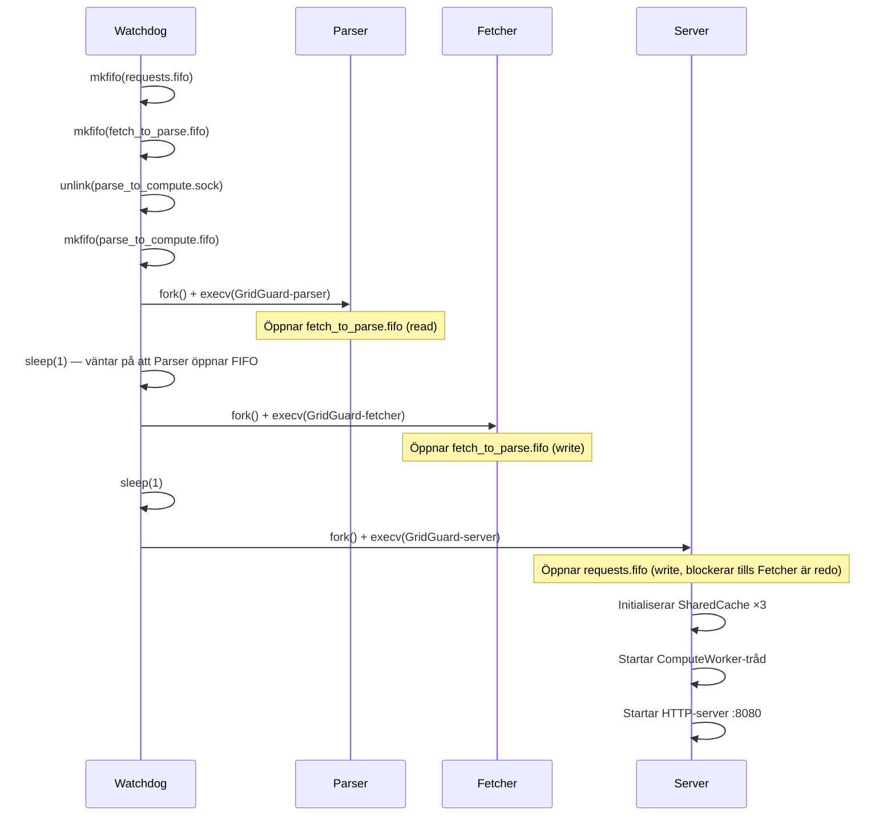
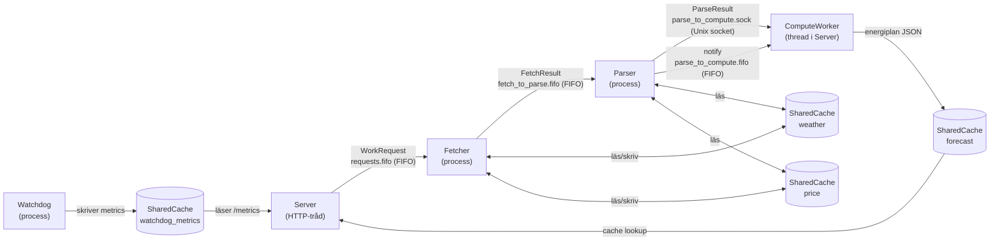
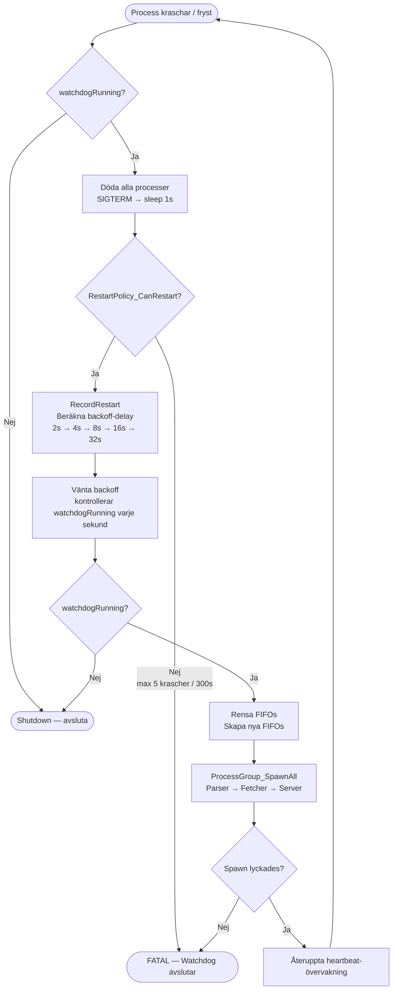

# GridGuard — Arkitektur och Systemdesign

**Local Energy Optimization Platform (LEOP)**

---

## 1. Process-hierarki

```
bin/GridGuard             (launcher — execv:ar watchdog direkt)
└── bin/GridGuard-watchdog (supervisor — äger alla processer)
    ├── bin/GridGuard-fetcher  (hämtar väder + spotprisdata)
    ├── bin/GridGuard-parser   (validerar och strukturerar rådata)
    └── bin/GridGuard-server   (HTTP API + energiberäkningar)
                └── [thread] ComputeWorker
```

**Launcher** (`src/main.c`) är en tunn wrapper som gör `execv` direkt på watchdog — den ersätter sig själv utan att lämna en extra process i trädet.

**Watchdog** är systemets rotprocess. Den:
- Skapar alla IPC-resurser (FIFOs, socket) innan processerna startas
- Forkar och exec:ar de tre child-processerna i rätt ordning
- Övervakar varje process via heartbeat-pipes
- Startar om hela gruppen vid krasj (med exponentiell backoff)
- Skriver processtatistik till POSIX shared memory (`/gridguard_watchdog_metrics`)
- Skriver PID-fil (`/tmp/gridguard.pid`)

**Server** äger inte längre sina child-processer — det gör Watchdog. Server initialiserar bara sin interna ComputeWorker-tråd och öppnar de IPC-resurser som Watchdog redan skapat.

---

## 2. Startsekvens



```
1. Watchdog startar
   └── Skapar IPC-resurser:
       ├── mkfifo /tmp/gridguard_requests.fifo        (Server → Fetcher)
       ├── mkfifo /tmp/gridguard_fetch_to_parse.fifo  (Fetcher → Parser)
       ├── unlink /tmp/gridguard_parse_to_compute.sock
       └── mkfifo /tmp/gridguard_parse_to_compute.fifo (Parser → Server notify)

2. Parser startas (öppnar FIFO read-end innan Fetcher försöker öppna write-end)
   └── sleep(1)

3. Fetcher startas
   └── sleep(1)

4. Server startas
   ├── Öppnar /tmp/gridguard_requests.fifo (O_WRONLY — blockerar tills Fetcher är redo)
   ├── Initialiserar SharedCache ×3 (weather, price, forecast)
   ├── Startar ComputeWorker-tråd (Unix socket-klient mot Parser)
   └── Startar HTTP-server på port 8080
```

---

## 3. IPC-kanaler



```
Server ──[FIFO: gridguard_requests.fifo]──► Fetcher
                   WorkRequest (struct, binär)

Fetcher ──[FIFO: gridguard_fetch_to_parse.fifo]──► Parser
                   FetchResult (struct, binär)

Parser ──[Unix socket: gridguard_parse_to_compute.sock]──► ComputeWorker
                   ParseResult (struct, binär)

Parser ──[FIFO: gridguard_parse_to_compute.fifo]──► ComputeWorker
                   Notify-signal (trigger för socket-läsning)

Watchdog ──[POSIX shm: /gridguard_watchdog_metrics]──► Server (/metrics endpoint)
                   WatchdogMetrics (struct, read-only från server)

Server ──[POSIX shm: /gridguard_weather]──► Fetcher/Parser (SharedCache)
Server ──[POSIX shm: /gridguard_price]───► Fetcher/Parser (SharedCache)
Server ──[POSIX shm: /gridguard_forecast]─► (forecast-cache, intern)
```

**Varför FIFO och inte anonym pipe?**
Watchdog startar processerna som oberoende exec:ade binärer. Anonyma pipes ärvs bara vid fork+exec i samma process — Watchdog måste använda namngivna FIFOs för att processerna ska kunna hitta varandra utan att dela file descriptors via arv.

---

## 4. Heartbeat-mekanism

Varje child-process får en anonym pipe vid fork:en via miljövariabeln `GRIDGUARD_HEARTBEAT_FD`. Processen skriver periodiskt till denna pipe för att signalera att den lever.

```
Watchdog                          Child-process
   |                                   |
   |── pipe() ──────────────────────── |
   |   read_fd (watchdog behåller)     |
   |   write_fd (ärvsett av child) ────► setenv("GRIDGUARD_HEARTBEAT_FD", fd)
   |                                   |
   |── poll(read_fd, 2s) ◄──────────── write(write_fd, "hb", 2)
   |   timeout = ingen heartbeat       |
```

**Timeout-hantering:** Om en process inte skickat heartbeat på `HEARTBEAT_TIMEOUT` sekunder klassar Watchdog den som fryst (`FROZEN`) och dödar hela processgruppen innan omstart.

---

## 5. Restart Policy

| Parameter | Värde |
|---|---|
| Max omstarter | 5 |
| Tidsfönster | 300 sekunder |
| Backoff-strategi | Exponentiell: 2s → 4s → 8s → 16s → 32s (max) |

Vid krasj dödar Watchdog **alla** processer (inte bara den kraschade) och startar om hela gruppen. Anledning: processerna är sammankopplade via FIFOs — om Fetcher kraschar har Parser ingen write-end att läsa ifrån, vilket leder till ett hängt tillstånd ändå.

**Resetlogik:** Om inga krascher sker på 300 sekunder nollställs räknaren. En stabil körning kan alltså hålla 5 omstarter per 5-minutersfönster utan att systemet ger upp.

```c
// Exponentiell backoff (RestartPolicy.c)
int delay = base_backoff_sec;        // 2
for (int i = 0; i < count - 1; i++) // Dubblar för varje restart
    delay *= 2;                      // cap vid 32s
```



---

## 6. Signalhantering (Watchdog)

| Signal | Effekt |
|---|---|
| `SIGTERM` / `SIGINT` | Graceful shutdown: vidarebefordrar SIGTERM till alla child-processer, väntar 3s, sedan SIGKILL |
| `SIGHUP` | Vidarebefordrar SIGHUP till alla child-processer (reload-signal) |
| `SIGUSR1` | Loggar processtatusrapport (PIDs, heartbeat-ålder, restart-räknare) |
| `SIGUSR2` | Manuell omstart av alla processer (triggar samma flöde som krasj-omstart) |

```bash
kill -USR1 $(cat /tmp/gridguard.pid)   # Statusrapport i watchdog.log
kill -USR2 $(cat /tmp/gridguard.pid)   # Manuell omstart
```

---

## 7. Shared Memory — Cacher

Tre SharedCache-instanser används för att dela data mellan processer utan att gå via nätverk eller disk:

| Namn (shm) | Innehåll | Producent | Konsument |
|---|---|---|---|
| `/gridguard_weather` | Väderdata (JSON, TTL-baserad) | Fetcher | Parser |
| `/gridguard_price` | Spotprisdata (JSON, TTL-baserad) | Fetcher | Parser |
| `/gridguard_forecast` | Beräknad energiprognos (JSON) | ComputeWorker | Server (HTTP-svar) |
| `/gridguard_watchdog_metrics` | Processtatistik | Watchdog | Server (`/metrics`) |

**Synkronisering:** SharedCache använder `pthread_rwlock` lagrad i shared memory — flera readers kan läsa parallellt, writers får exklusivt lås. Watchdog metrics är read-only från serverns sida (inga lås krävs vid läsning av atomära värden).

**TTL:** Vädercachen och priscachen har en Time-To-Live. Vid cache miss kör servern hela pipeline (Fetch → Parse → Compute) synkront och lagrar resultatet.

---

## 8. Server-intern pipeline (per HTTP-request)

```
HTTP-request (/forecast)
    │
    ▼
ClientHandler::HandleForecast()
    │
    ├── SharedCache_Lookup() ──► HIT: returnera cachat JSON direkt
    │
    └── MISS:
        ├── WorkCompletion_Initiate()     (skapar condition variable)
        ├── RegisterCompletion(userId)    (registrerar i CompletionRegistry)
        ├── write(requestFifo, WorkRequest)  ──► Fetcher
        │
        │   [asynkron pipeline: Fetcher → Parser → ComputeWorker]
        │
        └── WorkCompletion_Wait()         (blockerar HTTP-tråden, timeout 30s)
            │
            ▼
        SharedCache_Store() + HTTP-svar
```

**Trådmodell:** Servern hanterar varje HTTP-klient i en separat tråd (ThreadPool). ComputeWorker är en dedikerad bakgrundstråd som lyssnar på Parser-notifieringar. `CompletionRegistry` är en mutex-skyddad map `userId → WorkCompletion*` som kopplar ihop HTTP-tråden med ComputeWorker-tråden.

---

## 9. Designbeslut och avvägningar

### Varför separata processer istället för trådar för Fetcher/Parser?

- **Isolation:** En krasch i Fetcher (t.ex. vid nätverksfel eller mallformad JSON) påverkar inte Server-processen
- **Oberoende körbara:** Fetcher och Parser kan kompileras, testas och deployas separat
- **IPC som kontrakt:** FIFOs och sockets tvingar fram explicita dataformat (WorkRequest, FetchResult, ParseResult) — inga oavsiktliga delad state

**Nackdel:** Kommunikation via FIFOs/sockets är dyrare än inter-thread communication. För GridGuard med typisk last (<10 req/min) är detta försumbart.

### Varför FIFO (named pipe) och inte Unix socket för Fetcher → Parser?

Named pipe passar bättre för enkel, enkelriktad dataström av fixa structs. Unix socket valdes för Parser → ComputeWorker eftersom ComputeWorker behöver kunna skilja på separata meddelanden (datagram-semantik).

### Varför dödar Watchdog alla processer vid en enskild krasj?

FIFOs är enkelriktade och blockerar. Om Fetcher dör har Parser ingen writer — `read()` returnerar EOF och Parser hänger eller avslutar sig ändå. En atomär omstart av hela gruppen är enklare och mer förutsägbar än att hantera partiella tillstånd.

### Minnesmodell för SharedCache

Cachen allokeras i POSIX shared memory (`shm_open` + `mmap`). Mutex/rwlock lagras *inuti* det delade minnessegmentet med `PTHREAD_PROCESS_SHARED`-attribut, så att alla processer kan använda samma lock utan att gå via kernel-calls som semaforer.

```
shm-segment layout:
┌──────────────────────────────────────┐
│  pthread_rwlock_t  lock              │  (i shared memory, process-shared)
│  int               count             │
│  time_t            ttl               │
│  CacheEntry[16]    entries[]         │
│    char  key[64]                     │
│    char  data[32768]                 │
│    time_t created_at                 │
└──────────────────────────────────────┘
```

---

## 10. Loggning

Varje process loggar till sin egen fil:

| Process | Loggfil |
|---|---|
| Watchdog | `logs/watchdog.log` |
| Server | `logs/server.log` |
| Fetcher | `logs/fetcher.log` |
| Parser | `logs/parser.log` |

Loggnivåer: `DEBUG`, `INFO`, `WARNING`, `ERROR`, `FATAL`. Nivå sätts vid `Logger_Initiate()`.

---

## 11. Binärer och byggsystem

```
bin/
├── GridGuard          (launcher)
├── GridGuard-watchdog (supervisor)
├── GridGuard-server   (HTTP API)
├── GridGuard-fetcher  (datahämtning)
├── GridGuard-parser   (datavalidering)
└── GridGuard-client   (C++-klient, RAII + STL)
```

```bash
make clean && make all   # Fullständig rebuild (krävs efter header-ändringar)
make dev                 # Bygg + seed databaser + starta + generera token
make stop                # Graceful shutdown via SIGTERM
```

**OBS:** Makefilen använder inte `-MMD` dependency tracking. Kör alltid `make clean` efter ändringar i header-filer som påverkar struct-storlekar (annars riskeras heap corruption p.g.a. felaktig struct-layout i stale .o-filer).
