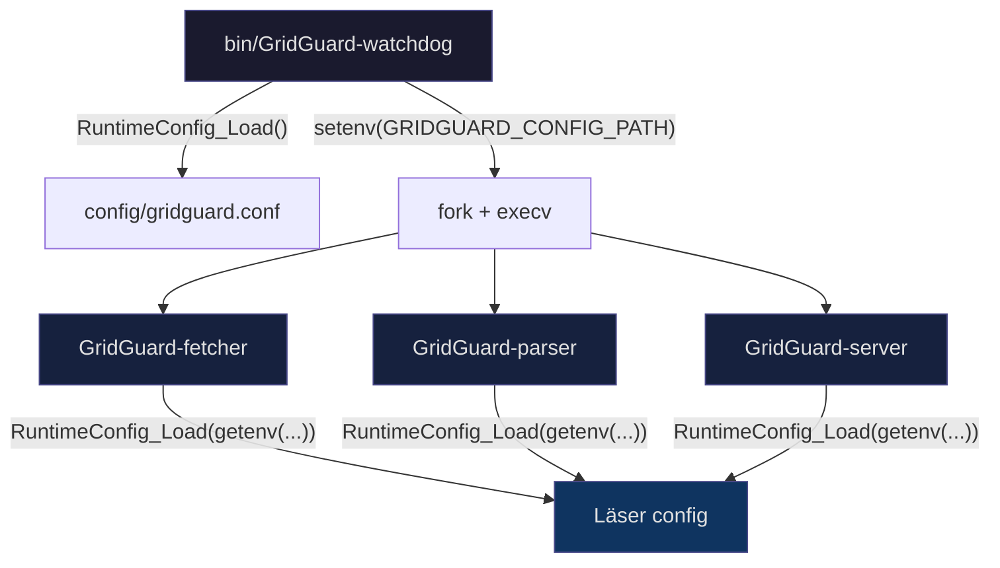

# Konfigurationssystem

## Översikt

Konfigurationen läses från en INI-fil vid uppstart, lagras i minnet och skyddas av en read/write-lock. Varje nyckel löses upp i tre steg — det första träffen vinner:

```
config/gridguard.conf  →  miljövariabel  →  kompilerad default
```

Ingen config-fil krävs. Alla nycklar har fungerande defaults.

---

## Flöde



Watchdog laddar config-filen och skriver sökvägen till `GRIDGUARD_CONFIG_PATH`. Barnprocesserna (Fetcher, Parser, Server) ärver miljövariabeln via `fork()` och laddar config-filen själva direkt när de startar.

---

## Komponenter

**ConfigParser** (`src/config/ConfigParser.c/h`)
- Lättviktig INI-parser — sektioner, `#`-kommentarer, whitespace-trimning
- Nycklar lagras internt som `sektion.nyckel`

**RuntimeConfig** (`src/config/RuntimeConfig.c/h`)
- Singleton (`g_config`), trådsäker via `pthread_rwlock`
- Stödjer hot-reload via SIGHUP utan omstart

---

## Konfigurationsfilformat

```ini
# ── Server ────────────────────────────────────────────────────────────────────
[server]
port = 8080

# ── Databas ───────────────────────────────────────────────────────────────────
[database]
# db_path = /var/lib/gridguard/gridguard.db

# ── Cache TTL (sekunder) ──────────────────────────────────────────────────────
[cache]
weather_ttl  = 900
price_ttl    = 43200
forecast_ttl = 1800

# ── Nätverk ───────────────────────────────────────────────────────────────────
[network]
timeout     = 30
max_retries = 3
```

---

## Nycklar

| Nyckel | Miljövariabel | Default | Beskrivning |
|--------|--------------|---------|-------------|
| `server.port` | — | `8080` | TCP-lyssningsport |
| `database.db_path` | `GRIDGUARD_DB_PATH` | auto | Sökväg till gridguard.db |
| `cache.weather_ttl` | — | `900` | Väder-cache, 15 min |
| `cache.price_ttl` | — | `43200` | Priscache, 12 h |
| `cache.forecast_ttl` | — | `1800` | Prognos-cache, 30 min |
| `network.timeout` | — | `30` | HTTP-timeout i sekunder |
| `network.max_retries` | — | `3` | Återförsök vid HTTP-fel |

> **JWT-hemligheten lagras aldrig i config-filen.** Sätt den via miljövariabel:
> ```bash
> export GRIDGUARD_JWT_SECRET="din-hemlighet"
> ```

---

## Hot-reload

Ladda om config utan att starta om systemet:

```bash
kill -SIGHUP $(cat /var/run/gridguard.pid)
```

Watchdog fångar signalen och anropar `RuntimeConfig_Reload()`. Barnprocesserna påverkas inte — starta om dem om config-ändringar ska nå Fetcher, Parser eller Server.

Anpassad config-sökväg:

```bash
bin/GridGuard-watchdog --config /path/to/gridguard.conf
```

---

## Trådsäkerhet

Alla läsningar tar `pthread_rdlock` — flera trådar kan läsa samtidigt utan att blockera varandra. Reload tar `pthread_wrlock` och väntar tills aktiva läsare är klara. Overhead per läsning är försumbar.

---

## Tester

```bash
make test-gtest
```

`tests/unit/test_config_parser_gtest.cpp` — 13 testfall för parsing, sektionshämtning, fallback-kedja och edge cases.
