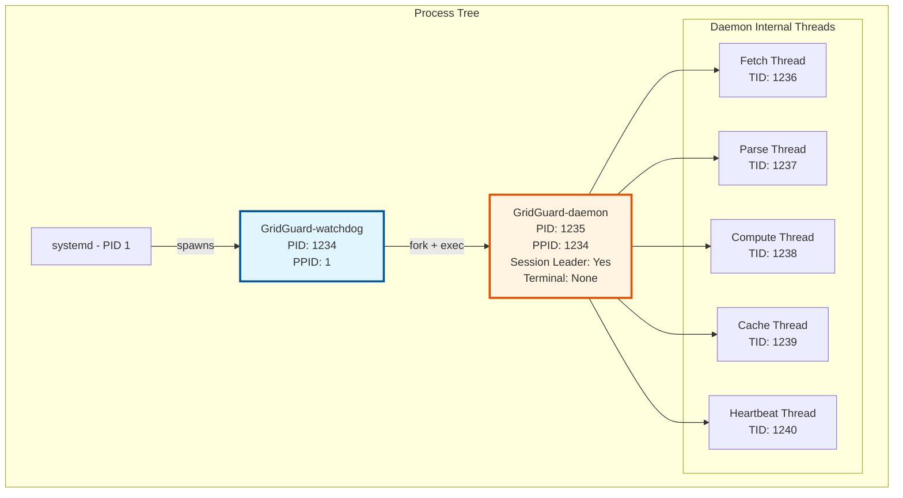
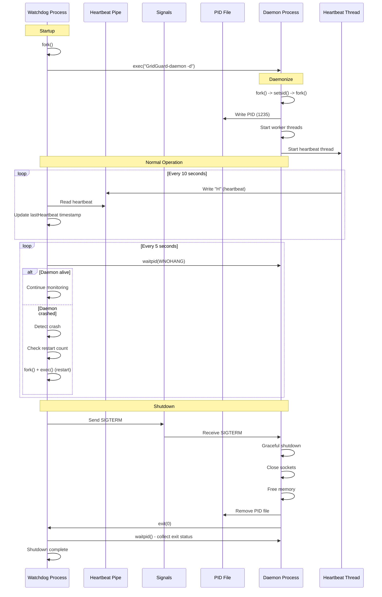
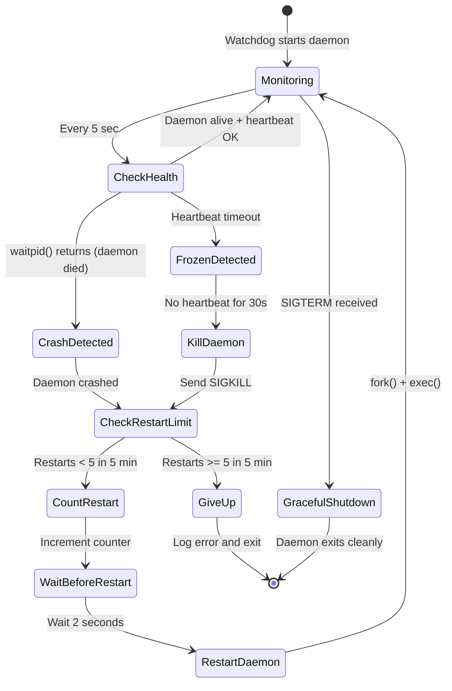

# Daemon & Watchdog - Implementation Guide

*Uppdaterad: 2026-02-17*

---

## Varför processer?

Vi har byggt GridGuard som en multi-threaded server där allt körs i samma process med flera trådar. Det funkar bra för utveckling, men vi missar stora delar av kursen - nämligen processhantering och kommunikation mellan processer.

Dessutom finns det praktiska problem med hur systemet fungerar just nu:

- **Måste köra i terminal** - Om vi stänger terminalen så dör servern
- **Ingen automatisk omstart** - Om servern kraschar måste någon manuellt starta om den
- **Saknar process-IPC** - Vi använder bara trådar och mutexes, inte pipes eller signaler mellan processer

Genom att lägga till daemon-funktionalitet och en watchdog-process får vi både ett mer robust system och täcker in viktiga kursmål kring fork, exec, wait, pipes och signaler.

---

## Systemarkitektur med Daemon & Watchdog

### Översikt - Komplett system

```mermaid
graph TB
    subgraph "System Boot / Init"
        INIT[systemd/init]
    end

    subgraph "Watchdog Process (PID 1234)"
        WD[Watchdog Main Loop]
        WD_FORK[fork + exec]
        WD_WAIT[waitpid monitoring]
        WD_RESTART[Restart Logic]
    end

    subgraph "Daemon Process (PID 1235)"
        DAEMON[GridGuard Daemon]
        DAEMON_INIT[Daemon_Init]

        subgraph "Server Components"
            TCP[TCP Server]
            TPOOL[ThreadPool]
        end

        subgraph "Worker Threads"
            FETCH[Fetch Thread]
            PARSE[Parse Thread]
            COMPUTE[Compute Thread]
            CACHE[Cache Thread]
        end

        HB_THREAD[Heartbeat Thread]
    end

    subgraph "Client Connections"
        CLIENT1[Client 1]
        CLIENT2[Client 2]
        CLIENT3[Client N...]
    end

    subgraph "IPC Mechanisms"
        PIPE[Pipe - Heartbeat]
        SIGNALS[Signals - Control]
        PIDFILE[/var/run/gridguard.pid]
    end

    INIT -->|starts| WD
    WD -->|fork| WD_FORK
    WD_FORK -->|exec| DAEMON
    WD -->|monitors| WD_WAIT
    WD_WAIT -->|detects crash| WD_RESTART
    WD_RESTART -->|restarts| WD_FORK

    DAEMON --> DAEMON_INIT
    DAEMON_INIT -->|daemonize| DAEMON
    DAEMON --> TCP
    DAEMON --> TPOOL
    DAEMON --> FETCH
    DAEMON --> PARSE
    DAEMON --> COMPUTE
    DAEMON --> CACHE
    DAEMON --> HB_THREAD

    TCP --> CLIENT1
    TCP --> CLIENT2
    TCP --> CLIENT3

    HB_THREAD -.->|writes heartbeat| PIPE
    WD -.->|reads heartbeat| PIPE

    WD -.->|SIGTERM/SIGHUP| SIGNALS
    SIGNALS -.->|shutdown/reload| DAEMON

    DAEMON -->|writes PID| PIDFILE
    WD -->|reads PID| PIDFILE

    style WD fill:#e1f5ff
    style DAEMON fill:#fff4e1
    style PIPE fill:#e8f5e9
    style SIGNALS fill:#fce4ec
```

### Process-hierarki



### IPC och kommunikationsflöden



### Krasch och återhämtning



---

## Vad är en daemon?

En daemon är helt enkelt ett program som körs i bakgrunden utan att vara kopplat till en terminal. Tänk på alla systemtjänster i Linux - de startar vid boot, kör i bakgrunden och loggar till systemet istället för att skriva till terminalen.

### Hur en daemon fungerar

När ett vanligt program startar så är det kopplat till terminalen du körde det från. Om du stänger terminalen så dör programmet. En daemon lösgör sig från terminalen genom att göra följande:

1. **Forka sig själv** - Skapar en kopia av processen
2. **Parent avslutar** - Den ursprungliga processen avslutar, child fortsätter
3. **Bli session leader** - Med `setsid()` skapar processen en ny session utan terminal
4. **Forka igen** - För att garantera att processen inte kan återfå en terminal
5. **Byta working directory** - Oftast till `/` så man inte låser någon katalog
6. **Stänga file descriptors** - stdin, stdout, stderr stängs och omdirigeras till `/dev/null`
7. **Skriva PID-fil** - Så andra program kan hitta daemon-processen

Efter dessa steg kör processen helt fristående från terminalen. Man kan logga ut, stänga SSH-sessionen eller starta om terminalen - daemon fortsätter köra.

### PID-filen

En PID-fil är en enkel textfil som innehåller process-ID:t för daemon. Den brukar ligga i `/var/run/` eller `/tmp/`. Detta gör det enkelt för andra program (som watchdog) eller systemadministratörer att hitta och hantera daemon.

Exempel på innehåll i `/var/run/gridguard.pid`:
```
1234
```

Där 1234 är process-ID:t. Då kan man enkelt stoppa daemon med:
```bash
kill $(cat /var/run/gridguard.pid)
```

---

## Vad är en watchdog?

En watchdog är en separat process vars enda jobb är att övervaka en annan process (i vårt fall daemon) och starta om den om den kraschar.

### Varför behövs det?

Tänk dig att GridGuard körs på en Raspberry Pi i ett smarthus. Servern kraschar mitt i natten på grund av ett minnesfel eller dålig data från API:t. Utan watchdog ligger systemet nere tills någon manuellt startar om det nästa morgon. Med watchdog upptäcks kraschen inom några sekunder och systemet startar automatiskt om.

### Hur watchdog fungerar

Watchdog är väldigt enkel i sin grundform:

1. **Starta daemon** - Använder `fork()` och `exec()` för att starta daemon som en child-process
2. **Vänta på problem** - Använder `waitpid()` för att se om child-processen dör
3. **Reagera vid krasch** - Om daemon kraschar, starta om den
4. **Begränsa omstarter** - För att undvika att fastna i en crash-loop (typ max 5 omstarter på 5 minuter)

Det är som att ha någon som hela tiden kollar "lever fortfarande servern?" och säger "nä, den dog, jag startar om den".

### Heartbeat - är daemon verkligen igång?

Det räcker inte alltid att kolla om processen existerar. Den kan ha fastnat i en deadlock eller hängt sig utan att krascha. Därför kan man lägga till en "heartbeat" - daemon skickar regelbundet en signal till watchdog som säger "jag lever fortfarande och fungerar".

Om watchdog slutar få heartbeats så vet den att något är fel även om processen tekniskt sett fortfarande körs. Då kan den skicka SIGTERM för att stänga ner daemon och starta om den.

---

## Kommunikation mellan processer (IPC)

Det coola med att ha två separata processer är att de måste kommunicera på riktiga sätt - inte bara genom delat minne som trådar gör. Det ger oss chansen att använda flera IPC-metoder från kursen.

### Metod 1: Signals

Signaler är det enklaste sättet. Det är som att skicka ett kort meddelande till en annan process. I vårt fall:

- **SIGTERM** - "Stäng ner snyggt nu"
- **SIGHUP** - "Ladda om din konfiguration"
- **SIGUSR1** - Kan användas för heartbeat

Watchdog kan skicka signaler till daemon för att styra den. Daemon kan skicka SIGUSR1 tillbaka till watchdog som heartbeat.

**Fördelar:** Enkelt, standard Unix
**Nackdelar:** Kan bara skicka en bit information (vilken signal)

### Metod 2: Pipes

En pipe är som en rörledning mellan två processer. Data som skrivs i ena änden kan läsas från andra änden.

Innan watchdog forkar daemon kan den skapa en pipe. Efter fork har både watchdog och daemon access till pipen. Daemon kan då skriva heartbeat-meddelanden till pipen och watchdog läser dem.

**Fördelar:** Kan skicka faktisk data, inte bara signaler
**Nackdelar:** Lite mer komplex setup

### Metod 3: Unix Domain Sockets

För mer avancerad tvåvägskommunikation kan man använda Unix sockets. Det är som TCP-sockets men lokala till maskinen. Men för vårt use-case är signals och pipes fullt tillräckliga.

---

## Praktisk implementation - översikt

Så här skulle implementationen se ut i praktiken:

### Filstruktur

```
src/application/daemon/
  ├── Daemon.h          - API för daemon-funktioner
  ├── Daemon.c          - Daemonize-logik
  └── PidFile.h/c       - Hantera PID-filer

src/application/watchdog/
  ├── Watchdog.h        - Watchdog API
  ├── Watchdog.c        - Övervakningslogik
  └── main.c            - Watchdog entry point
```

### Daemon-komponenten

Daemon-delen läggs till i er befintliga server. När man startar servern med flaggan `-d` så daemoniserar den sig själv innan den fortsätter köra som vanligt.

Huvudfunktionen `Daemon_Init()` tar en config-struct och genomför alla steg för att bli en daemon. Resten av servern behöver inte ändras - den fortsätter bara köra som vanligt men nu i bakgrunden.

En viktig del är signal handlers. Daemon måste lyssna på:
- **SIGTERM** - Stäng ner gracefully
- **SIGHUP** - Ladda om config (kan implementeras senare)
- **SIGPIPE** - Ignorera (händer när klienter disconnectar)

### Watchdog-komponenten

Watchdog är ett helt separat program - `bin/GridGuard-watchdog`. Den startar daemon och sitter sedan i en loop:

```
while (true) {
    // Kolla om daemon har dött
    if (daemon_died) {
        // Kolla om vi redan startat om för många gånger
        if (too_many_restarts) {
            log("Giving up after 5 restarts");
            exit(1);
        }

        log("Daemon crashed, restarting...");
        restart_daemon();
    }

    // Kolla heartbeat (om implementerat)
    if (heartbeat_timeout) {
        log("No heartbeat, daemon may be frozen");
        kill_and_restart_daemon();
    }

    sleep(5);
}
```

Det finns lite mer logik för att hålla koll på restart-räknare och tidsstämplar, men det är grundidén.

---

## fork, exec och wait - vad händer egentligen?

Det här är kärnan i processhantering och exakt det kursen fokuserar på vecka 1.

### fork()

När watchdog anropar `fork()` skapas en exakt kopia av processen. Efter fork finns det två identiska processer som kör samma kod. Den enda skillnaden är att `fork()` returnerar olika värden:
- I parent (watchdog): child-processens PID
- I child: 0

Så kod kan se ut såhär:

```c
pid_t pid = fork();

if (pid < 0) {
    // Fork misslyckades
    handle_error();
} else if (pid == 0) {
    // Vi är child-processen
    do_child_stuff();
} else {
    // Vi är parent, pid innehåller child's PID
    do_parent_stuff();
}
```

### exec()

Efter fork har vi två identiska processer. Men watchdog vill inte köra watchdog-kod i child - den vill köra daemon. Det är där `exec()` kommer in.

`exec()` ersätter hela processen med ett nytt program. Det är som att ta skalet av den gamla processen och fylla det med ett nytt program.

```c
// execl() kör /path/to/daemon med argument
execl("/path/to/daemon", "daemon-name", "-d", NULL);

// Om exec lyckas kommer vi aldrig hit
// Koden nedan körs bara om exec misslyckades
perror("exec failed");
exit(1);
```

### wait och waitpid()

Efter fork vill parent (watchdog) veta när child (daemon) avslutar. Det gör man med `wait()` eller `waitpid()`.

`waitpid()` är bättre eftersom den kan vara icke-blockerande med flaggan `WNOHANG`:

```c
int status;
pid_t result = waitpid(daemon_pid, &status, WNOHANG);

if (result == 0) {
    // Child lever fortfarande
} else if (result > 0) {
    // Child har avslutat
    if (WIFEXITED(status)) {
        int exit_code = WEXITSTATUS(status);
        printf("Daemon exited with code %d\n", exit_code);
    } else if (WIFSIGNALED(status)) {
        int signal = WTERMSIG(status);
        printf("Daemon killed by signal %d\n", signal);
    }
}
```

Detta ger watchdog full information om vad som hände med daemon.

---

## Restart-logik och crash loops

En viktig detalj är att inte fastna i en crash-loop. Om daemon kraschar omedelbart vid start (typ för att en config-fil saknas) så vill vi inte att watchdog ska sitta och starta om den hundratals gånger per sekund.

Lösningen är en restart-räknare med ett tidsfönster:

- **Max 5 omstarter per 5 minuter**
- Om daemon kraschar 5 gånger på 5 minuter, ge upp
- Om det går mer än 5 minuter sedan första kraschen, resetta räknaren

På så sätt kan systemet hantera sporadiska krascher (dåligt API-svar, tillfälligt minnesfel) men ger upp vid permanenta problem (trasig config, missande dependencies).

---

## Systemd integration

I produktion skulle man normalt inte köra sin egen watchdog - man använder systemd som redan har watchdog-funktionalitet inbyggd.

Man skapar en service-fil som beskriver hur daemon ska köras:

**`/etc/systemd/system/gridguard.service`:**
```ini
[Unit]
Description=GridGuard Energy Optimization Daemon
After=network.target

[Service]
Type=forking
PIDFile=/var/run/gridguard.pid
ExecStart=/usr/local/bin/GridGuard-server -d
Restart=on-failure
RestartSec=5s

[Install]
WantedBy=multi-user.target
```

Sedan kan man hantera tjänsten med:
```bash
sudo systemctl start gridguard
sudo systemctl enable gridguard    # Auto-start vid boot
sudo systemctl status gridguard
```

Men för att visa förståelse för processhantering är det bättre att implementera en egen watchdog först. Sedan kan systemd-integration vara en bonus.

---

## Testning

För att testa implementationen finns några viktiga scenarion:

### Test 1: Normal start och stop
Starta watchdog, vänta lite, stoppa med Ctrl+C eller SIGTERM. Både watchdog och daemon ska stänga ner snyggt.

### Test 2: Krasch och återhämtning
Starta watchdog, hitta daemon-processens PID och döda den med `kill -9`. Watchdog ska upptäcka det inom några sekunder och starta om daemon.

### Test 3: Crash loop protection
Gör så daemon kraschar direkt (typ genom att returnera fel i main). Watchdog ska försöka starta om 5 gånger och sedan ge upp.

### Test 4: Graceful shutdown
Stoppa daemon med SIGTERM (`kill -TERM`) istället för SIGKILL. Daemon ska stänga ner ordentligt (stänga sockets, frigöra minne, ta bort PID-fil) och watchdog ska inte försöka starta om.

### Debugging-verktyg

- **`ps aux | grep GridGuard`** - Se vilka processer som kör
- **`pstree -p`** - Se process-hierarkin
- **`cat /var/run/gridguard.pid`** - Kolla PID-fil
- **`strace -f ./bin/GridGuard-watchdog`** - Se alla system calls
- **Log-filer** - Logga allt så man kan se vad som hände

---

## Vad det ger kursmässigt

Genom att implementera daemon och watchdog täcker ni följande från kursen:

**Vecka 1 - Processer:**
- fork() för att skapa child-processer ✓
- exec() för att köra nya program ✓
- wait/waitpid() för att hantera child-processer ✓
- Process-hierarkier och PID ✓
- Felhantering vid processkapande ✓

**Vecka 4 - IPC med pipes:**
- pipe() systemanropet ✓
- Kommunikation mellan processer ✓
- Hantera file descriptors vid fork ✓
- Stänga oanvända descriptors ✓

**Vecka 5 - Signaler:**
- Signal handlers (SIGTERM, SIGHUP, SIGUSR1) ✓
- Skicka signaler mellan processer ✓
- Graceful shutdown ✓

**Kursmål 8:**
"Använda IPC-lösningar för processkommunikation i systemnära program" - detta täcks fullt ut.

---

## Implementation i steg

Om ni ska implementera detta föreslår jag följande ordning:

### Steg 1: Daemon basics
Börja med att bara göra daemon-funktionaliteten. Lägg till `-d` flagga till servern och implementera `Daemon_Init()`. Testa att servern kan köra i bakgrunden och att ni kan stoppa den med PID-filen.

### Steg 2: Watchdog skelett
Skapa watchdog-programmet som kan starta daemon med fork+exec och vänta på den med waitpid. Inget fancy med restart än.

### Steg 3: Restart-logik
Lägg till krasch-detektering och automatisk omstart. Implementera restart-räknaren för att undvika crash-loops.

### Steg 4: Signal handling
Lägg till proper signal handlers i både daemon och watchdog. Testa graceful shutdown.

### Steg 5: Heartbeat (optional)
Om ni hinner, lägg till heartbeat med antingen signals eller pipes. Detta visar IPC på riktigt.

### Steg 6: Systemd (bonus)
Skriv en systemd service-fil och testa att köra via systemd istället.

---

## Slutsats

Daemon och watchdog är två relativt enkla komponenter som ger er:

1. **Ett mer professionellt system** - Kan köra i produktion som en riktig systemtjänst
2. **Robusthet** - Automatisk återhämtning vid problem
3. **Kursinnehåll** - Täcker processer och IPC som ni annars missar
4. **Praktisk erfarenhet** - Så här funkar faktiskt alla system-daemons i Linux

Det är inte mycket kod - kanske 300-400 rader totalt - men det visar förståelse för fundamentala Unix-koncept som fork, exec, wait, signals och pipes. Precis det kursen handlar om.

Lycka till!
