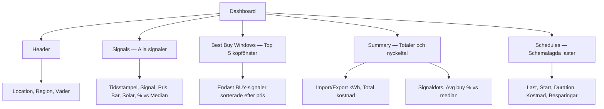
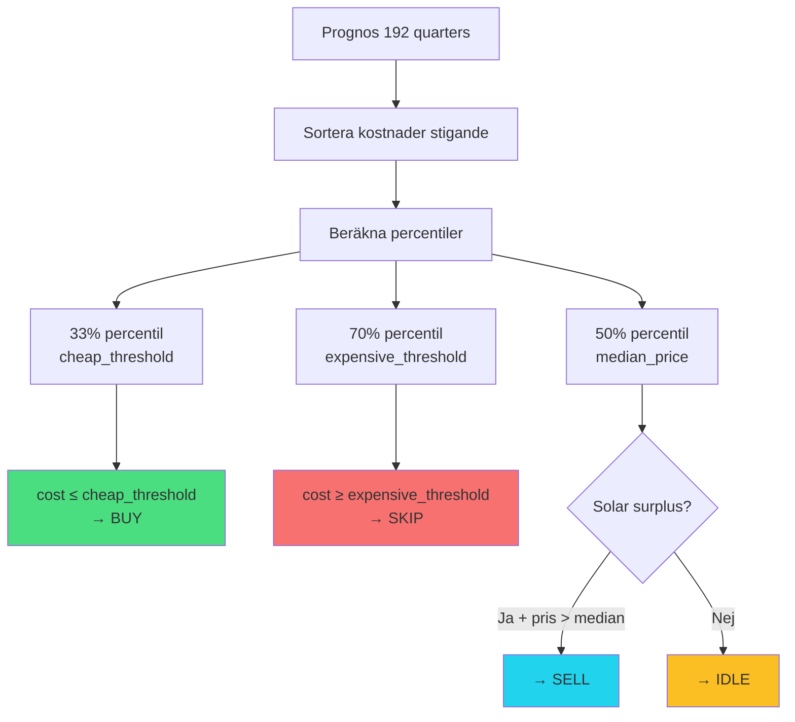
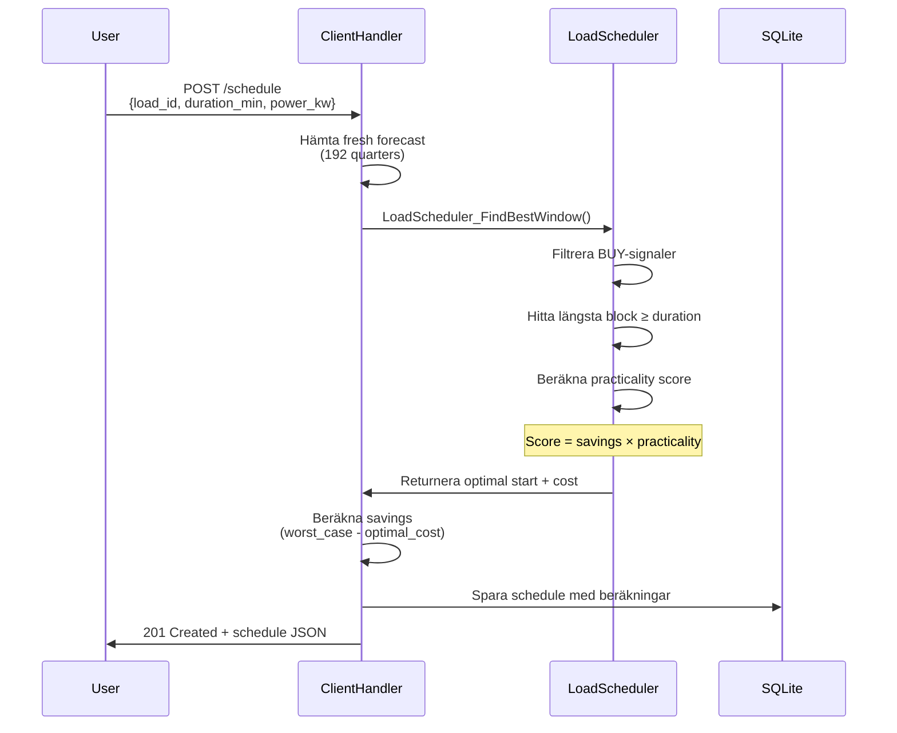
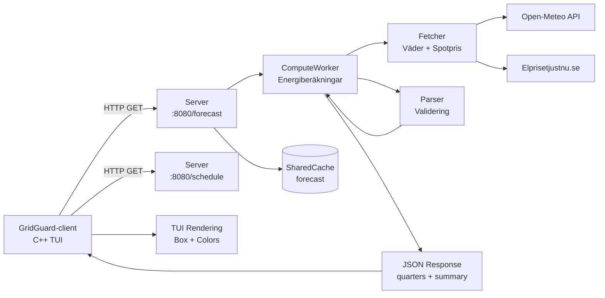

# GridGuard Dashboard — Användarmanual och Teknisk Dokumentation

## Översikt

GridGuard Dashboard är en terminal-baserad TUI (Text User Interface) som visualiserar energiprognoser och schemalagda laster i realtid. Systemet visar köp/sälj-signaler, solcellsproduktion, kostnader och optimala laddningstider för kommersiella fastigheter och industrilokaler.

```
╭──────────────────────────────────────────────────────────────────╮
│  GridGuard                                  13.1°C☀ 90.57 kW    |
│  SAAB_ARENA  SE3  Linköping                                      │
╰──────────────────────────────────────────────────────────────────╯
```

---

## Starta Dashboard

```bash
# Live-uppdatering var 60:e sekund
bin/GridGuard-client --token $TOKEN forecast --watch --interval 60

# Engångsvy utan auto-refresh
bin/GridGuard-client --token $TOKEN forecast
```

**Kontroller:**
- `Ctrl+C` — Avsluta
- Auto-refresh enligt `--interval` (default: 60s)
- Spinner-animation (⠙ → ⠹ → ⠸ → ⠼) visar att data hämtas

---

## Layout och Komponenter

Dashboard består av tre huvudsektioner:



---

## Sektion 1: Header

```
╭──────────────────────────────────────────────────────────────────╮
│  GridGuard                                   13.1°C  ☀ 90.57 kW  │
│  SAAB_ARENA  SE3  Linköping                                      │
╰──────────────────────────────────────────────────────────────────╯
```

**Komponenter:**
- **Location ID**: `SAAB_ARENA` (från JWT-token → databas)
- **Region**: `SE3` (elprisområde)
- **Stad**: `Linköping` (konfigurerad i `/user/config`)
- **Temperatur**: `13.1°C` (från Open-Meteo API)
- **Solikon**: `☀` (endast om solcellsdata finns)
- **Total solproduktion**: `90.57 kW` (summerad över hela prognosen)

**Datakälla:**
- Hämtas från `GET /forecast` endpoint
- Aggregeras från `quarters[]` array (192 entries × 15 min = 48 timmar)

---

## Sektion 2: Signals (Alla signaler)

```
│  Signals                                                         │
│                                                                  │
│  03-18 13:00  ▸ BUY   0.03 kr    ░░░░░░░░░░  109 kWh    -54.0%  │
│  03-18 15:00  ▸ BUY   0.39 kr    ██░░░░░░░░  6.90 kWh   -32.5%  │
│  03-18 16:15  ▸ SKIP  1.25 kr    ████████░░  4.96 kWh   +24.7%  │
```

**Kolumner:**

| Kolumn | Bredd | Beskrivning | Beräkning |
|--------|-------|-------------|-----------|
| **TIME** | 11 char | `MM-DD HH:MM` | Timestamp från `quarters[i].time` (ISO 8601 → lokal tid) |
| **SIGNAL** | 6 char | `▸ BUY`, `▸ SELL`, `▸ SKIP`, `▸ IDLE` | Klassificering från `Compute.c` baserat på percentiler |
| **PRICE** | 9 char | `X.XX kr` | `totalCostSekKwh` (totalkostnad inkl. skatter & moms) |
| **BAR** | 10 char | `██░░░░░░░░` | Visuell representation av pris (10 block-tecken) |
| **SOLAR** | 9 char | `X.XX kWh` | `solarKwh` (solcellsproduktion för kvarteret) |
| **VSAVG** | 7 char | `-37.3%` | `savingsVsMedian` (avvikelse från medianpris) |

### Signal-klassificering

Signaler genereras i `src/compute/Compute.c:215-326` med percentil-baserad algoritm:



**Klassificeringsregler:**

1. **BUY** (Grönt): `cost ≤ cheap_threshold` (billigaste 33%)
   - Optimal tid för tunga laster: elbilsflotta, HVAC-förvärmning, ismaskin (zamboni)
   - Negativa priser klassas alltid som BUY

2. **SKIP** (Rött): `cost ≥ expensive_threshold` (dyraste 30%)
   - Undvik icke-kritiska tunga laster
   - Typiskt vid topplast (07:00-09:00, 17:00-20:00)
   - Kritiska system (kyla, belysning under event) måste köras oavsett

3. **SELL** (Cyan): `cost > median + solar_surplus`
   - Högt pris + överskott från solceller
   - Endast relevant med batterilager

4. **IDLE** (Gult): Övriga perioder
   - Neutral tid — varken billigt eller dyrt

**Quality Filter (src/compute/Compute.c:200-213):**
- Minst 8% avvikelse från median krävs för signalkvalitet
- Förhindrar ogenomskinliga signaler vid platt priskurva

### Prisberäkning (totalCostSekKwh)

```c
// src/compute/Compute.c:149-178
double quarter_cost = (spotPriceSek + grid_fee + 0.40) * 1.25;
```

**Komponenter:**

| Komponent | Källa | Exempel |
|-----------|-------|---------|
| **Spotpris** | Elprisetjustnu.se API | 0.50 kr/kWh |
| **Nätavgift** | Användarkonfiguration (`grid_fee_low/normal/high`) | 0.35 kr/kWh |
| **Energiskatt** | Fast: 0.40 kr/kWh (svensk lag) | 0.40 kr/kWh |
| **Moms** | 25% på totalsumma | ×1.25 |

**Tidsberoende nätavgift:**
- `grid_fee_low`: 22:00-06:59 (natt)
- `grid_fee_normal`: 07:00-16:59, 21:00-21:59 (dag/kväll)
- `grid_fee_high`: 17:00-20:59 (topplast)

**Exempel:**
```
Spotpris:     0.50 kr/kWh
Nätavgift:    0.35 kr/kWh (normal)
Energiskatt:  0.40 kr/kWh
────────────────────────
Summa:        1.25 kr/kWh
Moms 25%:     ×1.25
────────────────────────
Total:        1.56 kr/kWh  ← Detta visas i kolumn "PRICE"
```

### Price Bar (10-block visualisering)

```cpp
// src/client/main.cpp:158-183
int bar_fill = 10 * (price - lo) / (hi - lo);
```

Baren visar relativ position mellan billigaste och dyraste priset:
- `░░░░░░░░░░` = Billigast (0/10 block fyllda)
- `█████░░░░░` = Medel (5/10 block fyllda)
- `██████████` = Dyrast (10/10 block fyllda)

### Savings vs Median (% avvikelse)

```c
// src/compute/Compute.c:234
double savings_vs_median = ((quarter_cost - median_price) / median_price) * 100.0;
```

**Tolkning:**
- `-37.3%` = Priset är 37.3% **billigare** än median → **BUY**
- `+24.7%` = Priset är 24.7% **dyrare** än median → **SKIP**
- `-54.0%` = Extremt billigt (ofta negativt spotpris eller nattid)

---

## Sektion 3: Best Buy Windows

```
│  Best buy windows  7 total                                       │
│                                                                  │
│  03-18 13:00  ▸ BUY   0.03 kr    ░░░░░░░░░░  109 kWh    -54.0%  │
│  03-18 22:30  ▸ BUY   0.26 kr    █░░░░░░░░░  0.00 kWh   -40.2%  │
│  03-18 21:45  ▸ BUY   0.35 kr    ██░░░░░░░░  0.00 kWh   -34.6%  │
```

**Syfte:**
- Visar de 5 billigaste BUY-signalerna sorterade stigande efter pris
- Hjälper användare hitta optimala laddningstider snabbt

**Sorteringslogik (src/client/main.cpp:208-222):**
1. Filtrera endast `signal == "BUY"`
2. Sortera efter `totalCostSekKwh` (lägst först)
3. Ta top 5

**Användningsfall:**
- Schemalägg elbilsladdning vid `13:00` (billigast)
- Kör tvätt/disk vid `22:30` (näst billigast)
- Undvik `16:15` (dyr period trots solproduktion)

---

## Sektion 4: Summary (Totalsiffror)

```
│  ● 7 buy   ● 0 sell   ● 6 avoid                                  │
│                                                                  │
│  import  1612.52 kWh   export  0.00 kWh   cost  3568.45 kr       │
│                                                                  │
│  ▸ 03-18 13:00  0.971 kr/kWh   avg buy -37.3% vs median          │
```

### Rad 1: Signal Dots

Visar antal signaler av varje typ över hela prognosen (48h):

```cpp
// src/client/main.cpp:286-289
int buy_count   = count("BUY");   // Gröna dots
int sell_count  = count("SELL");  // Cyan dots
int avoid_count = count("AVOID"); // Röda dots
```

**Exempel:**
- `● 7 buy` = 7 BUY-signaler (billiga perioder)
- `● 0 sell` = Inga säljtillfällen (inget batteri eller låg export)
- `● 6 avoid` = 6 SKIP-signaler (dyra perioder)

### Rad 2: Energiflöde

```cpp
// src/client/main.cpp:295-299
import  = summary.gridImportKwh   // Total import från elnätet
export  = summary.gridExportKwh   // Total export till elnätet
cost    = summary.totalCostSek    // Total kostnad för prognosen
```

**Beräkning (src/compute/ComputeWorker.c:180-220):**

```c
for (int i = 0; i < 192; i++) {
    double net_energy = production_kwh - consumption_kwh;

    if (net_energy < 0) {
        // Importerar från nätet
        grid_import_kwh += fabs(net_energy);
        total_cost += fabs(net_energy) * totalCostSekKwh;
    } else {
        // Exporterar till nätet
        grid_export_kwh += net_energy;
        // Intäkt från export (inte implementerat än)
    }
}
```

**Exempel:**
- `import 1612.52 kWh` = Totalt behov från nätet över 48h
  - Baserat på konsumtionsmönster (1.5 kWh/h i genomsnitt)
  - Minus solcellsproduktion (90.57 kWh totalt)

- `export 0.00 kWh` = Ingen överskottsproduktion
  - Typiskt för vinternatt eller små solpanelsystem

- `cost 3568.45 kr` = Total kostnad för prognosen
  - Beräknas som: `Σ(import_kwh × totalCostSekKwh)` för alla 192 kvarter
  - Inkluderar spotpris, nätavgift, skatt och moms

### Rad 3: Best Buy Window & Average Deviation

```
▸ 03-18 13:00  0.971 kr/kWh   avg buy -37.3% vs median
```

**Komponenter:**

| Komponent | Beräkning | Betydelse |
|-----------|-----------|-----------|
| **▸ 03-18 13:00** | Tid för billigaste BUY-signal | Optimal starttid för tung last |
| **0.971 kr/kWh** | `totalCostSekKwh` för det kvarteret | Totalkostnad (inkl. allt) |
| **avg buy -37.3%** | `Σ(savingsVsMedian för BUY) / buyCount` | Genomsnittlig besparing för alla BUY-signaler |

**Beräkning av Average Deviation:**

```cpp
// src/client/main.cpp:187-227
double totalDev = 0.0;
int buyCount = 0;

for (const auto& e : entries) {
    if (e.signal == "BUY" && e.savingsVsMedian < 0.0) {
        totalDev += e.savingsVsMedian;  // Summera negativa avvikelser
        buyCount++;
    }
}

double avgDev = totalDev / buyCount;  // → -37.3%
```

**Tolkning:**
- `-37.3% vs median` betyder att BUY-signalerna i genomsnitt är **37.3% billigare** än medianpriset
- Högre negativt värde = Bättre besparingsmöjligheter
- Om värdet är nära 0% indikerar det platt priskurva (svårt att optimera)

**Praktiskt exempel:**
```
Medianpris:        1.23 kr/kWh
Avg buy pris:      0.77 kr/kWh
Skillnad:          -0.46 kr/kWh
Procent:           -37.3%
────────────────────────────────
Besparing vid 10 kWh laddning:
10 × (1.23 - 0.77) = 4.60 kr
```

---

## Sektion 5: Schedules (Schemalagda laster)

```
╭──────────────────────────────────────────────────────────────────╮
│  Schedules                                                       │
│                                                                  │
│  Load        Start        Dur   Cost       Saving     Status     │
│                                                                  │
│  ev_fleet_…  03-18 13:00  240m  320.00 kr  580.00 kr  pending    │
│  zamboni_c…  03-18 13:00  90m   40.00 kr   18.00 kr   completed  │
│  hvac_prec…  03-18 22:30  120m  85.00 kr   42.00 kr   pending    │
│                                                                  │
│  total savings  640.00 kr                                        │
╰──────────────────────────────────────────────────────────────────╯
```

**Kolumner:**

| Kolumn | Bredd | Beskrivning |
|--------|-------|-------------|
| **Load** | 10 char | Last-ID (trunkeras med `…` om >10 tecken) |
| **Start** | 11 char | Optimal starttid (från LoadScheduler) |
| **Dur** | 4 char | Duration i minuter |
| **Cost** | 9 char | Estimerad kostnad i SEK |
| **Saving** | 9 char | Besparingar jämfört med omedelbar start (grönt) |
| **Status** | 9 char | `pending` (gul), `completed` (grön), `running` (cyan) |

### Schemaläggningsalgoritm

När användaren anropar `POST /schedule`:



**Practicality Factor (src/domain/LoadScheduler.c:85-106):**

```c
double practicality = 1.0;
if (hour >= 22 || hour < 7)       practicality = 1.0;  // Natt — bäst
else if (hour >= 7 && hour < 17)  practicality = 0.5;  // Arbetsdag — mindre praktiskt
else if (hour >= 17 && hour < 22) practicality = 1.5;  // Kväll — mest praktiskt
```

**Exempel:**
```
Last:           Elbilsflotta laddning (ev_fleet_charging)
Duration:       240 minuter (4 timmar)
Effect:         11 kW × 10 platser = 110 kW
────────────────────────────────────────────────────
Omedelbar start (16:00, dyr topplast):
  → 440 kWh × 1.84 kr/kWh = 900 kr

Optimal start (13:00, billig BUY-period):
  → 440 kWh × 0.73 kr/kWh = 320 kr

Besparing:     580 kr  ← Visas i kolumn "Saving"
```

### Total Savings

```cpp
// src/client/main.cpp:370-374
double total = 0.0;
for (const auto& s : schedules) {
    total += s.savingsSek;
}
// → "total savings  640.00 kr"
```

Summerar alla besparingar för schemalagda laster jämfört med omedelbar körning.

---

## Teknisk Implementation

### Arkitektur



### Dataflöde

1. **User kör:** `bin/GridGuard-client --token $TOKEN forecast --watch`
2. **Client skickar:** `GET /forecast` med JWT-token i header
3. **Server verifierar:** JWT mot platform.db (`locations` tabell)
4. **Server kollar cache:** SharedCache med key = `forecast_<date>_<lat>_<lon>_<region>_<solar>`
5. **Vid cache miss:**
   - Server skriver `WorkRequest` till FIFO → Fetcher
   - Fetcher hämtar väder (Open-Meteo) + spotpris (Elprisetjustnu)
   - Fetcher → Parser (validering)
   - Parser → ComputeWorker (energiberäkningar + signaler)
   - ComputeWorker bygger JSON med 192 quarters
6. **Server cachar:** JSON i SharedCache (TTL: 30 min)
7. **Server returnerar:** JSON till client
8. **Client parsar:** JSON → `std::vector<ForecastEntry>`
9. **Client renderar:** TUI med färger, boxar och bars

### Filöversikt

| Fil | Ansvar | Rader |
|-----|--------|-------|
| `src/client/main.cpp` | TUI rendering, färgkoder, box layout | 628 |
| `src/client/GridGuardClient.cpp` | HTTP client, JSON parsing | 210 |
| `src/compute/Compute.c` | Signal generation, percentiler, kostnad | 447 |
| `src/compute/ComputeWorker.c` | JSON response building, aggregering | 366 |
| `src/server/ClientHandler.c` | HTTP endpoints (/forecast, /schedule) | 760+ |
| `src/domain/LoadScheduler.c` | Best window finder, practicality scoring | 180 |

---

## Användningsexempel

### Scenario 1: Optimera elbilsflotta laddning (SAAB Arena)

**Situation:** Behöver ladda 10 elbilar för personalflottan, totalt 440 kWh (11 kW × 10 platser = 4 timmar)

**Steg:**
1. Kör dashboard: `bin/GridGuard-client --token $TOKEN forecast --watch`
2. Identifiera billigaste 4-timmars block i "Best buy windows"
3. Schemalägg:
   ```bash
   bin/GridGuard-client --token $TOKEN schedule add \
     --load ev_fleet_charging --duration 240 --power 110
   ```
4. Verifiera i "Schedules"-sektion att start är optimal

**Resultat:**
- Besparing: 580 kr per dygn (64% lägre kostnad än topplast)
- Start: 13:00 (solproduktion + lågt spotpris)
- Årlig besparing: ~211 700 kr

### Scenario 2: Zamboni ismaskin förvärmning

**Situation:** Ismaskin (zamboni) behöver förvärmas 90 minuter innan matchstart kl 19:00

**Steg:**
1. Kolla "Signals"-sektion för BUY-perioder före 19:00
2. Identifiera senaste möjliga BUY-signal (deadline: 17:30)
3. Schemalägg:
   ```bash
   bin/GridGuard-client --token $TOKEN schedule add \
     --load zamboni_preheat --duration 90 --power 15 --deadline "2026-03-18T17:30:00Z"
   ```

**Resultat:**
- Optimal start: 13:00 (BUY-period, -54.0% vs median)
- Kostnad: 40 kr (vs 58 kr vid 17:30-start)
- Besparing: 18 kr per match

### Scenario 3: HVAC-förvärmning innan event

**Situation:** Värm upp arenan 2 timmar innan match kl 19:00 (HVAC-system 50 kW)

**Steg:**
1. Dashboard visar SKIP-period 16:15-21:00 (dyr topplast)
2. Schemalägg förvärmning till tidigare BUY-period:
   ```bash
   bin/GridGuard-client --token $TOKEN schedule add \
     --load hvac_preheat --duration 120 --power 50 --deadline "2026-03-18T17:00:00Z"
   ```

**Resultat:**
- Optimal start: 15:00 (BUY-signal, -32.5% vs median)
- Kostnad: 85 kr (vs 127 kr vid 17:00-18:59)
- Besparing: 42 kr per event
- Arenan fortfarande varm vid matchstart 19:00

---

## Vanliga frågor

**Q: Varför visar dashboard 48 timmar men bara 13 signaler?**
A: Signaler aggregeras över 15-minutersintervall. En signal kan sträcka sig över flera kvarter (t.ex. BUY från 13:00-14:45 = 7 kvarter men visas som en signal).

**Q: Vad betyder "avg buy -37.3% vs median"?**
A: Genomsnittet av alla BUY-signalers avvikelse från medianpriset. -37.3% betyder att köpperioderna är 37.3% billigare än median. Högre negativt värde = bättre besparingsmöjligheter.

**Q: Hur beräknas "total savings 640.00 kr"?**
A: Summan av alla schemalagda lasters besparingar jämfört med worst-case (omedelbar start vid dyrt pris). Varje last jämförs mot dyraste perioden inom sin deadline. För SAAB Arena: ev_fleet (580 kr) + zamboni (18 kr) + hvac (42 kr) = 640 kr/dag.

**Q: Varför är solar 0.00 kWh på natten men ändå BUY-signal?**
A: BUY-signaler baseras på totalkostnad (spotpris + avgifter). Natt har ofta lågt spotpris + låg nätavgift → BUY även utan solproduktion.

**Q: Kan jag lita på prognoserna?**
A: Ja! Systemet uppdaterar automatiskt när ny data finns tillgänglig:
- **Spotpriser**: Fetcher kollar Elprisetjustnu.se var 15:e minut. När nya priser publiceras (13:00 dagen före) invalideras alla forecast-cachar automatiskt.
- **Väderdata**: Open-Meteo uppdateras var 60:e minut. Färsk väderprognos → automatisk cache-invalidering.
- **Forecast cache**: 30 minuters TTL, men invalideras omedelbart när Fetcher hämtar ny pris/väderdata.
- **Dashboard auto-refresh**: Med `--watch --interval 60` hämtar klienten ny data varje minut.

**Praktiskt:** Prognoser för nästa dygn är exakta (kända spotpriser). Dag 2 baseras på väderprognos → något osäkrare solproduktion, men priserna uppdateras automatiskt när de publiceras kl 13:00.

---

## Färgkoder

| Färg | Användning | Betydelse |
|------|-----------|-----------|
| **Grön** (`\033[32m`) | BUY-signaler, besparingar | Positiv aktion — köp el nu |
| **Röd** (`\033[31m`) | SKIP/AVOID-signaler | Negativ aktion — undvik el nu |
| **Cyan** (`\033[36m`) | SELL-signaler, headers | Informativ — säljtillfälle |
| **Gul** (`\033[33m`) | IDLE-signaler, pending | Neutral — ingen stark signal |
| **Vit** (`\033[97m`) | Värden (siffror, priser) | Data — viktiga tal |
| **Grå** (`\033[90m`) | Labels, borders | Struktur — mindre viktig text |

---

## Prestandaoptimering

Dashboard använder flera optimeringar för snabb rendering:

1. **SharedCache**: Forecast cachas i 30 minuter → undviker onödiga API-anrop
2. **Conditional requests**: Client skickar `If-None-Match` header
3. **Lazy evaluation**: Bara synliga rader renderas (ingen scrolling = ingen off-screen rendering)
4. **UTF-8 aware padding**: Korrekt hantering av multi-byte tecken (☀, ▸, █)

**Typisk responstid:**
- Cache hit: <5 ms
- Cache miss: ~800 ms (inkl. externa API-anrop)
- Rendering: <10 ms

---

## Felsökning

**Problem: Dashboard visar "No forecast data available"**
- Kontrollera att Server är igång: `curl http://localhost:8080/health`
- Verifiera JWT-token: `bin/GridGuard-client --token $TOKEN health`
- Kolla loggar: `tail -f logs/server.log`

**Problem: Alla priser är lika (ingen signal-variation)**
- Vänta på dagens spotpriser (publiceras 13:00)
- Kontrollera region i config: `bin/GridGuard-client --token $TOKEN config get`

**Problem: Solar alltid 0.00 kWh**
- Sätt `solar_area_m2` och `solar_efficiency` i config:
  ```bash
  bin/GridGuard-client --token $TOKEN config set \
    --solar-area 20 --solar-eff 0.18
  ```

---

**Dokumentversion:** 1.0
**Senast uppdaterad:** 2026-03-18
**Relaterad dokumentation:** `docs/ARCHITECTURE.md`, `docs/API.md`
