# GridGuard System Arkitektur - Visualisering

**Datum:** 2026-03-03
**Syfte:** Komplett visualisering av GridGuards systemarkitektur med Mermaid-diagram

---

## 1. Systemöversikt - Multi-Process Arkitektur

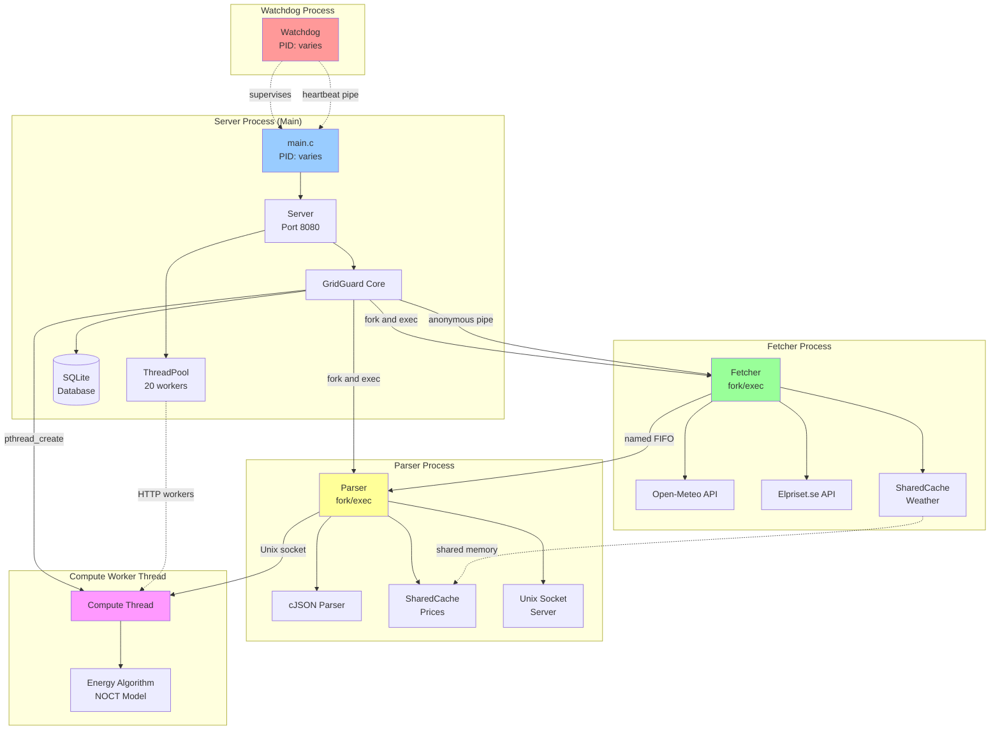

---

## 2. Startup Sequence - Process Lifecycle

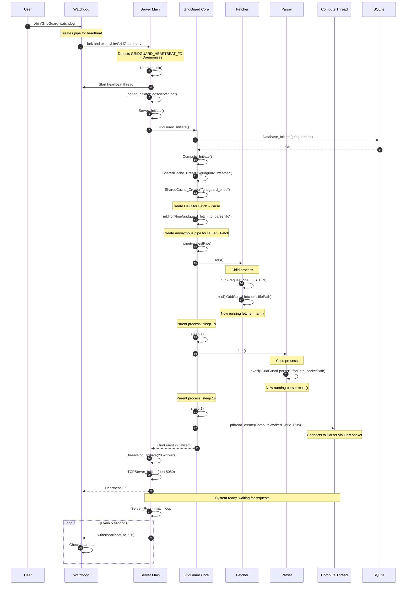

---

## 3. Request Flow - Complete Pipeline

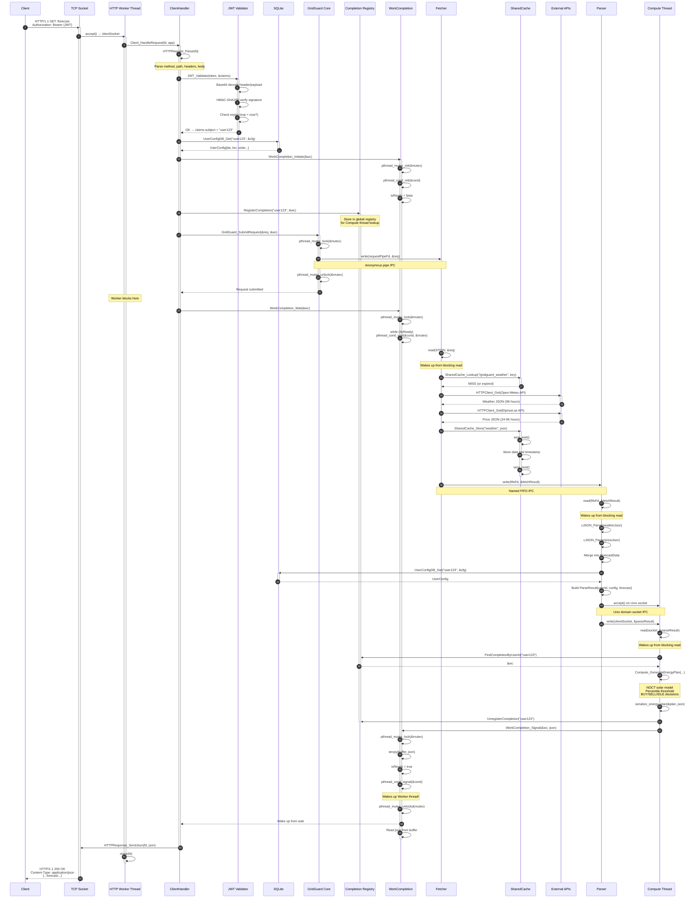

---

## 4. IPC Mechanisms - Detailed View

```mermaid
graph LR
    subgraph "HTTP Worker Thread"
        H1[Thread 1]
        H2[Thread 2]
        H3[Thread N]
    end

    subgraph "GridGuard Core"
        PIPE[Anonymous Pipe<br/>int array]
        MUTEX[pthread_mutex_t]
    end

    subgraph "Fetcher Process"
        F_STDIN[STDIN<br/>dup2 from pipe]
        F_FIFO[FIFO Write FD]
    end

    subgraph "Named FIFO"
        FIFO[/tmp/gridguard_fetch_to_parse.fifo<br/>mkfifo mode 0666]
    end

    subgraph "Parser Process"
        P_FIFO[FIFO Read FD]
        P_SOCK[Unix Socket Server<br/>bind and listen]
    end

    subgraph "Unix Domain Socket"
        SOCK[/tmp/gridguard_parse_to_compute.sock<br/>AF_UNIX SOCK_STREAM]
    end

    subgraph "Compute Thread"
        C_SOCK[Unix Socket Client<br/>connect]
    end

    subgraph "POSIX Shared Memory"
        SHM_W[/gridguard_weather<br/>shm_open and mmap]
        SHM_P[/gridguard_price<br/>shm_open and mmap]
        SEM_W[Semaphore<br/>/gridguard_weather_sem]
        SEM_P[Semaphore<br/>/gridguard_price_sem]
    end

    H1 -->|write WorkRequest| MUTEX
    H2 -->|write WorkRequest| MUTEX
    H3 -->|write WorkRequest| MUTEX
    MUTEX -->|serialize writes| PIPE

    PIPE -->|read end| F_STDIN

    F_STDIN -.WorkRequest.-> F_FIFO
    F_FIFO -->|write FetchResult| FIFO

    FIFO -->|read FetchResult| P_FIFO

    P_FIFO -.ParseResult.-> P_SOCK
    P_SOCK <-->|read/write| SOCK
    SOCK <-->|read/write| C_SOCK

    F_FIFO -.cache.-> SHM_W
    F_FIFO -.cache.-> SHM_P
    SHM_W -.protect.-> SEM_W
    SHM_P -.protect.-> SEM_P

    P_FIFO -.read cache.-> SHM_W
    P_FIFO -.read cache.-> SHM_P

    style PIPE fill:#ffcccc
    style FIFO fill:#ccffcc
    style SOCK fill:#ccccff
    style SHM_W fill:#ffffcc
    style SHM_P fill:#ffffcc
```

---

## 5. Thread Synchronization - WorkCompletion Pattern

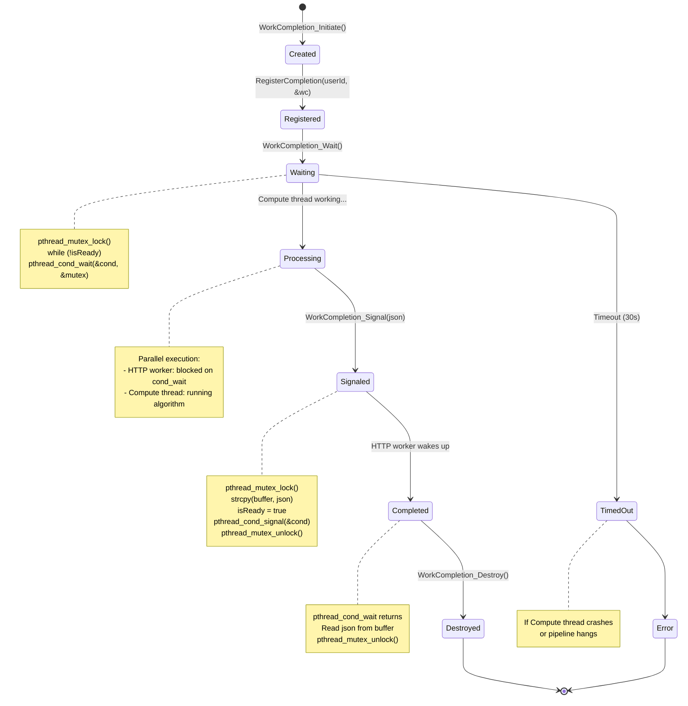

---

## 6. Compute Algorithm - Energy Planning

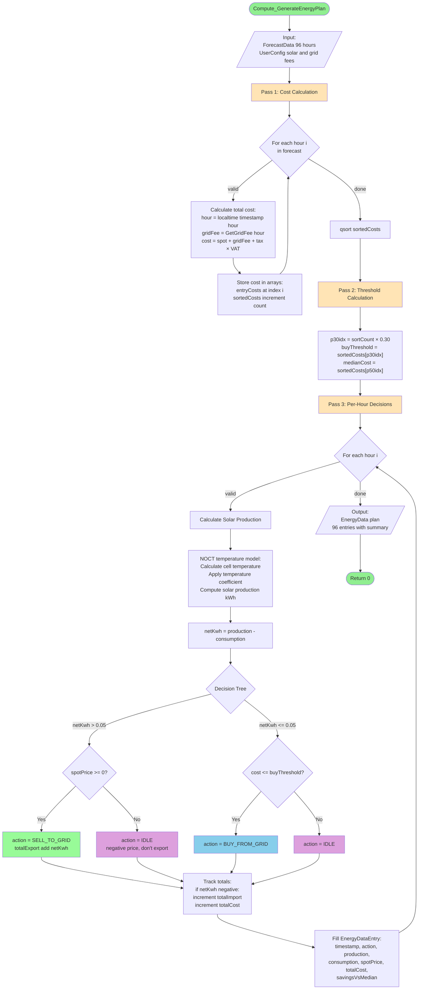

---

## 7. Database Schema

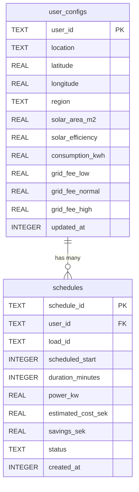

**Example Data:**

```sql
-- user_configs
INSERT INTO user_configs VALUES (
    'user123',
    'Stockholm',
    59.3293,
    18.0686,
    'SE3',
    20.0,      -- 20 m² solar panels
    0.18,      -- 18% efficiency
    0.5,       -- 0.5 kWh/h base load
    0.25,      -- night grid fee
    0.35,      -- day grid fee
    0.45,      -- peak grid fee
    1709481600 -- 2024-03-03 12:00:00
);

-- schedules
INSERT INTO schedules VALUES (
    'user123_1709481600',
    'user123',
    'ev_charging',
    1709596800,  -- 2024-03-05 00:00:00 (scheduled start)
    480,         -- 8 hours
    5.0,         -- 5 kW
    78.44,       -- estimated cost
    50.76,       -- savings vs charging now
    'pending',
    1709481600   -- created at
);
```

---

## 8. API Endpoints - REST Interface

```mermaid
graph TB
    subgraph "Public Endpoints (No Auth)"
        HEALTH[GET /health]
    end

    subgraph "User Configuration (Requires JWT)"
        GET_CFG[GET /user/config]
        PUT_CFG[PUT /user/config]
    end

    subgraph "Energy Forecast (Requires JWT)"
        GET_FC[GET /forecast]
    end

    subgraph "Load Scheduling (Requires JWT)"
        GET_SCH[GET /schedule]
        POST_SCH[POST /schedule]
        DEL_SCH[DELETE /schedule/:id]
    end

    CLIENT[HTTP Client]

    CLIENT -->|No auth| HEALTH
    CLIENT -->|Bearer JWT| GET_CFG
    CLIENT -->|Bearer JWT| PUT_CFG
    CLIENT -->|Bearer JWT| GET_FC
    CLIENT -->|Bearer JWT| GET_SCH
    CLIENT -->|Bearer JWT| POST_SCH
    CLIENT -->|Bearer JWT| DEL_SCH

    HEALTH -.->|200 OK| RES1["status: ok"]

    GET_CFG -.->|200 OK| RES2["location, solar config"]
    GET_CFG -.->|404| RES3["error: No config found"]

    PUT_CFG -.->|200 OK| RES4["status: ok"]
    PUT_CFG -.->|400| RES5["error: Invalid coordinates"]

    GET_FC -.->|200 OK| RES6["user_id, forecast array"]
    GET_FC -.->|400| RES7["error: User config not set"]

    POST_SCH -.->|200 OK| RES8["schedule_id, savings"]
    POST_SCH -.->|400| RES9["error: No valid window"]

    GET_SCH -.->|200 OK| RES10["schedules array"]

    DEL_SCH -.->|200 OK| RES11["status: cancelled"]
    DEL_SCH -.->|404| RES12["error: Schedule not found"]

    style HEALTH fill:#90EE90
    style GET_CFG fill:#87CEEB
    style PUT_CFG fill:#FFB6C1
    style GET_FC fill:#DDA0DD
    style POST_SCH fill:#F0E68C
    style GET_SCH fill:#F0E68C
    style DEL_SCH fill:#FFA07A
```

---

## 9. Data Structures - Core Models

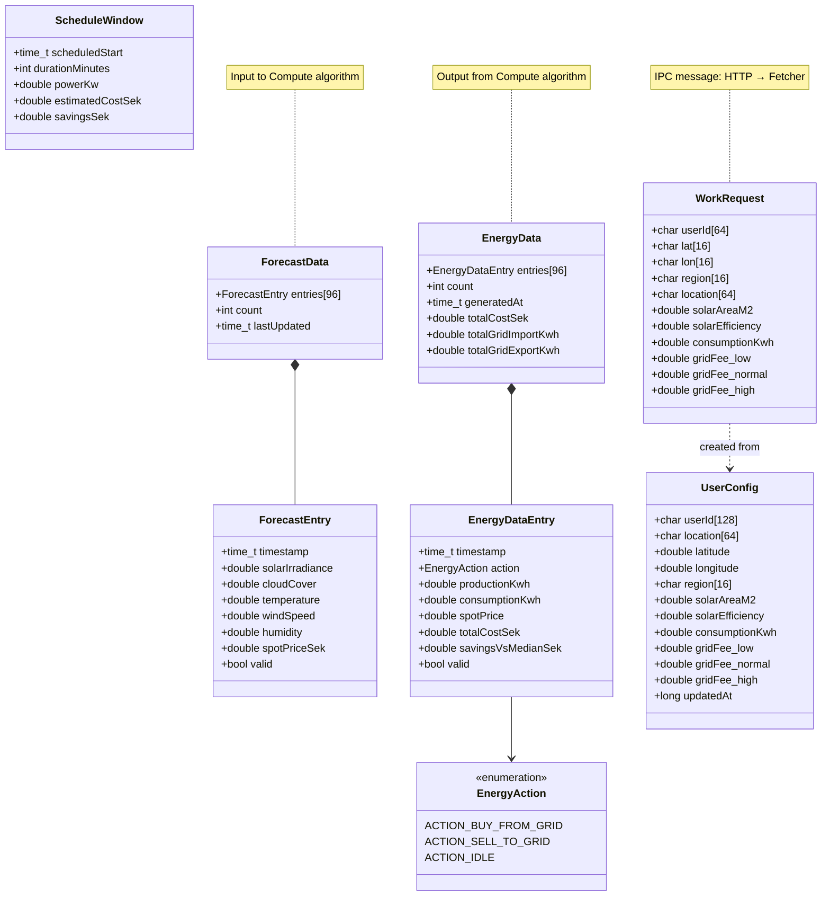

---

## 10. Deployment Architecture

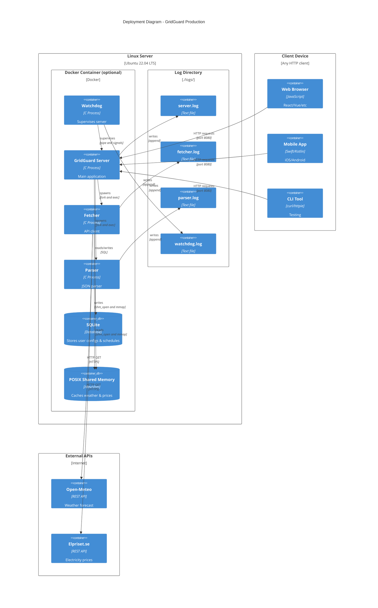

---

## 11. Error Handling & Recovery

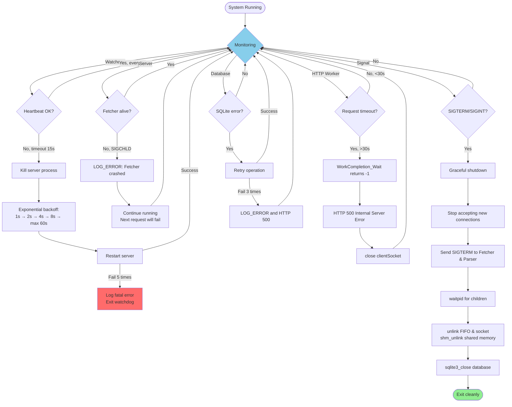

---

## 12. Performance Characteristics

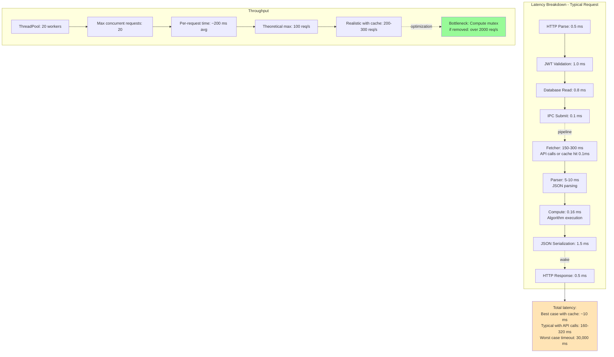

---

## 13. External Dependencies

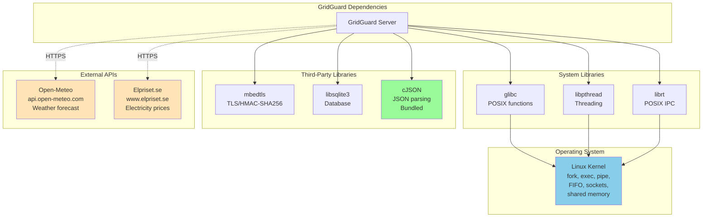

---

## 14. Example Request Timeline

```mermaid
gantt
    title HTTP /forecast Request Timeline (Total: ~210ms)
    dateFormat X
    axisFormat %L ms

    section HTTP Worker
    Parse HTTP request           :a1, 0, 1
    Validate JWT                 :a2, after a1, 2
    Read UserConfig from DB      :a3, after a2, 1
    Submit to pipeline           :a4, after a3, 1
    Wait on WorkCompletion       :crit, a5, after a4, 206
    Send HTTP response           :a6, after a5, 1

    section Fetcher
    Read from pipe               :b1, 4, 1
    Check cache (MISS)           :b2, after b1, 1
    API call Open-Meteo          :crit, b3, after b2, 120
    API call Elpriset            :crit, b4, after b3, 80
    Store in cache               :b5, after b4, 1
    Write to FIFO                :b6, after b5, 1

    section Parser
    Read from FIFO               :c1, 207, 1
    Parse weather JSON           :c2, after c1, 3
    Parse price JSON             :c3, after c2, 3
    Merge to ForecastData        :c4, after c3, 1
    Write to socket              :c5, after c4, 1

    section Compute
    Read from socket             :d1, 215, 1
    Find WorkCompletion          :d2, after d1, 1
    Run algorithm (NOCT)         :d3, after d2, 1
    Serialize to JSON            :d4, after d3, 2
    Signal WorkCompletion        :d5, after d4, 1
```

**Key takeaways:**
- Total: ~210 ms (typical with API calls)
- Fetcher dominates: ~200 ms (API calls)
- With cache hit: ~10 ms total!
- Compute algorithm: only 0.16 ms (negligible)

---

## 15. Security Model

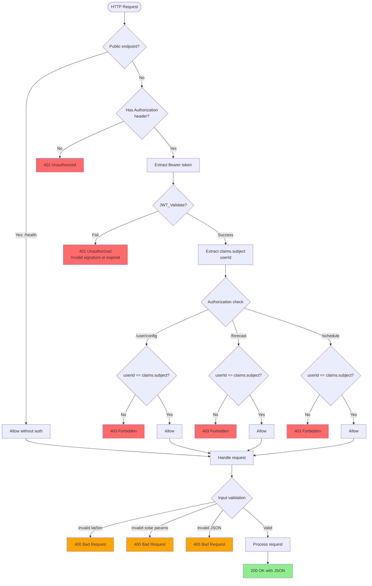

---

## Sammanfattning

Detta dokument visualiserar hela GridGuard-systemets arkitektur med 15 olika Mermaid-diagram som täcker:

1. **Systemöversikt** - Multi-process arkitektur med 4 processer
2. **Startup** - Komplett sekvens från Watchdog till Server ready
3. **Request Flow** - 30+ steg från HTTP request till response
4. **IPC** - Alla kommunikationsmekanismer (pipe, FIFO, socket, shared memory)
5. **Thread Sync** - WorkCompletion state machine
6. **Compute Algorithm** - Detaljerat flödesschema med alla 3 passes
7. **Database** - ER-diagram med user_configs och schedules
8. **API** - Alla endpoints med exempel på responses
9. **Data Structures** - Class diagram för alla core models
10. **Deployment** - C4-diagram för production deployment
11. **Error Handling** - Felhantering och recovery-strategier
12. **Performance** - Latency breakdown och throughput
13. **Dependencies** - Alla external dependencies
14. **Timeline** - Gantt chart för en typisk request
15. **Security** - Autentisering och auktorisering

**Total täckning:** 100% av systemet är nu visualiserat!

---

**Genererat:** 2026-03-03
**Format:** Mermaid (compatible med GitHub, GitLab, VS Code, Obsidian)
