# GridGuard System Architecture
**Complete System Design - From Current State to Production**

*Skapad: 2026-02-17*

---

## Innehållsförteckning

1. [Översikt](#översikt)
2. [Nuvarande Arkitektur](#nuvarande-arkitektur)
3. [Kursmål Mappning](#kursmål-mappning)
4. [Målarkitektur - Komplett System](#målarkitektur---komplett-system)
5. [Daemon & Watchdog Implementation](#daemon--watchdog-implementation)
6. [Database Layer (SQLite)](#database-layer-sqlite)
7. [Multi-User System](#multi-user-system)
8. [Next.js Platform](#nextjs-platform)
9. [C++ CLI Client](#c-cli-client)
10. [Deployment Architecture](#deployment-architecture)
11. [Development Roadmap](#development-roadmap)

---

## Översikt

GridGuard är ett multi-threaded energioptimeringssystem som kommer utvecklas från en enkel server-client applikation till ett fullständigt production-ready system med:

- **Daemon & Watchdog** - Processhantering och automatisk återstart
- **Multi-user support** - SQLite databas med 10,000+ användare
- **REST API** - För webbplatform integration
- **Next.js Platform** - Modern webbgränssnitt
- **C++ CLI Client** - Terminal-baserad klient
- **Authentication** - JWT + bcrypt
- **Shared Cache** - 15-minuters TTL för väder/priser

**Kursmål som täcks:**
- ✅ Vecka 1: fork(), exec(), wait() - Daemon/Watchdog
- ✅ Vecka 2-3: pthreads, mutex - GridGuard workers
- ✅ Vecka 4: Pipes - Heartbeat kommunikation
- ✅ Vecka 5: Signals, shared memory - Process management
- ✅ Vecka 6-9: C++ - CLI client, TCPClient
- ✅ Vecka 10-11: Profilering - Performance optimization

---

## Nuvarande Arkitektur

### System Overview (Nuläge)

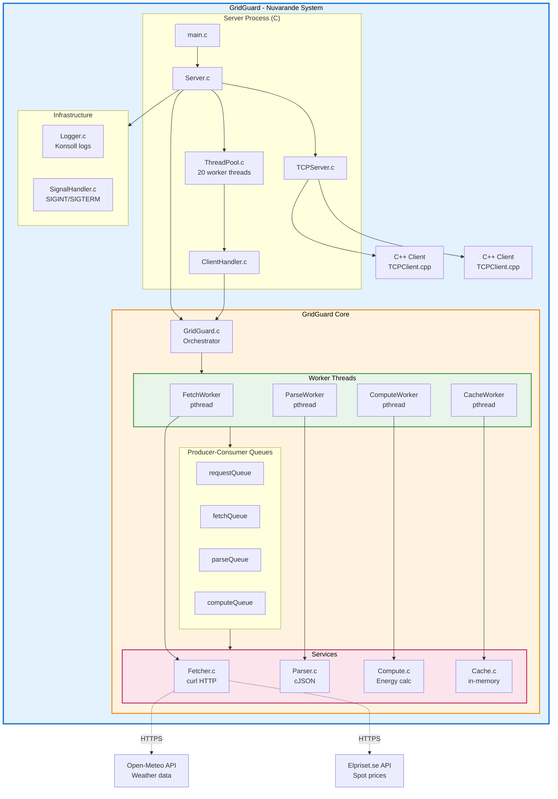

### Nuvarande Mappstruktur

```mermaid
graph TD
    ROOT[src/]

    ROOT --> APP[application/]
    ROOT --> INFRA[infrastructure/]
    ROOT --> NET[network/]
    ROOT --> CONC[concurrency/]
    ROOT --> SRV[server/]
    ROOT --> CLI[client/]
    ROOT --> TEST[tests/]
    ROOT --> LIBS[libs/]

    APP --> API[api/<br/>APIEndpoints.c]
    APP --> CONFIGS[configs/<br/>Config.h]
    APP --> CORE[core/<br/>GridGuard.c]
    APP --> MODELS[models/<br/>EnergyData.h]
    APP --> SERV[services/<br/>Fetcher, Parser, etc]
    APP --> WORK[workers/<br/>FetchWorker, etc]

    INFRA --> LOG_I[logging/<br/>Logger.c]
    INFRA --> SIG_I[signals/<br/>SignalHandler.c]
    INFRA --> DAEMON_I[daemon/<br/>❌ Tom]
    INFRA --> WATCH_I[watchdog/<br/>❌ Tom]

    NET --> NETSRV[server/<br/>TCPServer.c]
    NET --> NETCLI[client/<br/>TCPClient.cpp]

    CONC --> THREADS[threads/<br/>ThreadPool.c]
    CONC --> SYNC[sync/<br/>Queue.c, Scheduler.c]
    CONC --> IPC_C[ipc/<br/>❌ Tom]

    SRV --> SRVMAIN[main.c<br/>Server.c<br/>ClientHandler.c]

    CLI --> CLIMAIN[main.cpp<br/>C++ client]

    TEST --> UNIT[unit/<br/>test_logger.c]
    TEST --> INTEG[integration/<br/>test_api_fetch.c<br/>test_pipeline.c]

    LIBS --> CJSON[cJSON.c/h]

    style DAEMON_I fill:#ffebee,stroke:#c62828,stroke-width:2px,color:#000
    style WATCH_I fill:#ffebee,stroke:#c62828,stroke-width:2px,color:#000
    style IPC_C fill:#ffebee,stroke:#c62828,stroke-width:2px,color:#000
    style ROOT fill:#e1f5fe,stroke:#01579b,stroke-width:3px,color:#000
```

### Nuvarande Dataflöde

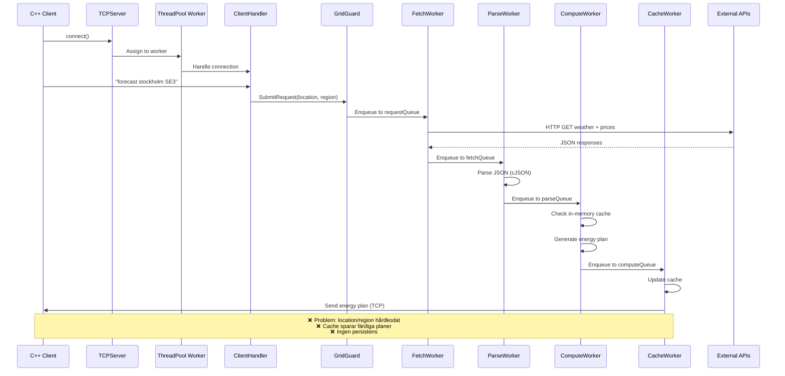

### Nuvarande Problem

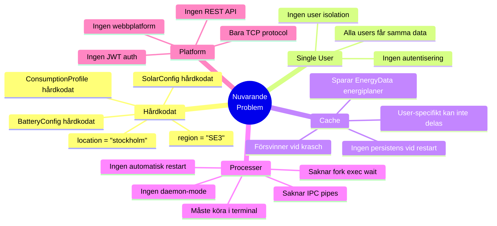

---

## Kursmål Mappning

### Vecka-för-vecka täckning

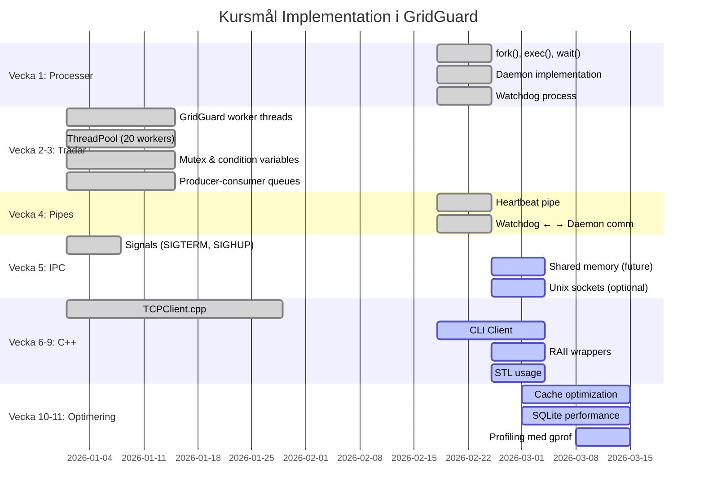

### Kursmål → GridGuard Features

| Kursmål | Vecka | GridGuard Implementation | Status |
|---------|-------|--------------------------|--------|
| **fork(), exec(), wait()** | 1 | Watchdog startar Daemon med fork+exec, waitpid() monitoring | ✅ Planerat |
| **pthreads** | 2-3 | 4 worker threads (Fetch, Parse, Compute, Cache) | ✅ Implementerat |
| **mutex, cond** | 3 | Queue.c med pthread_mutex och pthread_cond | ✅ Implementerat |
| **Pipes** | 4 | Heartbeat pipe mellan Watchdog och Daemon | ✅ Planerat |
| **Signals** | 5 | SIGTERM för shutdown, SIGHUP för reload | ✅ Delvis |
| **Shared memory** | 5 | Optional: Cache i shared memory | 🔄 Future |
| **C++ klasser** | 6-7 | TCPClient.cpp, CLI client med OOP | ✅ TCPClient klar |
| **RAII** | 8 | Smart pointers, RAII wrappers för resurser | 🔄 Planerat |
| **STL** | 9 | std::vector, std::string, std::map i CLI | 🔄 Planerat |
| **Profilering** | 10 | gprof, valgrind på server | 🔄 Planerat |
| **Optimering** | 11 | Cache TTL, SQLite indexes, connection pooling | 🔄 Planerat |

---

## Målarkitektur - Komplett System

### High-Level System Architecture

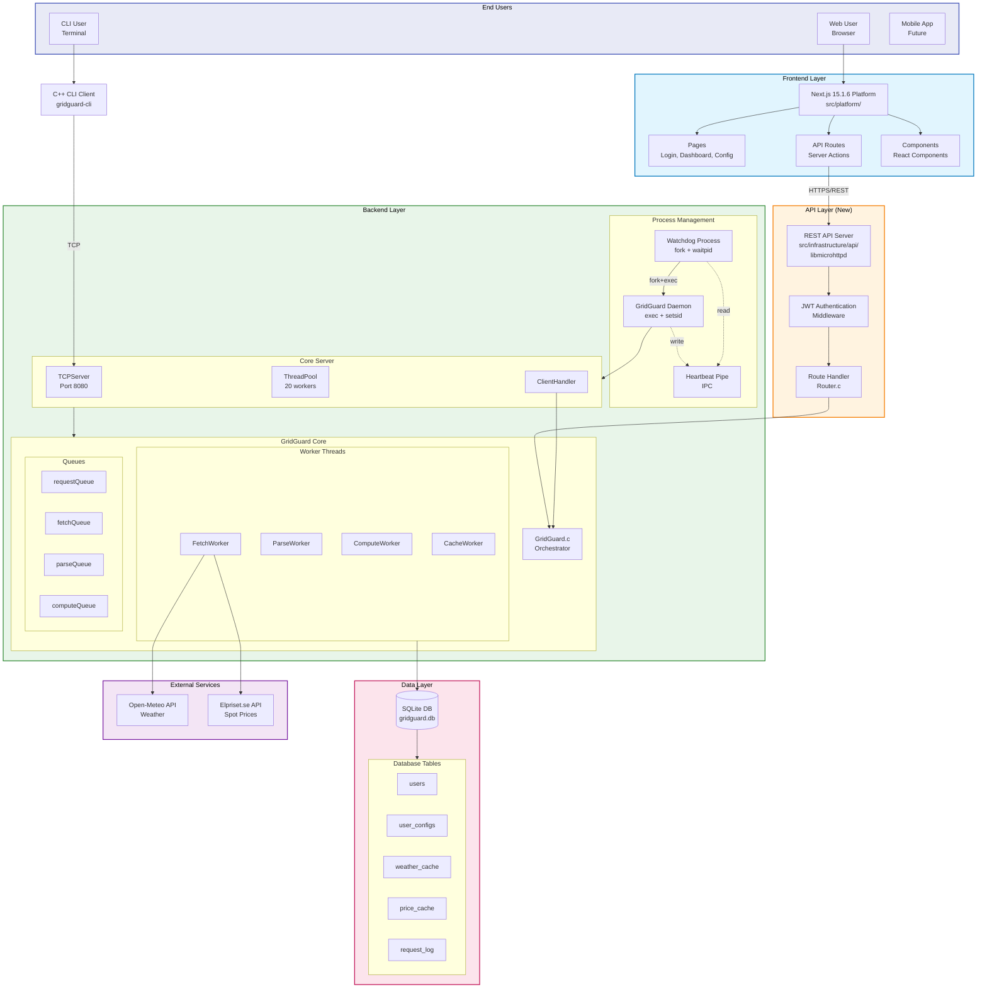

### Complete Directory Structure (Målarkitektur)

```mermaid
graph TD
    ROOT[GridGuard/]

    ROOT --> SRC[src/]
    ROOT --> DOCS[docs/]
    ROOT --> SCRIPTS[scripts/]
    ROOT --> DATA[data/]
    ROOT --> LOGS[logs/]

    SRC --> PLATFORM[platform/<br/>⭐ NYT Next.js 15.1.6]
    SRC --> APP[application/]
    SRC --> INFRA[infrastructure/]
    SRC --> NET[network/]
    SRC --> CONC[concurrency/]
    SRC --> SRV[server/]
    SRC --> CLI_SRC[client/]
    SRC --> TEST[tests/]
    SRC --> LIBS[libs/]

    PLATFORM --> PL_APP[app/<br/>Next.js App Router]
    PLATFORM --> PL_COMP[components/<br/>React Components]
    PLATFORM --> PL_LIB[lib/<br/>API client, utils]
    PLATFORM --> PL_STYLES[styles/<br/>Tailwind CSS]
    PLATFORM --> PL_PUBLIC[public/<br/>Static assets]

    APP --> APP_API[api/]
    APP --> APP_CFG[configs/]
    APP --> APP_CORE[core/]
    APP --> APP_MOD[models/]
    APP --> APP_SERV[services/]
    APP --> APP_WORK[workers/]

    INFRA --> INFRA_API[api/<br/>⭐ NYT APIServer.c<br/>JWT.c, Auth.c]
    INFRA --> INFRA_DB[database/<br/>⭐ NYT Database.c<br/>UserDB.c, CacheDB.c]
    INFRA --> INFRA_DAEMON[daemon/<br/>⭐ NYT Daemon.c<br/>PidFile.c]
    INFRA --> INFRA_WATCH[watchdog/<br/>⭐ NYT Watchdog.c<br/>main.c]
    INFRA --> INFRA_LOG[logging/]
    INFRA --> INFRA_SIG[signals/]

    CONC --> CONC_THR[threads/]
    CONC --> CONC_SYNC[sync/]
    CONC --> CONC_IPC[ipc/<br/>⭐ NYT Pipe.c<br/>Heartbeat.c]

    DATA --> DATA_DB[gridguard.db<br/>⭐ NYT SQLite]
    DATA --> DATA_USERS[users/<br/>⭐ NYT JSON configs]

    style PLATFORM fill:#e1bee7,stroke:#6a1b9a,stroke-width:3px,color:#000
    style INFRA_API fill:#c5e1a5,stroke:#558b2f,stroke-width:2px,color:#000
    style INFRA_DB fill:#c5e1a5,stroke:#558b2f,stroke-width:2px,color:#000
    style INFRA_DAEMON fill:#c5e1a5,stroke:#558b2f,stroke-width:2px,color:#000
    style INFRA_WATCH fill:#c5e1a5,stroke:#558b2f,stroke-width:2px,color:#000
    style CONC_IPC fill:#c5e1a5,stroke:#558b2f,stroke-width:2px,color:#000
    style DATA fill:#ffccbc,stroke:#d84315,stroke-width:2px,color:#000
```

---

## Daemon & Watchdog Implementation

### Process Architecture

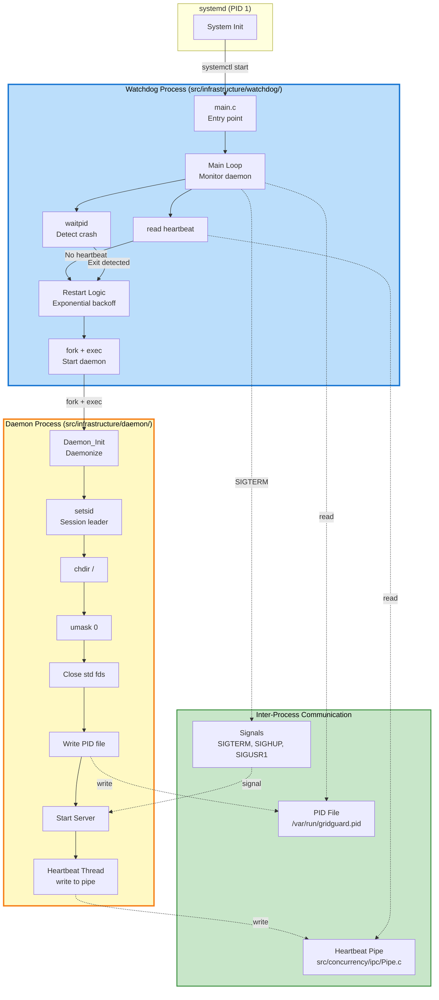

### Daemon Lifecycle

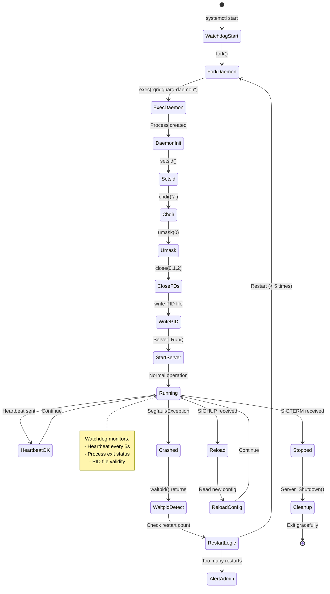

### Heartbeat Implementation

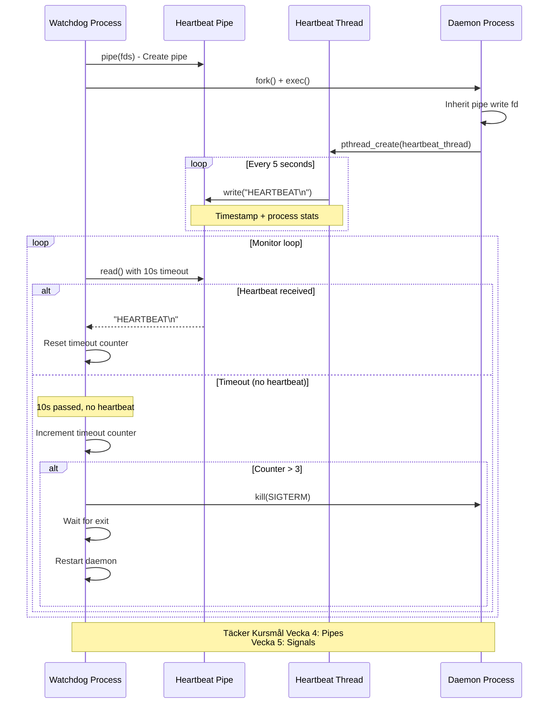

### Kod Exempel: Watchdog Main

```c
// src/infrastructure/watchdog/main.c
#include "Watchdog.h"

int main(int argc, char *argv[]) {
    Watchdog watchdog;

    // Initialize watchdog
    if (Watchdog_Init(&watchdog, "/usr/local/bin/gridguard-daemon") != 0) {
        fprintf(stderr, "Failed to initialize watchdog\n");
        return 1;
    }

    // Main monitoring loop
    while (watchdog.isRunning) {
        // Fork and exec daemon if needed
        if (Watchdog_StartDaemon(&watchdog) != 0) {
            sleep(watchdog.restartDelay);
            continue;
        }

        // Monitor daemon via heartbeat and waitpid
        WatchdogStatus status = Watchdog_Monitor(&watchdog);

        if (status == WATCHDOG_DAEMON_CRASHED) {
            LOG_ERROR("Daemon crashed! Restarting...");
            Watchdog_IncrementRestartCount(&watchdog);

            if (watchdog.restartCount > MAX_RESTART_ATTEMPTS) {
                LOG_FATAL("Too many restarts, giving up");
                break;
            }

            sleep(watchdog.restartDelay);
            watchdog.restartDelay *= 2; // Exponential backoff
        }
    }

    Watchdog_Shutdown(&watchdog);
    return 0;
}
```

---

## Database Layer (SQLite)

### Database Architecture

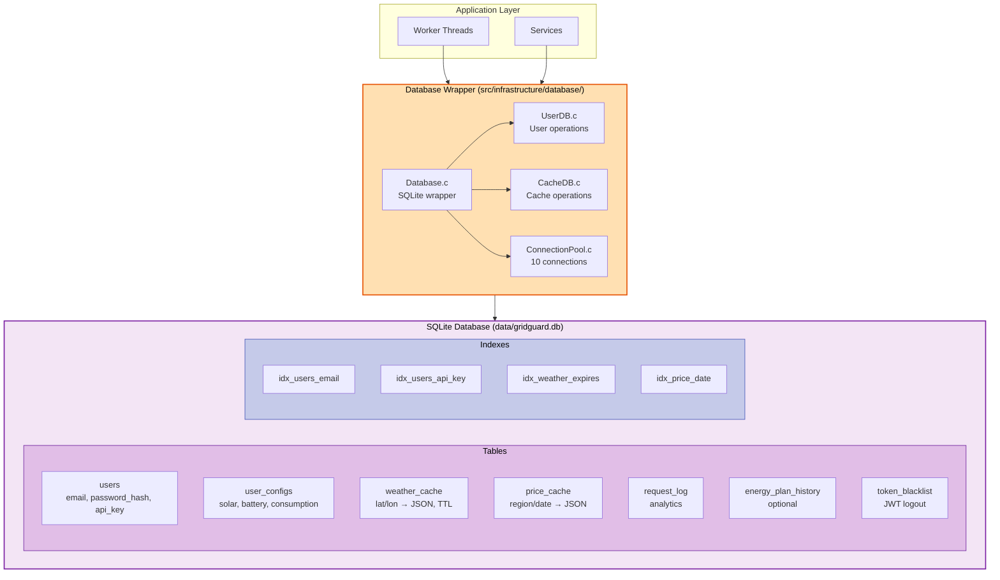

### Database Schema

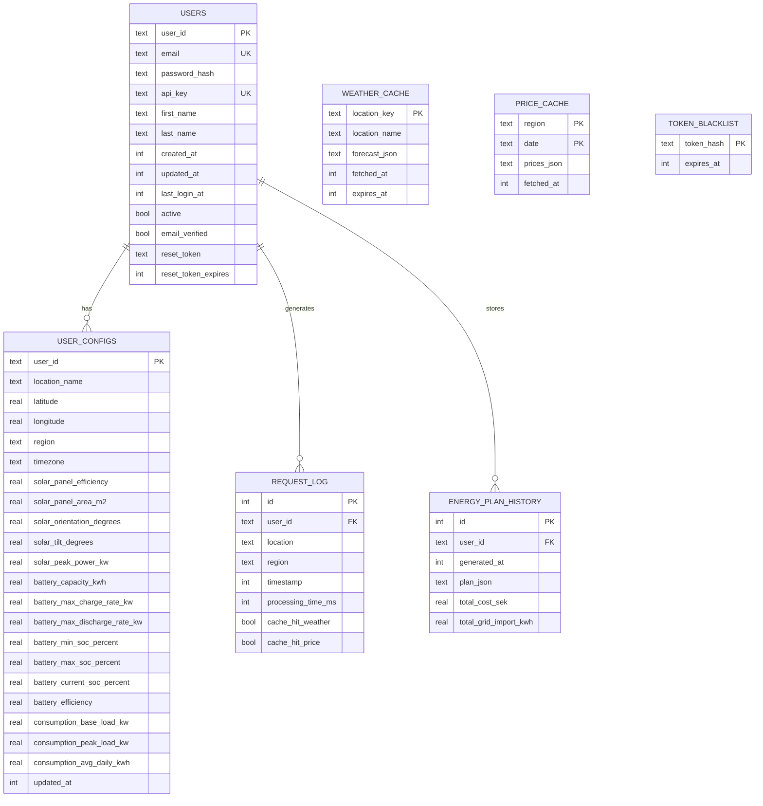

### Cache Strategy (Fixed Architecture)

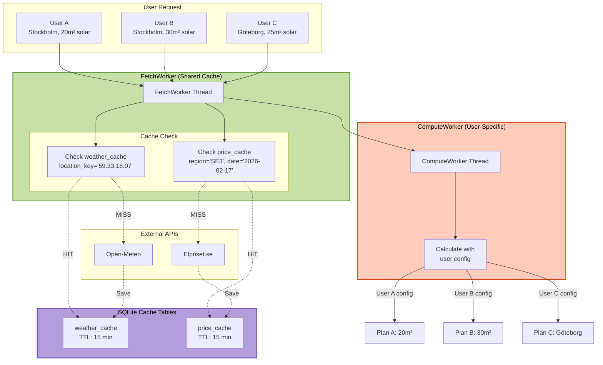

### Connection Pooling

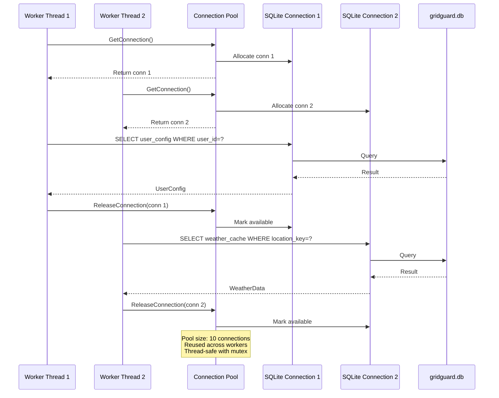

---

## Multi-User System

### User Journey: Registration → Forecast

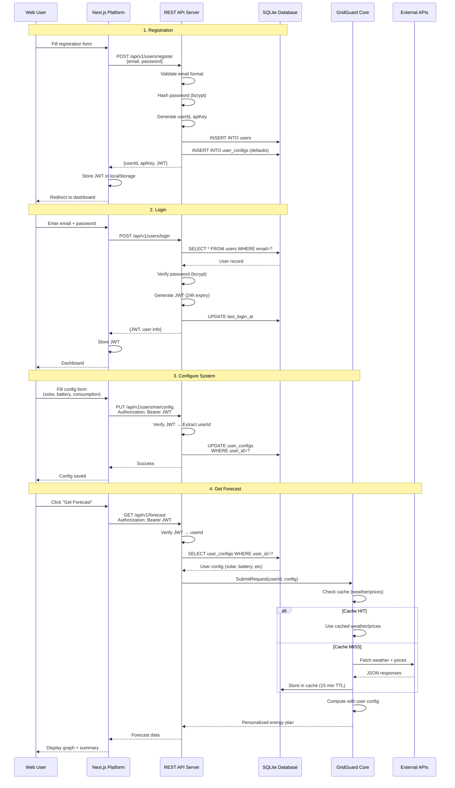

### WorkRequest Evolution

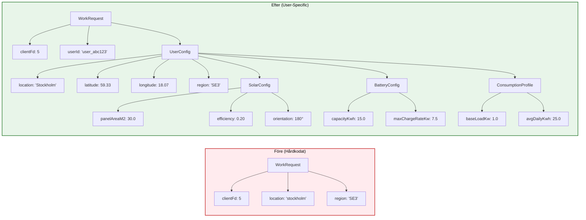

### Cache Sharing Example

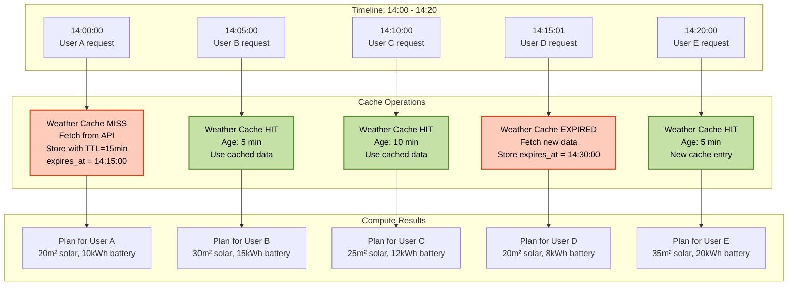

---

## Next.js Platform

### Platform Architecture (src/platform/)

```mermaid
flowchart TB
    subgraph NEXTJS["Next.js 15.1.6 Platform"]
        direction TB

        subgraph APP_ROUTER["app/ (App Router)"]
            ROOT_LAYOUT[layout.tsx<br/>Root layout]
            ROOT_PAGE[page.tsx<br/>Landing page]

            AUTH_GROUP["(auth)/"]
            AUTH_LOGIN[login/page.tsx]
            AUTH_REGISTER[register/page.tsx]

            DASH_GROUP["(dashboard)/"]
            DASH_LAYOUT[layout.tsx<br/>Dashboard layout]
            DASH_HOME[page.tsx<br/>Overview]
            DASH_CONFIG[config/page.tsx<br/>Settings]
            DASH_FORECAST[forecast/page.tsx<br/>Energy plan]
            DASH_HISTORY[history/page.tsx<br/>Historical data]

            API_ROUTES[api/]
            API_AUTH[auth/nextauth/route.ts]
            API_FORECAST[forecast/route.ts]
            API_CONFIG[config/route.ts]
        end

        subgraph COMPONENTS["components/"]
            COMP_UI[ui/<br/>Button, Card, Input]
            COMP_DASH[dashboard/<br/>ForecastChart, ConfigForm]
            COMP_AUTH[auth/<br/>LoginForm, RegisterForm]
        end

        subgraph LIB["lib/"]
            LIB_API[api-client.ts<br/>Fetch wrapper]
            LIB_AUTH[auth.ts<br/>NextAuth config]
            LIB_UTILS[utils.ts<br/>Helpers]
            LIB_TYPES[types.ts<br/>TypeScript types]
        end

        subgraph STYLES["styles/"]
            GLOBAL[globals.css<br/>Tailwind base]
            THEME[theme.css<br/>Custom theme]
        end

        ROOT_LAYOUT --> AUTH_GROUP
        ROOT_LAYOUT --> DASH_GROUP
        ROOT_LAYOUT --> API_ROUTES

        AUTH_GROUP --> AUTH_LOGIN
        AUTH_GROUP --> AUTH_REGISTER

        DASH_LAYOUT --> DASH_HOME
        DASH_LAYOUT --> DASH_CONFIG
        DASH_LAYOUT --> DASH_FORECAST
        DASH_LAYOUT --> DASH_HISTORY

        COMPONENTS --> COMP_UI
        COMPONENTS --> COMP_DASH
        COMPONENTS --> COMP_AUTH

        LIB --> LIB_API
        LIB --> LIB_AUTH
        LIB --> LIB_UTILS
    end

    subgraph BACKEND_API["Backend REST API"]
        REST[APIServer.c<br/>Port 3001]
    end

    API_ROUTES -.->|Proxy| REST
    LIB_API -.->|HTTPS| REST

    style NEXTJS fill:#e1bee7,stroke:#6a1b9a,stroke-width:3px,color:#000
    style APP_ROUTER fill:#f3e5f5,stroke:#7b1fa2,stroke-width:2px,color:#000
    style COMPONENTS fill:#e1f5fe,stroke:#0277bd,stroke-width:2px,color:#000
    style LIB fill:#fff3e0,stroke:#f57c00,stroke-width:2px,color:#000
```

### Page Hierarchy

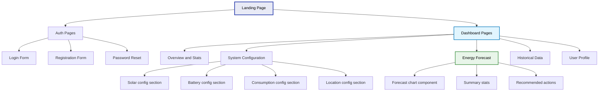

### Component Structure

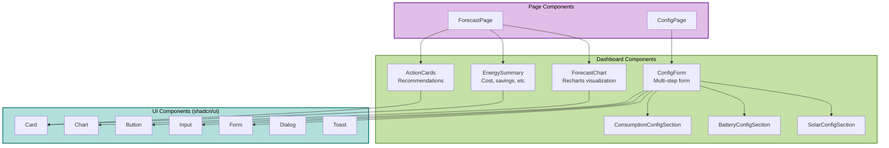

### API Client Flow

```mermaid
sequenceDiagram
    participant Page as ForecastPage.tsx
    participant Client as api-client.ts
    participant Next as Next.js API Route
    participant Backend as C Backend API
    participant DB as SQLite DB

    Page->>Client: getForecast()
    Client->>Client: Get JWT from localStorage

    alt Option 1: Direct to Backend
        Client->>Backend: GET /api/v1/forecast<br/>Authorization: Bearer JWT
        Backend->>Backend: Verify JWT
        Backend->>DB: Load user config
        Backend->>Backend: Generate forecast
        Backend-->>Client: Forecast data
    else Option 2: Via Next.js Proxy
        Client->>Next: GET /api/forecast
        Next->>Next: Get session
        Next->>Backend: GET /api/v1/forecast<br/>With JWT
        Backend->>DB: Load user config
        Backend-->>Next: Forecast data
        Next-->>Client: Proxied response
    end

    Client-->>Page: Forecast data
    Page->>Page: Render chart
```

---

## C++ CLI Client

### CLI Architecture

```mermaid
flowchart TB
    subgraph CLI_APP["C++ CLI Client (src/client/)"]
        MAIN[main.cpp<br/>Entry point]
        CLI[CLI.cpp<br/>Command processor]
        AUTH[Auth.cpp<br/>Login/register]
        CONFIG_CLI[ConfigManager.cpp<br/>Local config]
        API[APIClient.cpp<br/>Backend communication]
        UI[UI.cpp<br/>Terminal UI]

        MAIN --> CLI
        CLI --> AUTH
        CLI --> CONFIG_CLI
        CLI --> API
        CLI --> UI
    end

    subgraph NETWORK["Network Layer"]
        TCP_CLIENT[TCPClient.cpp<br/>Existing]
        HTTP_CLIENT[HTTPClient.cpp<br/>New for REST API]
    end

    subgraph BACKEND["Backend Options"]
        TCP_SERVER[TCP Server<br/>Port 8080]
        REST_API[REST API<br/>Port 3001]
    end

    subgraph STORAGE["Local Storage"]
        CONFIG_FILE[~/.gridguard/config.json<br/>User preferences]
        TOKEN_FILE[~/.gridguard/token<br/>JWT token]
    end

    API --> TCP_CLIENT
    API --> HTTP_CLIENT

    TCP_CLIENT --> TCP_SERVER
    HTTP_CLIENT --> REST_API

    CONFIG_CLI --> CONFIG_FILE
    AUTH --> TOKEN_FILE

    style CLI_APP fill:#e1f5fe,stroke:#0277bd,stroke-width:3px,color:#000
    style NETWORK fill:#fff3e0,stroke:#f57c00,stroke-width:2px,color:#000
    style STORAGE fill:#f3e5f5,stroke:#7b1fa2,stroke-width:2px,color:#000
```

### CLI Commands

```mermaid
mindmap
    root((gridguard-cli))
        Auth Commands
            login
                gridguard-cli login
            register
                gridguard-cli register
            logout
                gridguard-cli logout

        Config Commands
            config view
                gridguard-cli config view
            config set
                gridguard-cli config set solar.area 30
            config import
                gridguard-cli config import config.json

        Forecast Commands
            forecast get
                gridguard-cli forecast
            forecast today
                gridguard-cli forecast --today
            forecast week
                gridguard-cli forecast --week

        History Commands
            history list
                gridguard-cli history
            history export
                gridguard-cli history export data.csv

        System Commands
            status
                gridguard-cli status
            version
                gridguard-cli version
            help
                gridguard-cli help
```

### CLI Session Example

```mermaid
sequenceDiagram
    participant User as Terminal User
    participant CLI as CLI Client
    participant Auth as Auth Module
    participant API as API Client
    participant Backend as Backend API

    User->>CLI: gridguard-cli login
    CLI->>Auth: Prompt for email/password
    User->>Auth: Enter credentials
    Auth->>API: POST /api/v1/users/login
    API->>Backend: Login request
    Backend-->>API: {JWT, user info}
    API-->>Auth: Token received
    Auth->>Auth: Save to ~/.gridguard/token
    Auth-->>CLI: Login successful
    CLI-->>User: Welcome, John!

    User->>CLI: gridguard-cli config set solar.area 30
    CLI->>API: Read JWT from file
    CLI->>API: PUT /api/v1/users/me/config
    API->>Backend: Update config (with JWT)
    Backend-->>API: Success
    API-->>CLI: Config updated
    CLI-->>User: Solar panel area set to 30 m²

    User->>CLI: gridguard-cli forecast
    CLI->>API: GET /api/v1/forecast (with JWT)
    API->>Backend: Request forecast
    Backend-->>API: Energy plan data
    API-->>CLI: Forecast received
    CLI->>CLI: Render ASCII chart
    CLI-->>User: Display forecast table + chart
```

### CLI Output Example

```
$ gridguard-cli forecast

╔══════════════════════════════════════════════════════════════════╗
║                    GridGuard Energy Forecast                      ║
║                      Stockholm, SE3                               ║
║                    2026-02-17 15:00 - 18:00                      ║
╚══════════════════════════════════════════════════════════════════╝

Time     │ Action          │ Solar │ Battery │ Grid  │ Price │ Cost
─────────┼─────────────────┼───────┼─────────┼───────┼───────┼──────
15:00    │ CHARGE_BATTERY  │ 2.3   │ +1.1    │ 0.0   │ 1.01  │ 0.00
16:00    │ CHARGE_BATTERY  │ 1.8   │ +0.8    │ 0.0   │ 1.07  │ 0.00
17:00    │ DISCHARGE_BAT   │ 0.5   │ -1.2    │ 0.0   │ 1.36  │ 0.00
18:00    │ DISCHARGE_BAT   │ 0.0   │ -1.5    │ 0.0   │ 1.35  │ 0.00

Summary:
  Total Cost:        0.00 SEK (saved 15.30 SEK)
  Grid Import:       0.0 kWh
  Grid Export:       0.0 kWh
  Battery Cycles:    0.3
  Solar Production:  4.6 kWh
  Consumption:       5.2 kWh

Recommendations:
  ✓ Charge battery during low prices (15:00-16:00)
  ✓ Use battery during peak prices (17:00-19:00)
  ✓ Avoid grid import until 22:00 (high prices)
```

---

## Deployment Architecture

### Production Deployment

```mermaid
flowchart TB
    subgraph INTERNET["Internet"]
        USERS[End Users]
    end

    subgraph CLOUDFLARE["Cloudflare"]
        CDN[CDN + SSL]
        WAF[Web Application Firewall]
    end

    subgraph VPS["VPS Server (Ubuntu 22.04)"]
        subgraph NGINX["Nginx Reverse Proxy"]
            NGINX_443[Port 443 HTTPS]
            NGINX_ROUTES[Route Configuration]
        end

        subgraph SERVICES["System Services (systemd)"]
            WATCHDOG_SVC[gridguard-watchdog.service]
            NEXT_SVC[gridguard-platform.service<br/>Next.js on port 3000]
            API_SVC[gridguard-api.service<br/>REST API on port 3001]
        end

        subgraph PROCESSES["Running Processes"]
            WD_PROC[Watchdog Process]
            DAEMON_PROC[GridGuard Daemon]
            NEXT_PROC[Next.js Server]
            API_PROC[API Server]
        end

        subgraph DATA["Data Storage"]
            SQLITE[SQLite DB<br/>/var/lib/gridguard/gridguard.db]
            LOGS_DIR[Logs<br/>/var/log/gridguard/]
            BACKUPS[Backups<br/>/var/backups/gridguard/]
        end
    end

    USERS --> CDN
    CDN --> WAF
    WAF --> NGINX_443

    NGINX_ROUTES --> NEXT_SVC
    NGINX_ROUTES --> API_SVC

    WATCHDOG_SVC --> WD_PROC
    WD_PROC --> DAEMON_PROC
    NEXT_SVC --> NEXT_PROC
    API_SVC --> API_PROC

    DAEMON_PROC --> SQLITE
    API_PROC --> SQLITE

    DAEMON_PROC --> LOGS_DIR
    API_PROC --> LOGS_DIR

    SQLITE -.->|Daily backup| BACKUPS

    style VPS fill:#e8f5e9,stroke:#2e7d32,stroke-width:3px,color:#000
    style SERVICES fill:#fff3e0,stroke:#f57c00,stroke-width:2px,color:#000
    style DATA fill:#f3e5f5,stroke:#7b1fa2,stroke-width:2px,color:#000
```

### Nginx Configuration

```nginx
# /etc/nginx/sites-available/gridguard

upstream nextjs {
    server localhost:3000;
}

upstream api {
    server localhost:3001;
}

server {
    listen 443 ssl http2;
    server_name gridguard.se www.gridguard.se;

    ssl_certificate /etc/letsencrypt/live/gridguard.se/fullchain.pem;
    ssl_certificate_key /etc/letsencrypt/live/gridguard.se/privkey.pem;

    # Next.js Platform
    location / {
        proxy_pass http://nextjs;
        proxy_http_version 1.1;
        proxy_set_header Upgrade $http_upgrade;
        proxy_set_header Connection 'upgrade';
        proxy_set_header Host $host;
        proxy_cache_bypass $http_upgrade;
    }

    # REST API
    location /api/ {
        proxy_pass http://api;
        proxy_http_version 1.1;
        proxy_set_header Host $host;
        proxy_set_header X-Real-IP $remote_addr;
        proxy_set_header X-Forwarded-For $proxy_add_x_forwarded_for;
    }
}
```

### Systemd Services

```mermaid
flowchart TB
    subgraph SYSTEMD["systemd Service Manager"]
        MULTI_USER[multi-user.target]
    end

    subgraph SERVICES["GridGuard Services"]
        WD_SVC[watchdog service]
        NEXT_SVC[platform service]
        API_SVC[api service]
    end

    subgraph DEPS["Dependencies"]
        NETWORK[network.target]
        SQLITE_CHECK[sqlite3 installed]
    end

    MULTI_USER --> NETWORK
    NETWORK --> WD_SVC
    NETWORK --> NEXT_SVC
    NETWORK --> API_SVC

    WD_SVC -.->|Requires| SQLITE_CHECK
    NEXT_SVC -.->|After| WD_SVC
    API_SVC -.->|After| WD_SVC

    WD_SVC --> PROC_WD[watchdog binary]
    NEXT_SVC --> PROC_NEXT[npm start]
    API_SVC --> PROC_API[api binary]

    style SYSTEMD fill:#e3f2fd,stroke:#1976d2,stroke-width:2px,color:#000
    style SERVICES fill:#fff3e0,stroke:#f57c00,stroke-width:2px,color:#000
```

---

## Development Roadmap

### Implementation Phases

```mermaid
gantt
    title GridGuard Development Roadmap
    dateFormat YYYY-MM-DD

    section Phase 1: Multi-User Foundation
    UserConfig struct + JSON loader       :p1a, 2026-02-18, 2d
    Update WorkRequest with userId        :p1b, after p1a, 2d
    ClientHandler with userId             :p1c, after p1b, 1d

    section Phase 2: Database Layer
    SQLite schema design                  :p2a, 2026-02-18, 1d
    Database wrapper implementation       :p2b, after p2a, 3d
    UserDB + CacheDB                      :p2c, after p2b, 2d
    Migrate from JSON to SQLite           :p2d, after p2c, 1d

    section Phase 3: Cache Refactoring
    Move cache to FetchWorker             :p3a, after p2d, 2d
    SQLite cache integration              :p3b, after p3a, 2d
    Test cache hit rates                  :p3c, after p3b, 1d

    section Phase 4: Daemon & Watchdog
    Daemon implementation                 :p4a, 2026-02-25, 3d
    Watchdog process                      :p4b, after p4a, 3d
    Heartbeat pipe (IPC)                  :p4c, after p4a, 2d
    systemd service files                 :p4d, after p4b, 1d

    section Phase 5: REST API & Auth
    APIServer with libmicrohttpd          :p5a, 2026-03-01, 3d
    JWT implementation                    :p5b, after p5a, 2d
    bcrypt password hashing               :p5c, after p5a, 1d
    User registration endpoint            :p5d, after p5b, 2d
    User login endpoint                   :p5e, after p5d, 1d
    Config endpoints                      :p5f, after p5e, 2d
    Forecast endpoint                     :p5g, after p5f, 2d

    section Phase 6: Next.js Platform
    Project setup (Next.js 15.1.6)        :p6a, 2026-03-08, 1d
    Authentication pages                  :p6b, after p6a, 2d
    Dashboard layout                      :p6c, after p6b, 2d
    Config form                           :p6d, after p6c, 3d
    Forecast visualization                :p6e, after p6d, 3d
    API integration                       :p6f, after p6a, 5d

    section Phase 7: C++ CLI Client
    CLI framework setup                   :p7a, 2026-03-15, 2d
    Auth commands                         :p7b, after p7a, 2d
    Config commands                       :p7c, after p7b, 2d
    Forecast commands                     :p7d, after p7c, 2d
    HTTPClient implementation             :p7e, after p7a, 3d

    section Phase 8: Testing & Deployment
    Integration tests                     :p8a, 2026-03-22, 3d
    Performance testing                   :p8b, after p8a, 2d
    Security audit                        :p8c, after p8b, 2d
    VPS setup                             :p8d, 2026-03-27, 2d
    Nginx configuration                   :p8e, after p8d, 1d
    SSL certificates                      :p8f, after p8e, 1d
    Production deployment                 :p8g, after p8f, 1d
```

### Feature Completion Status

```mermaid
pie title Feature Implementation Status
    "✅ Completed (GridGuard core, ThreadPool, Queue)" : 35
    "🔄 In Progress (Documentation, Planning)" : 15
    "📋 Planned (Daemon, Watchdog, SQLite)" : 30
    "🚀 Future (Next.js, CLI, Deployment)" : 20
```

---

## Sammanfattning

### System Evolution

```mermaid
flowchart LR
    V1[Version 1.0<br/>Current<br/>Single-threaded<br/>Hardcoded config<br/>In-memory cache]

    V2[Version 2.0<br/>Multi-user<br/>SQLite database<br/>User configs<br/>Shared cache]

    V3[Version 3.0<br/>Daemon Watchdog<br/>Process mgmt<br/>Auto-restart<br/>IPC pipes]

    V4[Version 4.0<br/>REST API<br/>JWT auth<br/>Next.js platform<br/>C++ CLI client]

    V5[Version 5.0<br/>Production<br/>10k users<br/>Cloud deploy<br/>Monitoring]

    V1 -->|Phase 1-3| V2
    V2 -->|Phase 4| V3
    V3 -->|Phase 5-7| V4
    V4 -->|Phase 8| V5

    style V1 fill:#ffebee,stroke:#c62828,stroke-width:2px,color:#000
    style V2 fill:#fff3e0,stroke:#e65100,stroke-width:2px,color:#000
    style V3 fill:#e1f5fe,stroke:#0277bd,stroke-width:2px,color:#000
    style V4 fill:#f3e5f5,stroke:#7b1fa2,stroke-width:2px,color:#000
    style V5 fill:#e8f5e9,stroke:#2e7d32,stroke-width:3px,color:#000
```

### Kursmål Coverage

| Område | Kursvecka | GridGuard Implementation | Files |
|--------|-----------|--------------------------|-------|
| **Processer** | 1 | Daemon + Watchdog med fork/exec/wait | `infrastructure/daemon/`, `infrastructure/watchdog/` |
| **Trådar** | 2-3 | Worker threads, ThreadPool, Queue | `application/workers/`, `concurrency/threads/` |
| **IPC Pipes** | 4 | Heartbeat pipe mellan processer | `concurrency/ipc/Pipe.c` |
| **IPC Advanced** | 5 | Signals, shared memory (optional) | `infrastructure/signals/` |
| **C++ Basics** | 6 | TCPClient, CLI client | `network/client/`, `client/` |
| **C++ OOP** | 7 | Klasser, RAII wrappers | CLI client implementation |
| **RAII** | 8 | Smart pointers, resource management | C++ client modules |
| **STL** | 9 | vector, map, string i CLI | C++ client data structures |
| **Profilering** | 10 | gprof, valgrind | Performance testing |
| **Optimering** | 11 | Cache TTL, SQLite indexes | Database optimization |

---

**Status:** Detta dokument är den kompletta arkitekturreferensen för GridGuard.

**Nästa steg:** Börja med Phase 1 (Multi-User Foundation).

**Total estimated tid:** ~8-10 veckor för komplett implementation.
