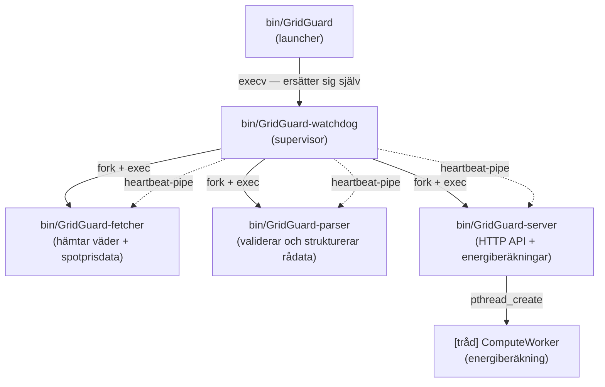
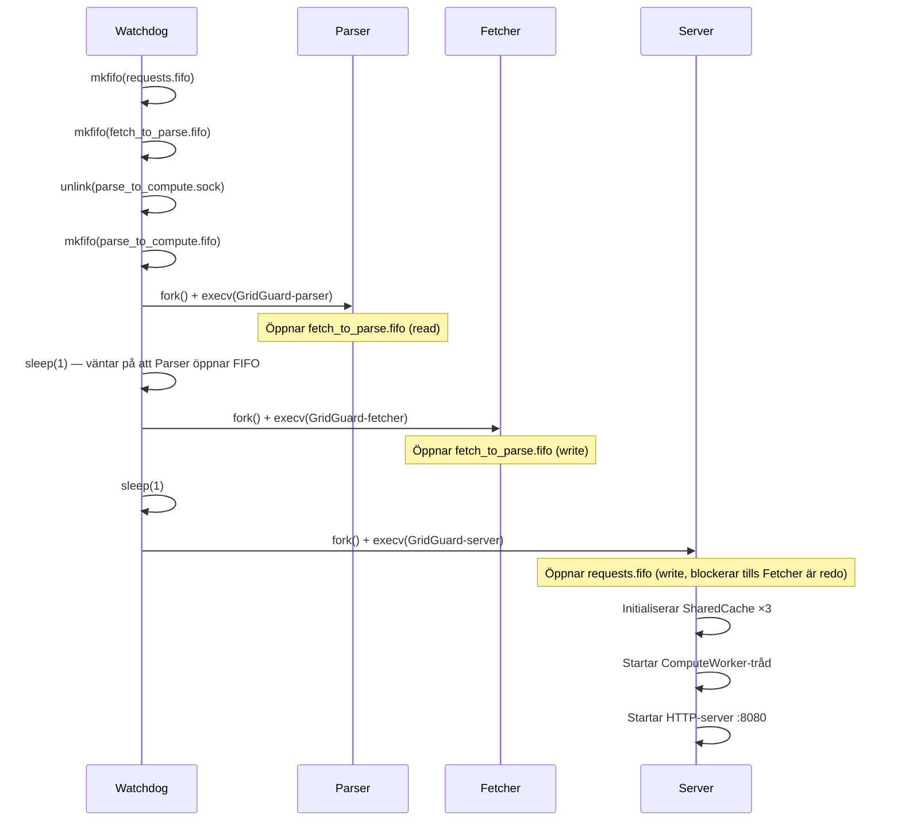

# GridGuard — Systemdokumentation

**Local Energy Optimization Platform (LEOP)**
Kurs 3 — Systemutvecklare C/C++, Chas Academy

---

## 1. Vad vi försökte åstadkomma

El kostar inte lika mycket hela dygnet. Spotpriset kan variera med flera hundra procent beroende på tid — men de flesta vet inte när det är billigt. De laddar elbilen när de kommer hem kl 17, som råkar vara den dyraste timmen på hela dygnet.

GridGuard är vårt försök att lösa det. Tanken är ett lokalt system som hämtar spotpriser och väderdata i realtid, räknar ut förväntad solproduktion och sedan talar om när det lönar sig att köpa el, sälja överskott eller undvika förbrukning. Vi satte upp scenariot för SAAB Arena i Linköping, men systemet fungerar för vilken fastighet som helst.

---

## 2. Input och output

**Input:**
- Väderdata (solinstrålning, temperatur, molnighet) från OpenMeteo — uppdateras var 15:e minut
- Spotprisdata för SE1–SE4 från Elpriset — uppdateras var 15:e minut
- Användarkonfiguration: solpanelsstorlek, verkningsgrad, förbrukningsprofil, position

**Output:**
- Ett JSON-API på port 8080 med `/forecast`, `/schedule`, `/metrics` och `/health`
- En CLI-dashboard skriven i C++ med färgkodade BUY/SKIP-signaler och prisgrafer
- Automatisk schemaläggning — man kan säga "ladda elbilsflottan, 110 kW i 4 timmar" och systemet hittar det billigaste fönstret inom en given deadline

---

## 3. Processarkitektur

Systemet körs som fyra separata processer under en processövervakare vi kallar Watchdog:

```
GridGuard (launcher)
└── GridGuard-watchdog   ← processövervakare, rotprocess
    ├── GridGuard-fetcher ← hämtar extern data
    ├── GridGuard-parser  ← validerar och strukturerar data
    └── GridGuard-server  ← HTTP-server + energiberäkning
            └── [tråd] ComputeWorker
```



### Watchdog

Watchdog är rotprocessen och ansvarar för hela processträdet. Den skapar alla IPC-resurser innan någon child-process startas, och startar sedan processerna i rätt ordning med fork och exec.

Det viktigaste watchdog gör är att övervaka att processerna faktiskt lever. Varje child kör en bakgrundstråd som skriver `"hb"` till en pipe var femte sekund. Watchdog pollar den pipe:n var 2:a sekund — om ingen heartbeat kommit inom 15 sekunder klassas processen som fryst och watchdog startar om hela gruppen.

Vi valde att alltid starta om hela gruppen, inte bara den kraschade processen. Anledningen är att processerna hänger ihop via FIFOs — om Fetcher dör sitter Parser och väntar på data som aldrig kommer. Det är enklare och säkrare att börja om från scratch.

Omstarter sker med exponentiell backoff: 2, 4, 8, 16, 32 sekunder, max fem gånger per fem-minutersfönster. Om det inte hjälper avslutar watchdog med ett fatalt fel.

### Startsekvens

Ordningen Parser → Fetcher → Server är inte godtycklig. En FIFO blockerar på `open()` tills båda sidor är redo, så om man startar i fel ordning hänger processen.



### Fetcher

Tar emot en `WorkRequest` från servern, gör HTTPS-anrop mot OpenMeteo och Elpriset och skickar rådata vidare till parsern. Svarar cachen finns det ingen anledning att göra ett nytt API-anrop — Fetcher kollar alltid shared memory-cachen först.

### Parser

Tar emot rådata, validerar JSON, konverterar tidsstämplar till Unix-tid och matchar väder- och prisdata per 15-minutersslot. Resultatet är en strukturerad prognos med 192 kvartar — 48 timmar — som skickas till ComputeWorker.

### Server och ComputeWorker

Servern hanterar inkommande HTTP-anslutningar via en trådpool. ComputeWorker är en dedikerad tråd inuti serverprocessen som tar emot prognosen via en Unix domain socket, kör optimeringsalgoritmen och skriver resultatet till shared memory. HTTP-tråden läser cachen och returnerar JSON till klienten.

---

## 4. IPC — hur processerna pratar med varandra

```
Server ──[FIFO]──► Fetcher           WorkRequest  (~100 B)
Fetcher ──[FIFO]──► Parser           FetchResult  (~65 KB)
Parser ──[Unix socket]──► ComputeWorker   ParseResult  (~4 KB)
Alla processer ◄──► SharedCache      POSIX shared memory (väder, pris, prognos)
Watchdog ──► SharedCache             WatchdogMetrics (PID, heartbeat-ålder per process)
```

| Meddelande | Transport | Innehåll |
|-----------|-----------|---------|
| `WorkRequest` | FIFO | userId, lat/lon, region, solpanelsstorlek, effektivitet, förbrukningsprofil |
| `FetchResult` | FIFO | Samma fält + `openMeteoJson[32KB]` + `priceJson[32KB]` |
| `ParseResult` | Unix socket | Samma konfig + `ForecastData` med 192 poster à 15 min: tidsstämpel, solinstrålning, molnighet, temperatur, vindstyrka, spotpris |

Vi använde fyra olika IPC-mekanismer och valde dem av specifika skäl:

**Namngivna FIFOs** används mellan Server, Fetcher och Parser. Processerna startas med fork+exec — de ersätter sig själva med nya binärer och ärver inte file descriptors på ett kontrollerbart sätt. En namngiven FIFO i filsystemet gör att de hittar varandra utan att behöva koordinera fd-arv.

**Unix domain socket** används mellan Parser och ComputeWorker. ComputeWorker är en tråd inuti serverprocessen, inte en separat process. En socket ger meddelandegränser och flödeskontroll på ett sätt som en FIFO inte gör.

**POSIX shared memory** används för cachen. Fetcher, Parser och Server behöver alla läsa väder- och prisdata, och shared memory eliminerar kopiering helt — alla processer mappar samma minnessida. Åtkomst skyddas med `pthread_rwlock`.

---

## 5. C++-klienten

Klienten är skriven i C++17 och kommunicerar med servern via HTTP. Den täcker kursmomentens C++-krav:

- **RAII:** `SocketGuard` hanterar POSIX file descriptors med Rule of Five
- **STL:** `std::vector`, `std::string`, `std::unique_ptr`, `std::sort`, `std::accumulate`
- **Exception handling:** Custom exceptions (`ConnectionError`, `NetworkError`) med `try/catch`
- **Namespaces:** All klientkod under `namespace gridguard`

---

## 6. Profileringsresultat

Vi använde tre verktyg: `clock_gettime(CLOCK_MONOTONIC)` med nanosekundsprecision (10 000 iterationer), `gprof` och `valgrind --leak-check=full`.

### Hotspot — gprof flat profile

```
  %   cumulative   self              self     total
 time   seconds   seconds    calls  ns/call  ns/call  name
100.00      0.01     0.01    30600   326.80   326.80  Compute_GenerateEnergyPlan
  0.00      0.01     0.00    30602     0.00     0.00  Logger_Log
  0.00      0.01     0.00        5     0.00     0.00  fill_forecast_realistic
  0.00      0.01     0.00        1     0.00     0.00  Compute_Initiate
```

100 % av CPU-tid ligger i en enda funktion. Det är ett bra tecken — overhead från logging och initialisering syns knappt.

### -O0 mot -O2

| | avg (-O0) | avg (-O2) | p99 (-O0) | p99 (-O2) |
|--|--|--|--|--|
| Realistisk prognos | 3.22 µs | 2.10 µs | 29.51 µs | 8.38 µs |
| Worst-case | 2.27 µs | 1.56 µs | 23.87 µs | 3.89 µs |
| Stor solpanel | 2.40 µs | 1.57 µs | 6.95 µs | 4.69 µs |

p99-latensen för det realistiska scenariot sjönk från 30 µs till 8 µs — 3.5× förbättring. Det beror framförallt på att -O2 aktiverar function inlining och loop unrolling i beräkningsloopen.

Med -O2 klarar systemet ~477 000 planer per sekund. En ny plan beräknas var 15:e minut — marginalen är ungefär 7 miljoner gånger.

### Minnesanalys

Valgrind hittade inga heap-läckor i produktionskoden. En oinitialiserad stackvariabel dök upp i benchmark-koden och dokumenterades.

### Analys

Compute-steget är inte flaskhalsen — det är redan snabbt nog med råge. p99-spikarna (8 µs mot p50 på 1.6 µs) beror på OS-schemaläggningsavbrott, inte på koden. Det går inte att åtgärda utan en realtidskärna.

---

## 7. Förbättringsmöjligheter

Baserat på profileringen finns ett par mikrooptimeringar:

| Komponent | Problem | Möjlig åtgärd |
|-----------|---------|--------------|
| Compute | `qsort` över hela prisarrayen vid köpfönsterberäkning | Ersätt med partial sort — O(N) istället för O(N log N) |
| Cache | Linjär sökning O(N) vid lookup | Fungerar bra på N=16, men en hash-tabell behövs om N skalas upp |
| Queue | Mutex-contention vid många producenter | Batch-dequeue minskar lock-frekvensen |

Ingen av dem är akuta — systemet är redan tillräckligt effektivt för sitt syfte.

**Om vi hade haft mer tid:**

Det vi saknar mest är en **batterimodell**. Idag simulerar systemet inte laddningscykler eller degradering, vilket gör att köp/sälj-besluten inte är optimala för fastigheter med batterilager. En riktig batterimodell hade varit nästa naturliga steg.

Vi hade också velat använda **historisk förbrukningsdata** för att träna en enkel prognos. Just nu baseras allt på aktuell väderprognos och prisdata — med historik hade förutsägelserna blivit mer precisa.

En praktisk sak vi hade åtgärdat direkt är **Makefile dependency tracking med `-MMD`**. Vi brände en del tid på svårspårade fel när structs som delades mellan processer ändrades — stale `.o`-filer som inte byggdes om automatiskt. Vi förlitade oss på `make clean` som workaround, men det borde inte behövas.

---

## 8. Slutsats

GridGuard är ett komplett system i C och C++ med multi-process IPC, JWT-autentisering, POSIX shared memory, en TUI-dashboard och en schemaläggningsalgoritm med deadline-stöd. Profileringen visar att systemet klarar realtidskraven med god marginal. Det finns förbättringar att göra, men de är alla mikrooptimeringar eller nya funktioner — inte grundläggande problem med arkitekturen.
