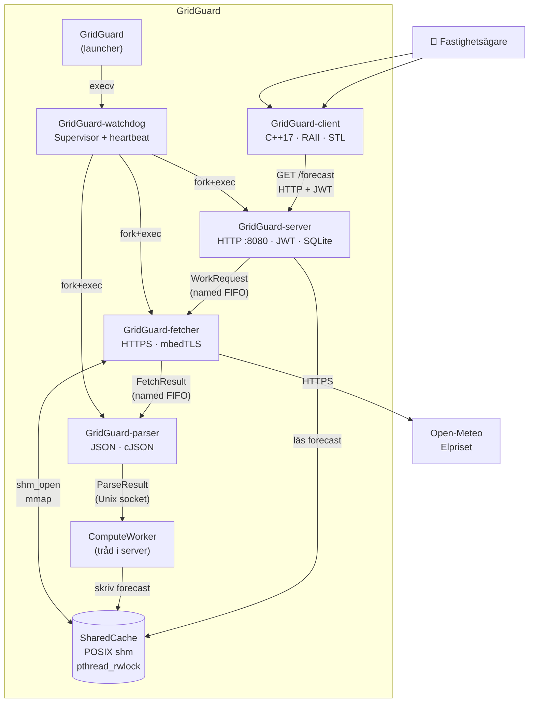
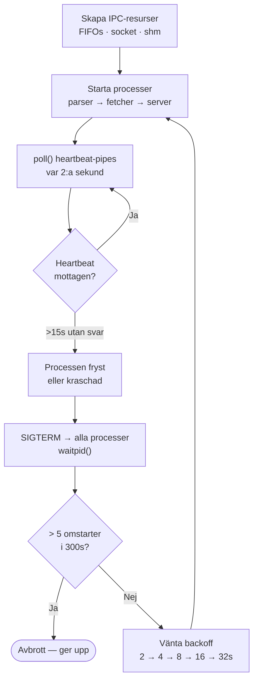
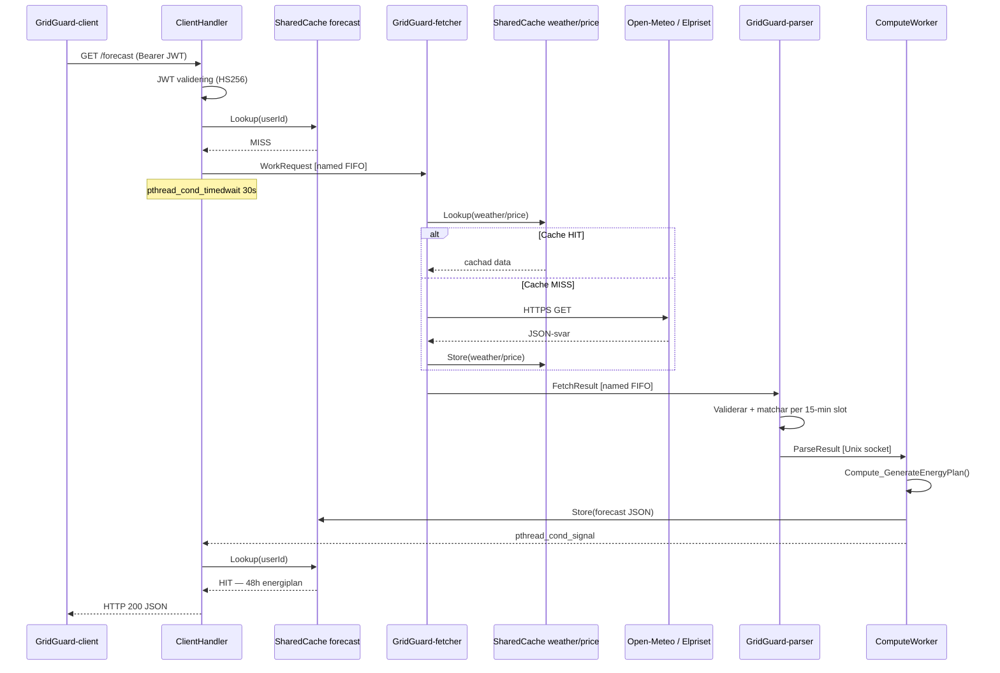
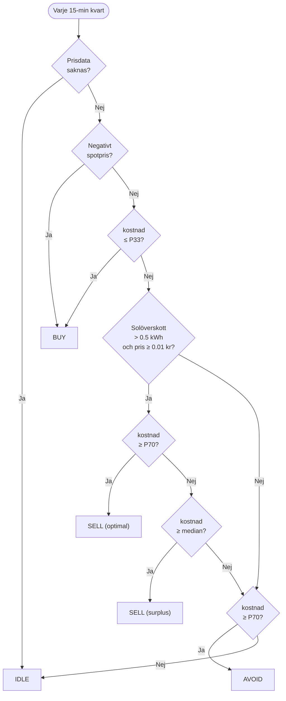

# GridGuard — Systemdokumentation

**Local Energy Optimization Platform (LEOP)**
Kurs 3 — Systemutvecklare C/C++, Chas Academy

---

## 1. Varför byggde vi detta?

- Lokal energioptimerings-plattform för fastigheter med solceller
- Analyserar väderprognos och spotprisdata i realtid
- Ger rekommendationer per 15-minutersslot: **BUY / SELL / AVOID / IDLE**
- Schemaläggning av flexibla laster till billigaste tillgängliga fönster

**Demokund: SAAB Arena, Linköping**

- 1 500 m² solpaneler på taket
- 45 kWh/h basförbrukning (45 kW konstant drift)
- Flexibla laster: elbilsflotta (50 kW, 4h), HVAC-förvärmning (30 kW, 2h)

**Resultat med GridGuard:**

| Mätpunkt | Före | Efter | Förbättring |
|----------|------|-------|-------------|
| Elkostnad/dag | 5 200 kr | 3 568 kr | **-31%** |
| Elbilsladdning | 900 kr | 320 kr | **-64%** |
| Solenergi-intäkt | 0 kr | ~450 kr/mån | **+450 kr** |

---

## 2. Input och Output

**Input:**
- Väderprognos (GHI, DNI, DHI, temperatur, vind, molntäckning) — Open-Meteo API, TTL 15 min
- Spotpriser per 15-minutersslot (SE1–SE4) — Elprisetjustnu
- Användarkonfiguration: solarea, verkningsgrad, panellutning, panelazimut, position, elområde, nätavgifter

*SAAB Arena-konfiguration:*
```
Position:        58.4109°N, 15.6216°E  (Linköping, SE3)
Solpaneler:      1 500 m²,  verkningsgrad 20%
Panellutning:    5° (flatt arentak),  azimut 180° (söder)
Basförbrukning:  45 kWh/h
Nätavgift:       0.25 / 0.35 / 0.45 kr/kWh  (låg/normal/hög)
Flexibla laster: ev_fleet_charger  50 kW  4h
                 hvac_precool       30 kW  2h
```

**Output:**
- 48-timmars energiplan med 192 kvartar — signal + pris + solproduktion per slot
- Sammanhängande actionfönster (aggregerade block)
- Bästa köpfönster för flexibla laster
- HTTP JSON-API port 8080: `/forecast`, `/schedule`, `/user/config`, `/health`, `/metrics`
- `/forecast`: returnerar cachat svar om data är färsk — vid cache-miss körs hela Fetch→Parse→Compute synkront (upp till 30s vid första anrop)
- `PUT /user/config`: ogiltigförklarar automatiskt hela cachen så att nästa prognos baseras på ny konfiguration

**Exempel (SAAB Arena, solig dag):**
```
BUY   02:00–05:45  0.32 kr/kWh  (-54%)   →  Ladda elbilsflottan nu
SELL  12:00–13:45  1.85 kr/kWh  (+45%)   →  Exportera solöverskott
AVOID 17:00–20:00  2.15 kr/kWh  (+63%)   →  Skjut upp icke-kritiska laster
```

**C++-klient (terminalbaserat dashboard):**
```
GridGuard                          13.1°C  Sol: 90.57 kW
SAAB_ARENA  SE3  Linköping

▸ 03-21 02:00  BUY   0.32 kr  ░░░░░░░░░░   90 kWh   -54%
▸ 03-21 12:00  SELL  1.85 kr  █████████░   55 kWh   +45%
▸ 03-21 17:00  AVOID 2.15 kr  ██████████    4 kWh   +63%

Bästa köpfönster:
  🥇 02:00  0.32 kr/kWh  (-54%)
  🥈 13:00  0.39 kr/kWh  (-32%)

Import: 1612 kWh   Kostnad: 3568 kr   Bästa köp: 02:00
```
**C++17-klient — kurskrav:**
- **RAII:** `SocketGuard` wrapprar POSIX file descriptors med Rule of Five (destruktor, move-konstruktor, move-tilldelning, deleted copy) — resurser frigörs garanterat även vid exception
- **STL:** `std::vector`, `std::string`, `std::unique_ptr`, `std::sort`, `std::accumulate`
- **Exception handling:** egna exceptions (`ConnectionError`, `NetworkError`) med `try/catch`-hierarki
- **Namespaces:** all klientkod under `namespace gridguard`

---

## 3. Vilka processer finns och vad gör de?



**GridGuard-watchdog:**
- Skapar alla IPC-resurser (FIFOs, socket, shared memory) innan child-processer startas
- Startar processer i rätt ordning: parser → fetcher → server
- Pollar heartbeat-pipes var 2:a sekund med `poll()`
- Startar om hela gruppen vid krasj: exponentiell backoff 2s → 4s → 8s → 16s → 32s
- Max 5 omstarter per 300s — annars avbrott
- Skriver PID, uptime och senaste heartbeat per process till shared memory → exponeras live via `GET /metrics`

**Watchdog-loop:**



**Signalhantering:**
- `SIGTERM` / `SIGINT` — watchdog fångar signalen, vidarebefordrar `SIGTERM` till alla child-processer och avslutar städat
- `SIGHUP` — watchdog vidarebefordrar till alla processer → varje process laddar om sin konfiguration utan omstart
- `SIGSEGV` / krasch — watchdog detekterar via `waitpid()`, loggar vilket signal som orsakade kraschen, startar om hela gruppen

**GridGuard-fetcher:**
- Tar emot `WorkRequest` via anonym pipe
- Gör HTTPS-anrop mot Open-Meteo och Elprisetjustnu (mbedTLS)
- Kontrollerar POSIX shared memory-cache innan anrop (TTL-baserad)
- Skickar rådata som `FetchResult` via named FIFO

**GridGuard-parser:**
- Tar emot `FetchResult` via named FIFO
- Validerar och parsar JSON med cJSON
- Matchar väder- och prisdata per 15-minutersslot
- Skickar `ParseResult` till ComputeWorker via Unix domain socket

**GridGuard-server + ComputeWorker:**
- Trådpool hanterar inkommande HTTP-anslutningar — en tråd per anslutning skalar dåligt och slösar resurser, poolen begränsar antalet samtidiga trådar och återanvänder dem
- JWT-validering med mbedTLS (HS256, 24h TTL)
- ComputeWorker tar emot `ParseResult`, kör algoritmen, skriver till shared memory-cache
- HTTP-trådar läser cachen och returnerar JSON
- **Persistent lagring (SQLite):** `user_configs`-tabellen sparar konfiguration per användare; `schedules`-tabellen sparar schemalagda laster med kostnad och besparingsvärde

---

## 4. Hur kommunicerar processerna mellan varandra?

```
Server      ──[named FIFO]──►   Fetcher        WorkRequest   (~200 B)
Fetcher     ──[named FIFO]──►   Parser         FetchResult   (~64 kB)
Parser      ──[Unix socket]──►  ComputeWorker  ParseResult   (~12 kB)
Alla        ◄──►  SharedCache   POSIX shm      väder, pris, prognos
Watchdog    ──►   SharedCache   WatchdogMetrics processstatistik
```

**Vad strukturerna innehåller:**

| Struct | Innehåll |
|--------|----------|
| `WorkRequest` | userId, position (lat/lon/region), solarea, verkningsgrad, förbrukning, nätavgifter |
| `FetchResult` | WorkRequest-fält + `openMeteoJson` (32 kB rådata) + `priceJson` (32 kB rådata) |
| `ParseResult` | WorkRequest-fält + `ForecastData` (192 parsade kvartar med pris, väder, produktion) |

Varje struct bär med sig användarens konfiguration hela vägen — ingen process behöver slå upp något i databasen.

| Kanal | Teknik | Varför |
|-------|--------|--------|
| Server → Fetcher | Named FIFO | Server startas via exec och ärver inte fd:er — FIFO i filsystemet löser det |
| Fetcher → Parser | Named FIFO | Processer körs via exec och ärver inte fd:er — FIFO i filsystemet löser det |
| Parser → ComputeWorker | Unix domain socket | Tråd, inte process; socket ger meddelandegränser för stora structs |
| Cache | POSIX shared memory | Tre processer läser samma data — eliminerar kopiering |

- Cache-synkronisering: `pthread_rwlock` — många läsare, en skrivare
- Hela gruppen startas om vid krasj: named FIFOs hänger i öppet läge tills båda sidor stängs — partial restart kräver mer komplexitet än det är värt

**Sekvens — end-to-end pipeline (cache miss):**



---

## 5. Varför designade vi systemet så här?

**Privacy-by-design:**

| Data | Plattform (moln) | GridGuard (enhet) |
|------|-----------------|-------------------|
| userId | ✅ | ✅ |
| GPS-koordinater | ❌ | ✅ |
| Solpanelsstorlek | ❌ | ✅ |
| Förbrukningsprofil | ❌ | ✅ |

- Känslig energidata lämnar aldrig enheten — ett medvetet val, inte en brist
- JWT (HS256, 24h TTL) ger stateless autentisering: servern behöver aldrig kontakta plattformen per request

**Konfiguration (RuntimeConfig):**
- Fallback-kedja: `gridguard.conf` → miljövariabel → hårdkodad default
- Omladdning vid `SIGHUP` utan omstart — watchdog skickar signalen vid konfigurationsändring

**SharedCache-design:**
- 16 poster, 64 KB/post, LRU-eviction vid fullt cache
- `PTHREAD_PROCESS_SHARED` rwlock — låset lever i shared memory, inte i en process
- Inga pekare i shared region — varje process mappar `mmap()` till olika virtuell adress
- Magic-nummer `0xCA5EC0DE` validerar att segmentet är korrekt initierat innan läsning
- `SharedCache_Cleanup` anropas **bara av Watchdog** efter att alla processer avslutats

---

## 6. Hur fungerar energialgoritmen?

**Solcellsmodell (IEC-baserad):**
- **POA-irradians (Hay & Davies):** Open-Meteo levererar GHI, DNI och DHI per kvartal. `CalculatePOA()` beräknar solens position (Spencer 1971) och transponerar strålningen till panelens lutade yta: direktstrålning + circumsolär diffus + isotrop himmeldiffus + markreflektion (albedo 0.2). Vid saknad DNI/DHI används GHI som isotrop diffus (graceful fallback).
- Paneltemperatur: NOCT-modell (IEC 61215) med vindkylning — använder POA som indata
- Temperaturderating: −0.45%/°C över 25°C (IEC 61724) — 16% förlust vid 60°C
- Energi per kvart: `(POA W/m² / 1000) × area × verkningsgrad × 0.75 × tempEff × 0.25h`
- *SAAB Arena vid full sol (POA ≈ 500 W/m² vid tilt=5°, söder):* `0.5 × 1500 × 0.20 × 0.75 × ~0.98 × 0.25 ≈ 28 kWh/kvart`

**Beslutlogik (P33/P70-percentiler):**



| Signal | Villkor |
|--------|---------|
| **BUY** | Totalkostnad ≤ P33, eller negativt spotpris |
| **SELL** | Solöverskott > 0.5 kWh, spotpris ≥ 0.01 kr, kostnad ≥ median (P70 = optimal, ≥ median = surplus) |
| **AVOID** | Totalkostnad ≥ P70 |
| **IDLE** | Allt annat |

**LoadScheduler (`POST /schedule`):**
- Söker BUY-signaler kommande 48h
- Hittar sammanhängande block som ryms inom angiven duration
- Viktar med "practicality score" (natt 1.0×, dag 0.5×, kväll 1.5×)
- Väljer fönstret med lägst viktad kostnad

**Varför scheman inte matchar "Best BUY windows":**

Best BUY windows visar billigaste *enskilda* 15-minutersslots. LoadScheduler löser ett annat problem — billigaste *kontinuerliga* fönstret för hela lastens duration:

- `ev_fleet_charger` behöver 16 kvarter i följd (240 min)
- Startar vid billigaste enskilda slot kl 09:15 → måste köra till 13:15, in i dyrare eftermiddagstider
- Startar istället kl 06:45 → kör 06:45–10:45, lägre totalkostnad trots att startpriset är högre

Detta är ekonomiskt korrekt — kunden bryr sig om totalkostnaden för hela laddningen, inte priset vid starttidpunkten.

---

## 7. Vad säger profileringsresultaten?

Profilering: `clock_gettime(CLOCK_MONOTONIC)` (10 000 iterationer), `gprof`, `valgrind --leak-check=full`

- `gprof`: 100% av compute-CPU-tid i `Compute_GenerateEnergyPlan()` — övriga funktioner negligibla

**Benchmark: -O0 vs -O2 (48h prognos / 192 kvartar, 10 000 körningar):**

| Scenario | avg -O0 | avg -O2 | Förbättring | p99 -O0 | p99 -O2 | Förbättring |
|----------|---------|---------|-------------|---------|---------|-------------|
| Realistisk | 3.22 µs | 2.10 µs | **1.53×** | 29.51 µs | 8.38 µs | **3.52×** |
| Worst-case | 2.27 µs | 1.56 µs | **1.45×** | 23.87 µs | 3.89 µs | **6.14×** |
| Stor solpanel | 2.40 µs | 1.57 µs | **1.53×** | 6.95 µs | 4.69 µs | **1.48×** |

**Analys:**
- Genomströmning med -O2: ~477 000 planer/sekund
- Systemet genererar en plan var 15:e minut — marginalen är **7 000 000×**
- p99-spikarna beror på OS-schemaläggningsavbrott, inte koden — inte åtgärdbart utan realtidskärna
- Valgrind: inga heap-läckor i produktionskod

---

## 8. Vad skulle vi förbättra och vad hade vi gjort med mer tid?

**Implementerade förbättringar under projektet:**
- Watchdog-monoliten (441 rader) delades upp i fyra testbara moduler
- Enhetstester för Watchdog-moduler — `test_restart_policy_gtest.cpp` och `test_heartbeat_gtest.cpp` finns och verifierar backoff-sekvensen isolerat
- `-MMD -MP` dependency tracking i Makefile — förhindrar stale `.o`-filer efter headerändringar
- `isatty()`-kontroll i logger — ANSI-färger bara i terminal, inte i loggfil
- `scheduleId` inkluderar nu `loadId` — förhindrar PRIMARY KEY-kollision vid snabb schemaläggning

**Kodkvalitet (baserat på profilering):**
- `qsort` för hela prisarrayen — kan ersättas med `nth_element`-ekvivalent (O(N) vs O(N log N))
- SharedCache: linjär sökning O(N) — hash-tabell om N skalas upp
- Mikrooptimeringar — systemet är redan tillräckligt effektivt

**Med mer tid:**
1. **Batterimodell** — lagra billig el, sälj vid höga priser (mest värdehöjande tillägget)
2. **Fler integrationstester** — pipeline-testerna täcker happy path men saknar chaos-scenarion för nätverksfel och ogiltiga API-svar
3. **Historisk förbrukningsdata** — schedules-tabellen samlar data, enkel modell kan förutsäga typisk förbrukning per tid/veckodag
4. **Systemd-integration** — `WatchdogMetrics` skriver redan statistik; koppla till `systemd-notify` för produktionsdrift

---

## 9. Bygga och köra

```bash
# Installera beroenden (Ubuntu/Debian)
sudo apt-get install libmbedtls-dev libsqlite3-dev libssl-dev

# Bygg och starta med demo-data
make dev        # Seedar databaser, genererar JWT, startar watchdog, visar prognos

# Tester
make test
make test-client

# Produktion
make clean && make release
make start / make stop
```

Binärer: `bin/GridGuard-watchdog`, `bin/GridGuard-fetcher`, `bin/GridGuard-parser`, `bin/GridGuard-server`, `bin/GridGuard-client`
